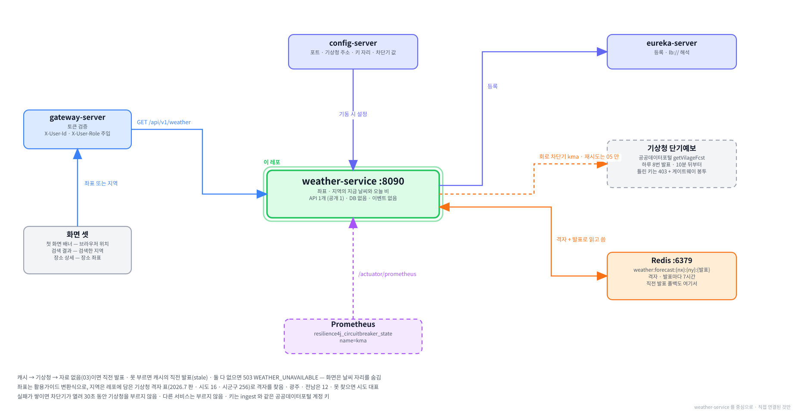

# weather-service

**함께하개**는 반려동물과 함께 갈 수 있는 장소를 찾고, 우리 아이가 그곳에
들어갈 수 있는지 판정해 주는 서비스입니다.

이 저장소는 그중 **지금 날씨를 알려 주는 서버**입니다.
좌표나 지역을 받아 기상청 단기예보를 불러오고, 지금 시각의 기온 · 하늘 · 강수와 오늘 남은 시간의 비 · 눈 예보를 돌려줍니다.
첫 화면 배너 · 검색 결과 · 장소 상세가 이 서비스를 부릅니다. DB 는 없고, 받은 예보를 Redis 에 잠시 담아 둡니다.

---

**먼저 전체 그림을 보고, 이 레포가 그 안 어디에 있는지 본 뒤 읽습니다.**

**① 전체 구조 — 층으로 본 것.** 위에서 아래로 요청이 내려가고, 어느 층에 무엇이 있는지.


**② 전체 구조 — 서비스끼리 무엇을 주고받는지.** 초록 실선이 `/internal` 호출, Kafka 표가 이벤트, 하늘색 점선이 VPC 경계.


**③ 이 레포를 중심으로.** 직접 연결된 것만 남긴 그림.



<br><br>

---

## 본문 시작

<br><br>

---

## 먼저 알아 두면 좋은 것

이 문서에 자주 나오는 말 4가지입니다. 더 자세한 설명은 [service-template 의 용어 장](https://github.com/paw-trail/service-template#11-용어)에 있습니다.

**게이트웨이가 넣어 주는 헤더 2개.** 브라우저의 요청은 게이트웨이(gateway-server)를 거치며 로그인 토큰을 검사받고,
게이트웨이가 `X-User-Id`(계정 식별자)와 `X-User-Role`(`USER` 또는 `ADMIN`)을 붙여 이 서비스로 넘깁니다.
날씨는 누가 부르든 같은 답이라 이 서비스는 헤더 값을 쓰지 않지만, 헤더가 없으면 공통 보안 체인이 막습니다.
그래서 로그인한 화면에서만 부를 수 있습니다.

**격자.** 기상청은 전국을 가로 5km · 세로 5km 칸으로 나눠 칸마다 예보를 냅니다. 동서 149칸 · 남북 253칸이고 번호는 1 부터 셉니다.
같은 칸이면 예보가 같으므로, 좌표든 지역이든 먼저 격자 번호로 바꾼 뒤 그 번호로 예보를 찾습니다([3장](#3-좌표--지역--격자)).

**발표.** 단기예보는 하루 8번(02 · 05 · 08 · 11 · 14 · 17 · 20 · 23시) 새로 나오고, 각 발표는 10분 뒤부터 받을 수 있습니다.
발표 하나에 앞으로 며칠의 시각별 예보가 들어 있습니다. 이 서비스는 발표 단위로 받아 캐시에 담습니다([2-2](#2-2-발표-시각)).

**회로 차단기.** 바깥 API 가 계속 실패하면 한동안 아예 부르지 않고 바로 실패로 넘기는 장치입니다.
실패를 기다리느라 요청마다 시간을 쓰지 않게 하려는 것입니다. 이 서비스는 기상청 호출에 겁니다([6장](#6-재시도와-회로-차단기)).

<br><br>

---

## 0. 이 서비스가 하는 일

### 0-1. 한 문장

**좌표나 지역을 받아 그 자리의 지금 날씨와 오늘 남은 비 · 눈 예보를 돌려줍니다.**

지역(서울 종로구)으로 부르면 이런 모양이 돌아옵니다. 값은 실물 확인 때 받은 그대로입니다.

```json
{
  "code": "SUCCESS",
  "message": "요청이 성공적으로 처리되었습니다.",
  "data": {
    "baseAt": "2026-09-20T14:00:00",
    "stale": false,
    "at": "2026-09-20T16:00:00",
    "tmp": 29,
    "sky": "CLEAR",
    "pty": "NONE",
    "pop": 0,
    "rainToday": null,
    "region": { "sidoCode": "11", "sigunguName": "종로구", "matched": "SIGUNGU" }
  },
  "traceId": "6aaf8ae51e98cd8e8d8d5989bad94375"
}
```

| 칸 | 뜻 |
|---|---|
| `baseAt` | 이 값이 나온 발표 시각 |
| `stale` | 새 발표를 못 받아 직전 발표를 내준 것이면 `true` |
| `at` | 지금으로 고른 예보 시각 — 14시 발표는 15시부터 담아서, 16시 20분에 부르면 16시 줄 |
| `tmp` · `sky` · `pty` · `pop` | 기온(℃) · 하늘 상태 · 강수 형태 · 강수 확률(%) |
| `rainToday` | 오늘 남은 시간의 첫 비 · 눈 예보 — 없으면 `null` |
| `region` | 지역으로 불렀을 때만 실림 — `matched` 가 `SIDO` 면 시군구를 못 찾아 시도 대표를 쓴 것 |

### 0-2. 부르는 화면 3곳

| 화면 | 넘기는 값 | 쓰는 방식 |
|---|---|---|
| 첫 화면 배너 | 브라우저 위치(좌표) — 위치 권한을 거부하면 정해 둔 고정 지역 | 사용자가 있는 곳의 지금 날씨 |
| 검색 결과 | 검색에 쓴 지역 값(`sidoCode` · `sigunguName`) | 검색한 지역의 지금 날씨 |
| 장소 상세 | 장소 좌표 | 장소의 지금 날씨 + 비 예보 경고 ([4-3](#4-3-장소-상세의-비-예보-경고)) |

3곳 모두 같은 경로 하나를 부릅니다. 좌표로 부를지 지역으로 부를지만 다릅니다([7장](#7-api)).

### 0-3. 한 번 부르면 일어나는 일

```
화면 ──▶ 게이트웨이 ──▶ weather-service
                        │
                        ├── 1 격자 찾기        좌표는 변환식 · 지역은 격자 표
                        ├── 2 발표 고르기      지금 받을 수 있는 가장 새 발표
                        ├── 3 예보 얻기        Redis → 없으면 기상청 → 안 되면 직전 발표
                        └── 4 줄 고르기        지금 한 줄 · 오늘 남은 비
```

### 0-4. 하지 않는 것

| 하지 않는 것 | 까닭 |
|---|---|
| 혼잡도(집중률) | 채워진 데이터가 적어 날씨만 남겼습니다. 서비스 이름도 congestion 에서 weather 로 바꿨습니다 |
| 초단기 실황 · 초단기 예보 | 화면에 필요한 네 칸(기온 · 하늘 · 강수 형태 · 강수 확률)이 단기예보 한 번으로 다 나옵니다 |
| 최저 · 최고 기온 | 화면에 자리가 없습니다 |
| 다른 서비스 호출 · 이벤트 · DB | 기상청만 부르고, 예보는 Redis 에 잠시 담을 뿐입니다 |

<br><br>

---

## 1. 로컬에서 띄우기

### 1-1. 전체 흐름

| 차례 | 할 일 | 절 |
|---|---|---|
| 1 | 인프라 컨테이너를 띄웁니다 — Redis · 설정 서버 · 유레카 · 게이트웨이 (+ 로그인용 PostgreSQL · auth) | [1-2](#1-2-인프라-컨테이너) |
| 2 | `.env` 에 기상청 키를 넣습니다 | [1-3](#1-3-기상청-키) |
| 3 | 띄웁니다 — 컨테이너 또는 IntelliJ | [1-4](#1-4-실행) |
| 4 | 떴는지 봅니다 | [1-5](#1-5-떴는지-확인) |
| 5 | 로그인하고 불러 봅니다 | [1-6](#1-6-불러-보기) |

### 1-2. 인프라 컨테이너

infra 레포의 compose 를 씁니다.

| 컨테이너 | 이 서비스가 쓰는 것 |
|---|---|
| `pawtrail-redis` | 예보 캐시 |
| `pawtrail-config-server` | 포트 · 기상청 주소 · 키 자리 · 차단기 값 |
| `pawtrail-eureka-server` | 등록 — 게이트웨이가 `lb://weather-service` 를 풉니다 |
| `pawtrail-gateway-server` | 화면에서 오는 요청 — `/api/v1/weather/**` 라우트가 있습니다 |
| `pawtrail-postgres` · `pawtrail-auth-service` | 이 서비스는 안 쓰지만, 게이트웨이를 거쳐 부르려면 로그인이 필요합니다 |

이 서비스만 보려면 이것만 띄우면 됩니다. Windows · macOS 모두 같습니다.

```bash
cd infra
docker compose --profile db --profile infra --profile platform --profile app up -d postgres kafka redis config-server eureka-server gateway-server auth-service
```

> 서비스 이름을 적었으므로 `app` 프로파일을 켜도 auth 하나만 뜹니다.

### 1-3. 기상청 키

키는 공공데이터포털 계정 하나에 하나라, ingest 가 쓰는 키와 **값이 같습니다.** infra 레포의 `.env` 에 한 줄을 더합니다.

```
WEATHER_PUBLIC_DATA_SERVICE_KEY=(INGEST_PUBLIC_DATA_SERVICE_KEY 와 같은 값)
```

| 알아 둘 것 | 내용 |
|---|---|
| 어느 키인가 | 원본(Decoding) 키입니다. 코드가 한 번 인코딩해 주소에 붙입니다 |
| 비어 있으면 | 기동이 실패합니다 — 설정의 `${WEATHER_PUBLIC_DATA_SERVICE_KEY}` 를 풀 수 없기 때문입니다 |
| 틀리면 | 뜨기는 뜹니다. 부를 때마다 기상청이 HTTP 403 으로 거절하고 로그에 `코드 30` 이 찍힙니다([10-1](#10-1-키가-막혔을-때)) |
| 계정 승인 | 기상청 단기예보는 운영계정으로 승인되어 있습니다 |

### 1-4. 실행

**컨테이너로.** infra 레포에서 띄웁니다. 이미지는 ghcr 에서 받습니다.

```bash
docker compose pull weather-service
docker compose up -d weather-service
```

코드를 고쳐 가며 볼 때는 이 레포에서 구워 같은 이름으로 덮고, `--pull never` 로 방금 구운 것을 씁니다.

```bash
./gradlew clean bootJar
docker build -t ghcr.io/paw-trail/weather-service:latest .
docker compose up -d --pull never --force-recreate weather-service
```

---

**IntelliJ 로.** `WeatherApplication` 실행 구성의 Environment variables 에 키 한 줄을 넣고 실행합니다.

```
WEATHER_PUBLIC_DATA_SERVICE_KEY=(INGEST_PUBLIC_DATA_SERVICE_KEY 와 같은 값)
```

---

**터미널에서 Gradle 로.** `.env` 에서 키를 읽어 넣고 바로 띄웁니다. 키가 화면에 찍히지 않습니다.

```powershell
# Windows (PowerShell 7)
$env:WEATHER_PUBLIC_DATA_SERVICE_KEY = (Select-String -Path C:\Tour_Prj\infra\.env -Pattern '^INGEST_PUBLIC_DATA_SERVICE_KEY=(.+)$').Matches[0].Groups[1].Value.Trim().Trim('"')
cd C:\Tour_Prj\weather-service; ./gradlew bootRun
```

```bash
# macOS
export WEATHER_PUBLIC_DATA_SERVICE_KEY="$(grep '^INGEST_PUBLIC_DATA_SERVICE_KEY=' ~/Tour_Prj/infra/.env | cut -d= -f2- | tr -d '"')"
cd ~/Tour_Prj/weather-service && ./gradlew bootRun
```

> **Windows 에서 bootRun 을 띄운 채 `./gradlew clean build` 를 하면 실패합니다.** 떠 있는 앱이 `build` 폴더를 잡고 있기 때문입니다.
> 먼저 `Ctrl+C` 로 멈춥니다. macOS 에는 해당하지 않습니다.

### 1-5. 떴는지 확인

Windows 는 `curl.exe`, macOS 는 `curl` 입니다.

```bash
curl.exe -s http://localhost:8090/actuator/health
curl.exe -s -H "Accept: application/json" http://localhost:8761/eureka/apps/WEATHER-SERVICE
```

| 볼 것 | 정상 |
|---|---|
| health | `"status":"UP"` · 그 안에 `redis` 도 `UP` · config 파일 3개(`application-local` · `weather-service` · `application`) |
| 유레카 | IntelliJ · Gradle 로 띄웠으면 `host.docker.internal:weather-service:8090` · `UP` — 게이트웨이 컨테이너가 이 주소로 찾아옵니다 |

### 1-6. 불러 보기

게이트웨이를 거쳐 부릅니다. 로그인 쿠키가 있어야 합니다. 계정은 user-service README 의 시험 계정 u1 입니다.

```powershell
# Windows (PowerShell 7)
Set-Content -Path login.json -Encoding ascii -Value '{"email":"pawtrail.noreply+u1@gmail.com","password":"test1234"}'
curl.exe -s -o NUL -c cookies.txt -X POST "http://localhost:8080/api/v1/auth/login" -H "Content-Type: application/json" -d "@login.json" -w "login %{http_code}`n"

# 좌표 — 서울시청
curl.exe -s -b cookies.txt "http://localhost:8080/api/v1/weather?lat=37.5663&lon=126.9779"

# 지역 — 한글 이름은 먼저 인코딩합니다. 그대로 넘기면 curl.exe 가 깨뜨려 보냅니다
$q = [uri]::EscapeDataString('종로구')
curl.exe -s -b cookies.txt "http://localhost:8080/api/v1/weather?sidoCode=11&sigunguName=$q"
```

```bash
# macOS
curl -s -o /dev/null -c cookies.txt -X POST "http://localhost:8080/api/v1/auth/login" \
    -H "Content-Type: application/json" \
    -d '{"email":"pawtrail.noreply+u1@gmail.com","password":"test1234"}' -w "login %{http_code}\n"

curl -s -b cookies.txt "http://localhost:8080/api/v1/weather?lat=37.5663&lon=126.9779"
curl -s -G -b cookies.txt "http://localhost:8080/api/v1/weather" --data-urlencode "sidoCode=11" --data-urlencode "sigunguName=종로구"
```

> **쿠키 파일이 있는 폴더에서 부릅니다.** curl 은 `-b` 에 적은 파일이 없으면 오류 없이 빈손으로 보내고,
> 게이트웨이가 401 `AUTHENTICATION_FAILED` 로 막습니다. 폴더를 옮겨 다니다 이것으로 헤매기 쉽습니다.

두 번째 부름이 훨씬 빠르면 캐시가 도는 것입니다. 실물 확인 때 서울시청 좌표가 1.27초(기상청), 같은 격자인 종로구가 0.025초(캐시)였습니다.

<br><br>

---

## 2. 기상청 단기예보

### 2-1. 무엇을 부르나

공공데이터포털의 **기상청_단기예보 조회서비스**(15084084) 가운데 단기예보 조회(`getVilageFcst`) 하나만 부릅니다.

| 파라미터 | 넣는 값 |
|---|---|
| `serviceKey` | 원본 키를 한 번 인코딩한 값 |
| `pageNo` · `numOfRows` | `1` · `1000` — 한 쪽만 받습니다 |
| `dataType` | `JSON` |
| `base_date` · `base_time` | 발표 날짜 · 시각 — `20260920` · `1400` ([2-2](#2-2-발표-시각)) |
| `nx` · `ny` | 격자 번호 ([3장](#3-좌표--지역--격자)) |

> **인증키는 한 번만 인코딩해 완성된 주소를 그대로 넘깁니다.** 두 번 인코딩되면 `%2B` 가 `%252B` 가 되어
> 등록되지 않은 키라고 답합니다. ingest 의 호출과 같은 방식입니다.

### 2-2. 발표 시각

| 지금 | 부르는 발표 | 까닭 |
|---|---|---|
| 14시 9분 | 같은 날 11시 | 14시 발표는 14시 10분부터 받을 수 있습니다 |
| 14시 10분 | 같은 날 14시 | |
| 1시 | 전날 23시 | 하루 첫 발표(02시)가 2시 10분에야 나옵니다 |

발표 하나는 발표 시각 1시간 뒤부터 담습니다. 14시 발표의 첫 줄은 15시입니다.
발표마다 사흘 앞까지는 1시간 간격이고 그 뒤는 3시간 간격입니다(2026 판 활용가이드). `numOfRows` 1000 이면 오늘 · 내일이 넉넉히 들어옵니다.

### 2-3. 응답 모양

한 줄에 한 칸씩 옵니다. 같은 시각의 줄을 모아 한 시각의 예보를 만듭니다.

```json
{"baseDate":"20260920","baseTime":"1400","category":"TMP","fcstDate":"20260920","fcstTime":"1500","fcstValue":"29","nx":60,"ny":127}
{"baseDate":"20260920","baseTime":"1400","category":"SKY","fcstDate":"20260920","fcstTime":"1500","fcstValue":"1","nx":60,"ny":127}
```

쓰는 칸은 4개이고 나머지(풍속 · 습도 · 강수량 등)는 버립니다.

| 칸 | 뜻 | 응답에서 |
|---|---|---|
| `TMP` | 1시간 기온 (℃) | `tmp` — 정수 |
| `SKY` | 하늘 상태 — 1 맑음 · 3 구름많음 · 4 흐림 | `sky` — `CLEAR` · `MOSTLY_CLOUDY` · `CLOUDY` |
| `PTY` | 강수 형태 — 0 없음 · 1 비 · 2 비/눈 · 3 눈 · 4 소나기 | `pty` — `NONE` · `RAIN` · `RAIN_SNOW` · `SNOW` · `SHOWER` |
| `POP` | 강수 확률 (%) | `pop` — 정수 |

| 이런 값이 오면 | 이렇게 |
|---|---|
| `+900` 이상 · `-900` 이하 | 기상청이 값을 비워 둔 자리표라 `null` — 바다 격자는 기온 · 강수 확률을 이렇게 가립니다 |
| 모르는 하늘 · 강수 코드 | 그 칸만 `null` — 응답 전체를 실패시키지 않습니다 |
| 요청과 다른 격자 · 발표의 줄 | 버립니다 — 섞여 오면 다른 곳의 예보를 내게 됩니다 |

### 2-4. 오류 응답

오류는 두 모양으로 옵니다.

| 모양 | 언제 | 코드를 읽는 자리 |
|---|---|---|
| 기상청 응답 | 기상청이 받아서 답한 오류 | `response.header.resultCode` |
| 공공데이터포털 게이트웨이 봉투 | 키 · 요청 한도에서 막힌 경우 — 우리 요청(`dataType=JSON`)에는 JSON 으로 왔고, XML 로 와도 읽습니다 | `OpenAPI_ServiceResponse.cmmMsgHeader.returnReasonCode` |

틀린 키로 부르면 실제로 이렇게 옵니다(HTTP 403).

```json
{
  "OpenAPI_ServiceResponse": {
    "cmmMsgHeader": {
      "errMsg": "SERVICE_KEY_IS_NOT_REGISTERED_ERROR",
      "returnAuthMsg": "등록되지 않은 서비스키",
      "returnReasonCode": "30"
    }
  }
}
```

| 코드 | 뜻 | 이 서비스가 하는 일 |
|---|---|---|
| 00 | 정상 | 예보를 씁니다 |
| 03 | 자료 없음 — 발표 시각이 지났는데 아직 안 나옴 | 실패가 아니라 직전 발표를 쓰라는 뜻으로 읽습니다([5-2](#5-2-순서)) |
| 05 | 서비스 연결 실패 | 한 번 더 부릅니다 |
| 10 · 11 · 12 | 파라미터 · 서비스 | 다시 안 부릅니다 — 다시 불러도 같습니다 |
| 20 · 21 · 22 | 접근 거부 · 키 일시 정지 · 요청 한도 초과 | 다시 안 부릅니다 — 한도는 다시 부르면 그만큼 씁니다 |
| 30 · 31 · 32 · 33 | 미등록 키 · 기한 만료 · 미등록 IP · 서명 없음 | 다시 안 부릅니다 |
| 01 · 02 · 04 · 99 | 기상청 쪽 오류 · 기타 | 다시 안 부르고 바로 직전 발표로 넘어갑니다 |

<br><br>

---

## 3. 좌표 · 지역 → 격자

### 3-1. 같은 칸이면 예보가 같습니다

좌표든 지역이든 먼저 격자 번호로 바꿉니다. 캐시도 이 번호로 찾습니다.
그래서 서울시청 좌표와 종로구가 같은 칸(60, 127)이면 한쪽이 받아 둔 예보를 다른 쪽이 그대로 씁니다.

### 3-2. 좌표 → 격자

기상청 활용가이드에 실린 C 원문(`lamcproj`)을 그대로 옮긴 변환식입니다(`GridConverter`).
람베르트 정각원추도법으로 좌표를 평면에 펴고 5km 칸 번호로 자릅니다.

| 상수 | 값 |
|---|---|
| 지구 반경 · 격자 간격 | 6371.00877 km · 5.0 km |
| 표준위도 · 기준점 | 30° · 60° / 경도 126° · 위도 38° |
| 기준점의 격자 좌표 | x 210/5 · y 675/5 |
| 격자 범위 | 동서 1~149 · 남북 1~253 — 벗어나면 400 |

> 활용가이드의 격자 표 3,838행 가운데 3,793행이 이 식과 칸까지 같습니다.
> 나머지 45행은 칸 경계에서 한 칸씩 갈리며, 표가 위치를 따로 고친 행으로 보입니다.
> 그래서 **지역으로 부를 때는 식이 아니라 표의 격자를 그대로 씁니다.**

### 3-3. 지역 → 격자

`src/main/resources/kma/region-grid.csv` 에 기상청 격자 표(2026.7.1 판)의 시도 · 시군구 행만 옮겨 두었습니다.
시도 16행 · 시군구 256행입니다. 행정구역이 아닌 이어도 두 행은 뺐습니다.

```
sido_code,sido_name,sigungu_name,nx,ny
11,서울특별시,,60,127
11,서울특별시,종로구,60,127
41,경기도,고양시덕양구,57,128
```

검색 화면이 넘기는 값(search 지역 목록의 시도 코드 · 시군구 이름)을 그대로 받아, 이 순서로 찾습니다.

| 차례 | 찾는 방법 | 예 |
|---|---|---|
| 1 | 시군구 이름이 없으면 시도 대표 격자 | `sidoCode=36` (세종) |
| 2 | 같은 이름 — 띄어쓰기를 빼고 비교 | 우리 `고양시 덕양구` · 표 `고양시덕양구` |
| 3 | 표 이름이 우리 이름으로 시작 — 표 순서의 첫 구 | 우리 `화성시` · 표 `화성시만세구` … |
| 4 | 우리 이름이 표 이름으로 시작 | 표에는 시만 있고 우리는 시와 구까지 적은 경우 |
| 5 | 그래도 없으면 시도 대표 격자 — `matched: SIDO` | 인천 `중구` |
| — | 시도 코드 자체를 모르면 400 | `sidoCode=99` |

날씨가 아예 안 뜨는 것보다 넓은 지역의 날씨가 낫다고 보고 5번을 둡니다. 화면은 `matched` 로 "종로구 날씨" 와 "서울 날씨" 를 가려 씁니다.

### 3-4. 2026년 7월 개편

기상청 표는 2026년 7월 행정 개편을 반영했고, 우리 장소 데이터는 옛 코드 · 이름을 씁니다. 그 차이를 이렇게 맞춥니다.

| 우리 값 | 기상청 표 | 맞추는 방법 |
|---|---|---|
| 광주 `29` · 전남 `46` | 둘을 묶은 `12` 전남광주통합특별시 | 12 에서 찾습니다. 두 쪽 시군구 이름이 겹치지 않아 섞이지 않습니다 |
| 인천 `동구` | `제물포구` | 옛 동구가 통째로 제물포구가 되어 그 이름으로 찾습니다 |
| 인천 `중구` · `서구` | 제물포구 · 영종구 / 서해구 · 검단구 | 둘로 갈려 한쪽으로 보낼 수 없어 인천 대표 격자로 떨어집니다 |

### 3-5. 표를 새 판으로 바꿀 때

기상청이 격자 표를 새로 내면(활용가이드의 「격자_위경도」 엑셀) 이렇게 옮깁니다.

| 차례 | 할 일 |
|---|---|
| 1 | 엑셀에서 3단계가 비어 있는 행(시도 행 · 시군구 행)만 고릅니다 |
| 2 | 행정구역코드 앞 두 자리를 `sido_code` 로, 1단계를 `sido_name`, 2단계를 `sigungu_name`(시도 행은 비움), 격자 X · Y 를 `nx` · `ny` 로 씁니다 |
| 3 | 이어도처럼 행정구역이 아닌 행은 뺍니다. 맨 위 `#` 줄에 출처와 판을 적습니다 |
| 4 | `RegionGridCsvReaderTest` 의 행 수(시도 16 · 시군구 256)를 새 판에 맞춥니다 |
| 5 | 개편으로 코드 · 이름이 바뀌었으면 `RegionGridTable` 의 별칭을 고칩니다 |

<br><br>

---

## 4. 지금 한 줄과 오늘 비

### 4-1. 지금 한 줄

지금 시각을 정시로 내린 것과 같거나 뒤인 첫 줄을 고릅니다(`ForecastPicker.current`).

| 지금 | 쓰는 발표 | 고른 줄 (`at`) |
|---|---|---|
| 14시 20분 | 14시 | 15시 — 14시 발표는 15시부터 담습니다 |
| 16시 40분 | 14시 | 16시 |

고른 시각을 응답의 `at` 에 실어, 화면이 "15시 예보" 처럼 밝힐 수 있게 합니다.

### 4-2. 오늘 남은 비

오늘 남은 시간 가운데 강수 형태가 비 · 비/눈 · 눈 · 소나기인 첫 시각을 `rainToday` 로 돌려줍니다. 없으면 `null` 입니다.

```json
"rainToday": { "firstAt": "2026-09-20T18:00:00", "type": "RAIN" }
```

| 정한 것 | 까닭 |
|---|---|
| 강수 확률로 가르지 않음 | 몇 % 부터 비로 볼지 정할 근거가 없습니다. 기상청이 비 · 눈으로 예보한 시각만 봅니다 |
| 내일로 넘어간 예보는 세지 않음 | 배너가 알리려는 것은 오늘 나갈 때의 비입니다 |

### 4-3. 장소 상세의 비 예보 경고

장소 상세 화면이 조합합니다. 이 서비스와 verdict 는 서로 부르지 않습니다.

```
verdict 판정의 이유 줄에 "실내 동반 불가"   ──┐
                                              ├──▶  화면이 "비 예보가 있어요" 경고를 띄움
장소 좌표로 부른 날씨의 rainToday 가 있음   ──┘
```

<br><br>

---

## 5. 캐시와 직전 발표

### 5-1. 열쇠 · 값 · 수명

| | 내용 |
|---|---|
| 열쇠 | `weather:forecast:{nx}:{ny}:{발표 yyyyMMddHHmm}` — 예 `weather:forecast:60:127:202609201400` |
| 값 | 발표 한 번의 시각별 예보 — 머리 뒤로 시각마다 한 덩어리, 빈 값은 `-` |
| 수명 | 7시간 — 가장 새 발표로 3시간, 그다음 직전 발표로 3시간 쓰이고 조금 남깁니다 |

```
v1|60|127|202609201400;202609201500|29|CLEAR|NONE|0;202609201600|29|CLEAR|NONE|0;202609201700|28|CLEAR|NONE|0;…
```

`redis-cli` 로 열어 봐도 읽히게 JSON 대신 이 모양을 씁니다. 모양을 바꾸면 머리의 `v1` 을 올리고,
읽을 때 모르는 판이면 캐시에 없는 것으로 봅니다(`ForecastRunCodec`).

```bash
docker exec pawtrail-redis redis-cli --scan --pattern "weather:forecast:*"
docker exec pawtrail-redis redis-cli TTL weather:forecast:60:127:202609201400
```

### 5-2. 순서

| 상황 | 쓰는 것 | `stale` |
|---|---|---|
| 가장 새 발표가 캐시에 있음 | 캐시 — 기상청을 안 부릅니다 | `false` |
| 캐시에 없음 | 기상청에서 받아 캐시에 넣고 씁니다 | `false` |
| 기상청에 그 발표 자료가 아직 없음 (03) | 직전 발표 — 캐시에 없으면 기상청에서 한 번 더 받습니다 | `true` |
| 기상청을 못 부름 (재시도를 다 씀 · 차단기 열림) | 캐시에 남은 직전 발표 — 기상청은 다시 안 부릅니다 | `true` |
| 위 어느 것도 없음 | 503 `WEATHER_UNAVAILABLE` — 화면은 날씨 자리를 숨깁니다 | — |

> **직전 발표로 넘기는 근거.** 직전 발표도 며칠 앞까지 내다본 예보라, 3시간 늦었다고 틀린 안내가 되지 않습니다.
> 없음과 고장을 섞지 않으려고 "실패해도 200 + 빈 값" 으로 답하지는 않습니다.

### 5-3. `stale` 과 `baseAt`

직전 발표를 내준 응답은 `stale` 이 `true` 이고 `baseAt` 이 그 발표 시각입니다. 실물 확인 때 기상청을 막고 부른 결과입니다.

```json
{ "baseAt": "2026-09-20T11:00:00", "stale": true, "at": "2026-09-20T16:00:00", "tmp": 29, "sky": "CLEAR", "pty": "NONE", "pop": 0, "rainToday": null, "region": null }
```

화면은 이 둘로 "11시 발표 기준" 처럼 밝힐 수 있습니다.

### 5-4. Redis 가 죽으면

읽기가 실패하면 캐시에 없는 것으로 보고, 쓰기가 실패하면 건너뜁니다. 로그에 경고만 남기고 기상청을 직접 불러 날씨를 내줍니다.
캐시가 죽었다고 날씨까지 멈추지 않게 하려는 것입니다(`ForecastStoreImpl`).

<br><br>

---

## 6. 재시도와 회로 차단기

### 6-1. 다시 부르는 실패 · 안 부르는 실패

요청을 받은 자리에서 부르므로 오래 버티지 않습니다. 최대 2번(처음 + 한 번 더), 사이에 0.3초 쉽니다.

| 실패 | 다시 부름 |
|---|---|
| 시간 초과 · 연결 실패 | 부름 |
| HTTP 5xx | 부름 |
| 오류 코드 05 (서비스 연결 실패) | 부름 |
| HTTP 4xx | 본문의 코드가 05 일 때만 부름 — 틀린 키는 403 + 코드 30 이라 안 부름 |
| 그 밖의 오류 코드 | 안 부름 — [2-4](#2-4-오류-응답) |
| 03 자료 없음 | 실패가 아님 — 직전 발표로 |

### 6-2. 회로 차단기

기상청 호출 하나를 차단기 `kma` 로 감쌉니다. 스프링 클라우드의 추상화(`CircuitBreakerFactory`)를 코드에서 부릅니다.
실패를 직전 발표로 넘기는 흐름이 한 자리에서 보이게 하려는 것입니다.

| 값 | 설정 | 뜻 |
|---|---|---|
| 최근 몇 번을 볼지 | 10 | 최근 10번의 호출로 실패율을 셉니다 |
| 최소 호출 수 | 5 | 5번은 본 뒤에 판단합니다 |
| 실패율 | 50% | 이 이상 실패하면 엽니다 |
| 열린 시간 | 30초 | 그동안 기상청을 부르지 않고 바로 실패로 넘깁니다 |
| 시험 호출 | 2 | 30초 뒤 2번 흘려보내 보고 닫을지 정합니다 |

> **기본값을 쓰지 않은 까닭.** Resilience4j 기본값은 최소 100번을 보고 판단해, 이 서비스의 호출 수로는 거의 열리지 않습니다.

> **시간 제한기는 껐습니다**(`spring.cloud.circuitbreaker.resilience4j.disable-time-limiter: true`).
> 켜 두면 기본 1초에 끊기고 호출이 다른 스레드로 넘어갑니다. 제한 시간은 공통 모듈의 바깥 API 용 RestClient
> (연결 2초 · 읽기 5초)가 맡습니다.

### 6-3. 지표로 보기

차단기 상태는 프로메테우스 지표로 나옵니다. Windows · macOS 모두 같습니다(macOS 는 `curl`).

```bash
curl.exe -s http://localhost:8090/actuator/prometheus
```

실패가 쌓여 열린 뒤의 실물 값입니다. `state="open"` 줄이 `1.0` 이면 열린 것입니다.

```
resilience4j_circuitbreaker_failure_rate{group="kma",name="kma"} 100.0
resilience4j_circuitbreaker_not_permitted_calls_total{group="kma",kind="not_permitted",name="kma"} 2.0
resilience4j_circuitbreaker_state{group="kma",name="kma",state="closed"} 0.0
resilience4j_circuitbreaker_state{group="kma",name="kma",state="open"} 1.0
```

### 6-4. 로그의 까닭

기상청을 못 불러 직전 발표를 찾을 때 이런 줄이 남습니다.

```
기상청을 부르지 못해 캐시의 직전 발표를 찾음 grid=Grid[nx=60, ny=127] baseAt=2026-09-20T14:00 까닭=기상청 호출 실패 — 코드 30 · HTTP 403 · SERVICE_KEY_IS_NOT_REGISTERED_ERROR · 등록되지 않은 서비스키
기상청을 부르지 못해 캐시의 직전 발표를 찾음 grid=Grid[nx=98, ny=76] baseAt=2026-09-20T14:00 까닭=회로 차단기가 열려 있어 부르지 않음
```

| 알아 둘 것 | 내용 |
|---|---|
| 모르는 모양의 응답 | 본문 앞 200자를 까닭에 담습니다 — "실패" 만 남으면 로그로 원인을 찾을 수 없습니다 |
| 인증키 | 까닭 · 재시도 로그 어디에도 남지 않게 `serviceKey=***` 로 가립니다 — 연결 실패 문구에는 요청 주소가 통째로 들어 있습니다 |

<br><br>

---

## 7. API

### 7-1. `GET /api/v1/weather`

경로는 하나이고 2가지 방식으로 부릅니다. 로그인이 필요합니다(게이트웨이가 쿠키의 토큰을 봅니다).

| 방식 | 파라미터 | 부르는 곳 |
|---|---|---|
| 좌표 | `lat` · `lon` (둘 다) | 첫 화면 배너 · 장소 상세 |
| 지역 | `sidoCode` (+ `sigunguName`) | 검색 결과 — `sigunguName` 을 빼면 시도 대표 |

| 이렇게 부르면 | 결과 |
|---|---|
| 좌표와 지역을 함께 | 400 |
| 둘 다 없이 | 400 |
| `lat` 이나 `lon` 하나만 | 400 |
| `sigunguName` 만 | 400 |
| 격자 밖 좌표 (예 파리) | 400 |
| 모르는 시도 코드 | 400 |
| 숫자가 아닌 `lat` · `lon` | 400 |

응답 칸은 [0-1](#0-1-한-문장) 의 표와 같습니다. 좌표로 부르면 `region` 이 `null` 입니다.

| 칸 | 타입 | 비어 있을 때 |
|---|---|---|
| `baseAt` · `at` | 날짜 시각 (`2026-09-20T14:00:00`) | 늘 있음 |
| `stale` | 참 · 거짓 | 늘 있음 |
| `tmp` · `pop` | 정수 | 기상청이 값을 비워 두면 `null` |
| `sky` · `pty` | 열거형 이름 ([2-3](#2-3-응답-모양)) | 모르는 코드면 `null` |
| `rainToday` | `firstAt` · `type` | 오늘 남은 비 · 눈이 없으면 `null` |
| `region` | `sidoCode` · `sigunguName` · `matched` | 좌표로 부르면 `null` |

### 7-2. 에러

| HTTP | 코드 | 언제 |
|---|---|---|
| 400 | `VALIDATION_FAILED` | [7-1](#7-1-get-apiv1weather) 의 잘못된 조합 · 격자 밖 · 모르는 시도 · 숫자가 아닌 좌표 — 문구는 "올바르지 않은 입력값 입니다." |
| 401 | `AUTHENTICATION_FAILED` | 로그인 쿠키가 없음 — 게이트웨이가 막아 이 서비스에 닿지 않습니다(`traceId` 가 `null`) |
| 503 | `WEATHER_UNAVAILABLE` | 새 발표도 직전 발표도 없음 — 화면은 날씨 자리를 숨깁니다 |

```json
{"code":"WEATHER_UNAVAILABLE","message":"날씨를 불러오지 못했습니다.","data":null,"traceId":"6aaf8ca93fac58eb819a2c2c046d070e"}
```

<br><br>

---

## 8. 코드 구조

### 8-1. 4계층

본 코드 30개입니다. 계층 규칙은 service-template 과 같습니다.

```
com.pawtrail.weather
├── presentation
│   └── controller      WeatherController              한 경로 두 방식 · 잘못된 조합은 400
├── application
│   ├── service         WeatherService                 캐시 → 기상청 → 직전 발표 → 503 의 순서
│   └── dto/output      WeatherOutput                  응답 모양
├── domain
│   ├── enums           SkyCondition · PrecipitationType · RegionMatch
│   ├── model           Grid · HourlyForecast · ForecastRun · RainToday · RegionGridRow · RegionResolution
│   ├── rule            GridConverter · BaseTimeRule · ForecastPicker · RegionGridTable
│   ├── provider        ForecastProvider               기상청에서 발표 하나를 받아 오는 약속
│   ├── repository      ForecastStore                  받은 발표를 담아 두는 약속
│   └── exception       WeatherErrorCode · ForecastUnavailableException
└── infrastructure
    ├── config          WeatherConfig · WeatherProperties
    ├── persistence     ForecastStoreImpl · ForecastRunCodec · RegionGridCsvReader
    └── provider
        └── external    KmaForecastProviderImpl · KmaResponseParser · KmaResponse · KmaApiException
```

| 자리 | 하는 일 |
|---|---|
| `domain/rule` | 네트워크 · 스프링을 모르는 계산 — 격자 변환 · 발표 시각 · 줄 고르기 · 지역 찾기. 시험이 가장 촘촘한 곳입니다 |
| `KmaForecastProviderImpl` | 주소 만들기 · 재시도 · 회로 차단기 · 실패 까닭 |
| `KmaResponseParser` | 응답 글자만으로 읽는 순수 함수 — 기상청 모양 · 게이트웨이 봉투(JSON · XML) · 오류 코드 가르기 |
| `WeatherConfig` | 시각(`Clock`) · 격자 표 · 차단기 설정을 빈으로 둡니다 |

### 8-2. 인터페이스 뒤에 둔 것

| 약속 (`domain`) | 구현 (`infrastructure`) | 뒤에 둔 까닭 |
|---|---|---|
| `provider/ForecastProvider` | `provider/external/KmaForecastProviderImpl` | 서비스 시험에서 가짜 기상청으로 갈아 끼웁니다 |
| `repository/ForecastStore` | `persistence/ForecastStoreImpl` | 서비스 시험에서 가짜 저장소로 갈아 끼웁니다 |

지금 시각도 `Clock` 빈으로만 얻습니다. 발표 시각 계산을 시험에서 정해 둔 시각으로 돌리기 위해서입니다.

### 8-3. 시험 38개

`./gradlew clean build` 로 전부 돕니다. 기상청 · Redis 를 실제로 부르는 시험은 없고, 그것은 실물 확인으로 봅니다.

| 시험 | 개수 | 보는 것 |
|---|---|---|
| `GridConverterTest` | 2 | 격자 표의 좌표가 표와 같은 칸으로 · 격자 밖 · 숫자가 아님 |
| `BaseTimeRuleTest` | 3 | 10분 경계 · 자정 넘김 · 직전 발표 |
| `ForecastPickerTest` | 2 | 지금 줄 · 오늘 비 (내일 것은 안 셈) |
| `RegionGridTableTest` | 6 | 찾는 순서 5단계 · 광주 · 전남 · 인천 개편 · 모르는 시도 |
| `RegionGridCsvReaderTest` | 2 | 레포에 담은 표를 실제로 읽음 — 시도 16 · 시군구 256 |
| `ForecastRunCodecTest` | 2 | 캐시 글자 되돌리기 · 깨진 값 |
| `KmaResponseParserTest` | 8 | 정상 · 다른 격자 · 빈 값 · 03 · 오류 가르기 · 게이트웨이 봉투 JSON(실물 403 본문) · XML · 모르는 모양 |
| `KmaForecastProviderImplTest` | 4 | 감싼 예외 벗기기 · 열린 차단기 · 인증키 가리기 둘 |
| `WeatherServiceTest` | 6 | 캐시 · 기상청 · 03 → 직전 · 못 부름 → 캐시의 직전 · 503 · 잘못된 입력 |
| `WeatherControllerTest` | 2 | 한 방식이면 200 · 잘못된 조합 다섯 |
| `WeatherApplicationTests` | 1 | 앱이 뜨는지 (`contextLoads`) — DB · Redis 컨테이너 없이 뜹니다 |

<br><br>

---

## 9. 설정값

### 9-1. 이 레포의 `application.yml`

`spring.application.name: weather-service` · 설정 서버 주소 · 기본 프로파일 `local` 3줄뿐입니다. 나머지는 config 저장소에서 옵니다.

### 9-2. config 의 `weather-service.yml`

| 키 | 값 | 뜻 |
|---|---|---|
| `server.port` | 8090 | |
| `spring.cloud.circuitbreaker.resilience4j.disable-time-limiter` | `true` | [6-2](#6-2-회로-차단기) |
| `app.weather.kma.base-url` | `https://apis.data.go.kr/1360000/VilageFcstInfoService_2.0` | 오퍼레이션 이름은 코드가 붙입니다 |
| `app.weather.kma.service-key` | `${WEATHER_PUBLIC_DATA_SERVICE_KEY}` | [1-3](#1-3-기상청-키) |
| `app.weather.kma.num-of-rows` | 1000 | 한 쪽만 받습니다 |
| `app.weather.kma.max-attempts` · `retry-backoff-ms` | 2 · 300 | [6-1](#6-1-다시-부르는-실패--안-부르는-실패) |
| `app.weather.cache.ttl-hours` | 7 | [5-1](#5-1-열쇠--값--수명) |
| `app.weather.circuit-breaker.*` | 10 · 5 · 50 · 30 · 2 | [6-2](#6-2-회로-차단기) |

값이 비거나 범위를 벗어나면 기동을 막습니다(`WeatherProperties` 의 검증). 비어 있는 채로 떠서 첫 요청에 실패하는 것보다 뜨지 않는 편이 낫습니다.

> **config 에서 온 값은 환경 변수로 덮이지 않습니다.** 설정 서버의 값이 로컬 환경 변수보다 앞서기 때문입니다.
> 시험 삼아 기상청 주소를 바꾸려면 config 를 고쳐야 합니다. 키는 `${…}` 자리표라 환경 변수에서 풀리므로 예외입니다.

### 9-3. 코드에 둔 값

| 값 | 자리 | 까닭 |
|---|---|---|
| 발표 시각 8개 · 10분 · 3시간 간격 | `BaseTimeRule` | 기상청 규격이라 설정으로 바꿀 일이 없습니다 |
| 변환식 상수 | `GridConverter` | 바꾸면 기상청 격자와 어긋납니다 |
| 다시 부르는 오류 코드 `05` | `KmaResponseParser` | ingest 와 같은 기준입니다 |
| 빈 값 자리표 ±900 · 까닭에 담는 앞부분 200자 | `KmaResponseParser` | |
| 차단기 이름 `kma` | `KmaForecastProviderImpl` | 지표의 `name` 에도 이 이름으로 남습니다 |
| 캐시 열쇠 머리 `weather:forecast:` | `ForecastStoreImpl` | |
| 격자 표 자리 `kma/region-grid.csv` | `RegionGridCsvReader` | 뜰 때 한 번 읽고, 깨졌으면 기동을 막습니다 |

### 9-4. 시험 설정

`src/test/resources/application.yml` 이 설정 서버를 끄므로, `app.weather` 값을 사본으로 둡니다. 키는 가짜입니다.
검증을 바꾸면 이 사본도 함께 봐야 합니다. 없으면 `contextLoads` 가 `WeatherProperties` 검증에 걸려 깨집니다.

<br><br>

---

## 10. 운영

### 10-1. 키가 막혔을 때

503 이 늘거나 `stale: true` 가 계속 나오면 로그의 `까닭` 을 봅니다.

| 까닭의 코드 | 뜻 | 할 일 |
|---|---|---|
| `30` | 등록되지 않은 키 | `.env` 의 값이 원본(Decoding) 키인지 · 앞뒤 따옴표가 섞이지 않았는지 봅니다 |
| `31` | 기한 만료 | 공공데이터포털에서 활용 기간을 연장합니다 |
| `22` | 하루 요청 한도 초과 | 다음 날 풀립니다. 그동안은 캐시의 직전 발표로 버팁니다 |
| `IO` | 연결 실패 · 시간 초과 | 네트워크 · 기상청 쪽을 봅니다. 차단기가 열렸다 닫히며 알아서 다시 붙습니다 |

### 10-2. 차단기가 열렸을 때

열린 30초 동안은 기상청을 부르지 않고, 캐시에 직전 발표가 있는 격자는 `stale: true` 로, 없는 격자는 503 으로 답합니다.
30초 뒤 2번을 시험 삼아 흘려보내 둘 다 성공하면 닫힙니다. 상태는 [6-3](#6-3-지표로-보기) 의 지표로 봅니다.

### 10-3. 캐시 들여다보기 · 지우기

```bash
docker exec pawtrail-redis redis-cli --scan --pattern "weather:forecast:*"
docker exec pawtrail-redis redis-cli GET weather:forecast:60:127:202609201400
docker exec pawtrail-redis redis-cli DEL weather:forecast:60:127:202609201400
```

지워도 다음 요청이 기상청에서 다시 받아 채웁니다. 발표가 바뀌면 열쇠가 바뀌므로 옛 열쇠는 수명이 다해 저절로 사라집니다.

### 10-4. 격자 표를 새 판으로

[3-5](#3-5-표를-새-판으로-바꿀-때) 의 차례대로 옮기고, 시험 수와 별칭을 새 판에 맞춘 뒤 이미지를 다시 굽습니다.

<br><br>

---

## 11. 왜 이렇게 만들었나

| 정한 것 | 까닭 |
|---|---|
| 혼잡도를 빼고 날씨만 | 집중률 데이터가 적게 채워져 있어 화면에서 뺐습니다. 이름도 congestion 에서 weather 로 바꿨습니다 |
| route 서비스는 없앰 | 경로 안내가 프론트의 카카오맵 웹 링크로 옮겨 가 서버에서 부를 곳이 사라졌습니다. 포트 8091 은 비워 둡니다 |
| 사용자 지역은 브라우저 위치 | IP 로 위치를 추정하려면 위치 DB · 프록시 헤더 처리가 먼저 필요하고, 로컬에서는 늘 같은 값이 나옵니다 |
| 단기예보 하나 | 화면의 네 칸이 한 번에 나옵니다. 초단기 조회를 더하면 부르는 수만 늘어납니다 |
| 지역은 기상청 표의 격자 | 변환식은 칸 경계에서 한 칸씩 갈리는 행이 있어, 지역 대표점은 기상청이 정한 격자를 그대로 씁니다 |
| 못 찾은 지역은 시도 대표 | 날씨가 아예 안 뜨는 것보다 넓은 지역의 날씨가 낫습니다. `matched` 로 알립니다 |
| 격자 + 발표로 캐시 | 같은 칸 · 같은 발표면 예보가 같습니다. 3시간마다만 바뀌어 캐시가 잘 맞습니다 |
| 못 받으면 직전 발표 | 직전 발표도 며칠 앞을 내다본 예보라 틀린 안내가 되지 않습니다. 없음과 고장을 섞지 않도록 둘 다 없을 때만 503 입니다 |
| 한 경로 두 방식 | 화면 3곳이 같은 응답을 받습니다. 함께 주면 400 인 것은 place 의 색인 조회와 같은 규칙입니다 |
| 오류 코드는 05 만 다시 | 키 · 파라미터 · 한도는 다시 불러도 같고, 한도는 부를수록 줄어듭니다. ingest 와 같은 기준입니다 |
| 차단기는 코드로 감쌈 | 실패를 직전 발표로 넘기는 흐름이 서비스 한 자리에서 보이게 하려는 것입니다 |
| 키 환경 변수는 서비스 이름을 앞에 | `AUTH_` · `INGEST_` 처럼 서비스 몫 비밀값은 앞에 이름을 붙입니다. 값은 ingest 와 같습니다 |

<br><br>

---

## 12. 막히기 쉬운 자리

| 증상 | 원인 · 해결 |
|---|---|
| `Could not resolve placeholder 'WEATHER_PUBLIC_DATA_SERVICE_KEY'` 로 기동 실패 | 키 환경 변수가 없습니다. 컨테이너면 `.env`, IntelliJ 면 실행 구성, 터미널이면 같은 창에서 먼저 넣습니다([1-4](#1-4-실행)) |
| 부를 때마다 503 · 로그에 `코드 30 · HTTP 403` | 키가 틀렸습니다. 원본(Decoding) 키인지 봅니다([10-1](#10-1-키가-막혔을-때)) |
| 게이트웨이로 부르면 401 인데 로그인은 했음 | 쿠키 파일이 없는 폴더에서 불렀습니다([1-6](#1-6-불러-보기)) |
| 지역 이름으로 부르면 400 이나 엉뚱한 결과 | Windows 의 `curl.exe` 에 한글을 그대로 넘겼습니다. `[uri]::EscapeDataString` 으로 인코딩합니다 |
| 기상청 주소를 바꿔 실패를 만들어 보려는데 안 바뀜 | config 에서 온 값은 환경 변수로 덮이지 않습니다([9-2](#9-2-config-의-weather-serviceyml)). 실패를 만들려면 틀린 키로 띄웁니다 |
| 첫 호출이 1초 넘게 걸림 | 정상입니다. 캐시가 빈 격자는 기상청을 부르고, 재시작 뒤 첫 HTTPS 연결도 시간이 듭니다 |
| 정각 10분 무렵 `stale: true` 가 잠깐 나옴 | 발표 시각이 지났는데 기상청 자료가 아직 없어(03) 직전 발표를 쓴 것입니다. 곧 새 발표로 바뀝니다 |
| Windows 에서 `./gradlew clean build` 가 파일을 못 지움 | bootRun 이 떠 있습니다. 먼저 멈춥니다 |
| 차단기 설정을 바꿨는데 반영이 안 됨 | 차단기 이름이 `kma` 인지 봅니다. `WeatherConfig` 가 이 이름에만 설정을 얹습니다 |

<br><br>

---

## 13. 아직 안 한 것

### 13-1. 커지면 볼 것

| 것 | 지금 | 커지면 |
|---|---|---|
| 같은 격자의 첫 요청이 몰릴 때 | 캐시가 비면 요청마다 기상청을 부를 수 있습니다 | 한 격자에 한 번만 부르도록 묶습니다 |
| 격자 표 갱신 | 사람이 엑셀에서 옮깁니다 | 새 판이 나오면 옮기는 스크립트를 둡니다 |
| 지금 기온의 정확도 | 단기예보의 가장 가까운 시각 값입니다 | 초단기 실황을 더해 "지금" 을 실측으로 바꿀 수 있습니다 |

### 13-2. 하지 않기로 한 것

| 것 | 까닭 |
|---|---|
| 혼잡도(집중률) | 데이터가 적게 채워져 있습니다 |
| IP 로 지역 추정 | 브라우저 위치로 충분하고, 추정은 부정확합니다 |
| 강수 확률 기준값으로 비 경고 | 몇 % 부터 비인지 근거가 없습니다 |
| 최저 · 최고 기온 | 화면에 자리가 없습니다 |

<br><br>

---

## 14. 용어

공통 용어(게이트웨이 · 유레카 · 설정 서버 …)는 [service-template 의 용어 장](https://github.com/paw-trail/service-template#11-용어)에 있습니다. 여기에는 이 레포에서만 쓰는 말을 둡니다.

| 용어 | 뜻 | 자세히 |
|---|---|---|
| 단기예보 | 기상청이 하루 8번 내는 시각별 예보 — 이 서비스가 부르는 유일한 조회 | [2-1](#2-1-무엇을-부르나) |
| 발표 (`baseAt`) | 예보가 나온 시각 — 02 · 05 · … · 23시 | [2-2](#2-2-발표-시각) |
| 직전 발표 | 가장 새 발표보다 3시간 앞의 발표 | [5-2](#5-2-순서) |
| `stale` | 직전 발표를 내준 응답 | [5-3](#5-3-stale-과-baseat) |
| 격자 (`nx` · `ny`) | 기상청의 5km 칸 번호 | [3-1](#3-1-같은-칸이면-예보가-같습니다) |
| 변환식 | 좌표를 격자로 바꾸는 식 — 활용가이드의 C 원문 | [3-2](#3-2-좌표--격자) |
| 격자 표 | 행정구역마다 기상청이 정한 격자 — `region-grid.csv` | [3-3](#3-3-지역--격자) |
| 시도 대표 | 시군구를 못 찾았을 때 쓰는 시도 행의 격자 — `matched: SIDO` | [3-3](#3-3-지역--격자) |
| 게이트웨이 봉투 | 공공데이터포털이 막았을 때의 응답 모양 — `OpenAPI_ServiceResponse` | [2-4](#2-4-오류-응답) |
| 원본(Decoding) 키 | 공공데이터포털 인증키의 인코딩 전 값 | [1-3](#1-3-기상청-키) |
| 회로 차단기 (`kma`) | 실패가 쌓이면 한동안 기상청을 안 부르는 장치 | [6-2](#6-2-회로-차단기) |
| 시간 제한기 | 차단기에 딸린 제한 시간 — 이 서비스는 끔 | [6-2](#6-2-회로-차단기) |
| 까닭 | 서비스 로그에 남는 실패 이유 — 코드 · HTTP · 문구 | [6-4](#6-4-로그의-까닭) |
