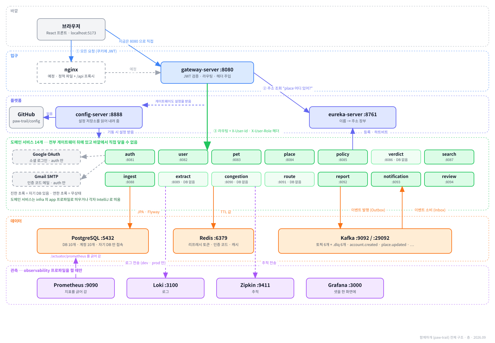
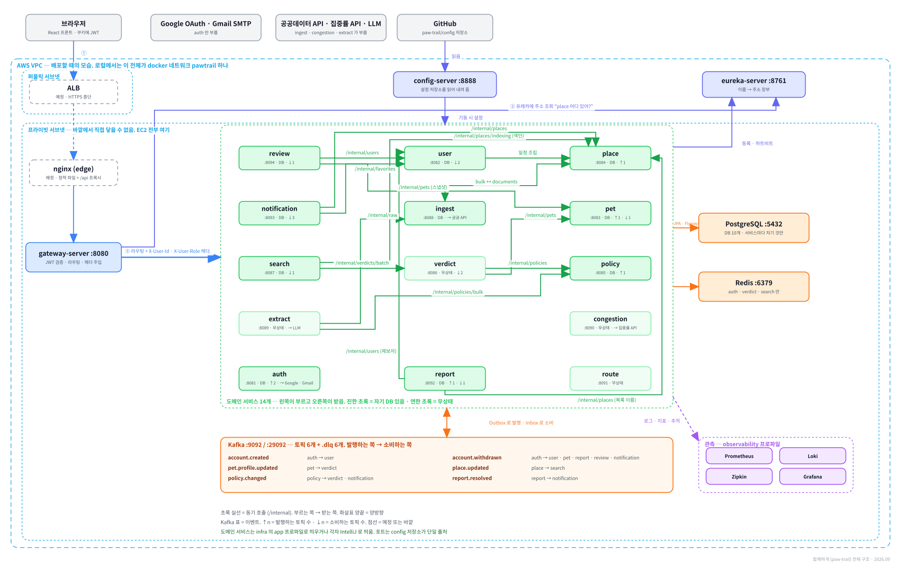
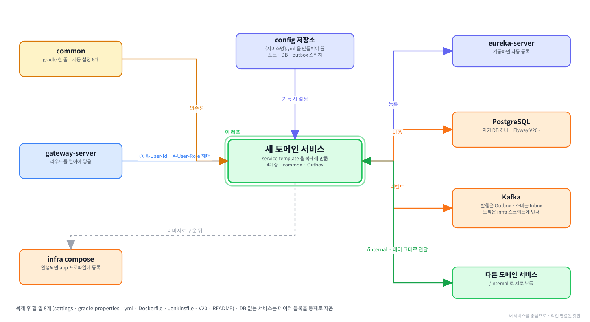

# 함께하개 서비스 템플릿

**함께하개**는 반려동물과 함께 갈 수 있는 장소를 찾고, 우리 아이가 그곳에
들어갈 수 있는지 판정해 주는 서비스입니다.

백엔드는 **작은 서버 14개**로 나뉘어 있고, 각각이 **별도의 GitHub 저장소**입니다.
이 저장소는 그 14개를 만들 때 **복제해서 시작하는 틀**입니다.

---

**먼저 전체 그림을 보고, 이 레포가 그 안 어디에 있는지 본 뒤 읽습니다.**

**① 전체 구조 — 층으로 본 것.** 위에서 아래로 요청이 내려가고, 어느 층에 무엇이 있는지.



**② 전체 구조 — 서비스끼리 무엇을 주고받는지.** 초록 실선이 `/internal` 호출, Kafka 표가 이벤트, 하늘색 점선이 VPC 경계.



**③ 이 레포를 중심으로.** 직접 연결된 것만 남긴 그림.



<br><br>

---

## 본문 시작

```
paw-trail (GitHub 조직)
│
├── service-template        이 저장소. 도메인 서비스를 만들 때 복제함
│
├── 도메인 서비스 14개         auth · user · pet · place · policy · search
│                           ingest · extract · report · review · notification
│                           verdict · congestion · route
│                           → 전부 service-template 을 복제해서 만듦
│
├── 플랫폼 3개               gateway-server   요청을 받아 어느 서비스로 보낼지 정함
│                           eureka-server    어느 서비스가 어디 떠 있는지 알고 있음
│                           config-server    설정 파일을 서비스들에게 내려 줌
│
├── common                  14개가 함께 쓰는 자바 라이브러리 (jar 로 배포)
├── config                  설정 파일 저장소 (포트 · DB 주소 · 라우트)
└── infra                   Docker Compose (Kafka · Redis · PostgreSQL · 관측)
```

---

**실행하면 이렇게 돕니다.** 위 그림을 글자로 줄인 것입니다.

```
         [ config 저장소 ]  ──▶  [ 설정 서버 ]
                                      │
                                      │  기동할 때 포트·DB 주소·계정을 내려 줌
                                      ▼
브라우저  ──▶  게이트웨이  ──▶  도메인 서비스  ──▶  자기 DB
                   │                  │
                   │                  ├──▶  카프카  ──▶  다른 서비스가 받음
                   │                  │
                   │                  └──▶  유레카에 "나 여기 있다" 고 등록
                   │
                   └──▶  유레카에게 "auth 어디 있어?" 하고 물어봄
```

> 이 그림의 각 화살표가 **이 문서의 장 하나씩**에 해당합니다.
> 설정 서버는 6장, 게이트웨이와 유레카는 2장, 카프카는 7장, 자기 DB 는 4장입니다.

---

**이 문서가 하는 일**

서비스 저장소를 새로 만든 뒤 **무엇을 어떻게 세팅하고, 각 폴더와 파일이 무슨
일을 하는지**를 정리한 개발 지침입니다.

**개발하는 동안 계속 참고합니다.** 구현이 끝나면 이 내용을 지우고
그 서비스를 설명하는 README 로 바꿉니다.

<br><br>

---

## 0. 이 문서를 읽는 순서

문서가 길지만 **처음부터 끝까지 읽을 필요는 없습니다.**
지금 무엇을 하려는지에 따라 볼 곳이 다릅니다.

| 지금 하려는 일 | 볼 곳 |
|---|---|
| JDK · Docker · IntelliJ 부터 깔아야 한다 | [3장](#3-개발-환경-준비) |
| 방금 저장소를 만들었고 코드를 처음 연다 | [1장](#1-복제-후-최초-설정) → [2장](#2-다른-저장소에-등록하기) |
| 서비스를 띄워보려 한다 | [4장](#4-서비스를-띄우기) |
| 개발이 끝나 팀원에게 넘기려 한다 | [5장](#5-로컬-개발이-끝나면) |
| 설정값을 어디에 둘지 모르겠다 | [6장](#6-설정값을-어디에-두는가) |
| 공통 모듈이 무엇인지 모르겠다 | [7장](#7-공통-모듈) |
| 코드를 어느 폴더에 둘지 모르겠다 | [8장](#8-코드를-어디에-두는가) |
| 기동이 안 되거나 IntelliJ 가 빨간 줄을 긋는다 | [3-4](#3-4-intellij-가-gradle-프로젝트로-인식하지-못할-때) · [3-5](#3-5-intellij-가-표시하는-정상적인-경고) · [3-6](#3-6-자주-겪는-것들) · [10장](#10-spring-boot-4-에서-달라진-것) |
| DB 를 쓰지 않는 서비스를 맡았다 | [1-5](#1-5-db-를-사용하지-않는-서비스라면) → [8-8](#8-8-db-가-없는-서비스-verdict) |
| 모르는 말이 나온다 | [11장](#11-용어) |

---

**처음 읽는다면 순서대로 읽으면 됩니다.**

```
1장  저장소를 내 서비스로 바꾸고
2장  config 와 infra 에 등록하고
4장  띄워 보고
8장  코드를 어디에 만들지 익힘
```

> **개발 환경(JDK · Docker · IntelliJ)이 아직 없다면 3장을 먼저 봅니다.**
> 이미 다른 서비스를 만들어 본 사람은 건너뜁니다.

> 6장(설정)과 7장(공통 모듈)은 **막혔을 때 찾아보는 장**입니다.
> 처음부터 읽지 않아도 됩니다.

<br><br>

---

### 먼저 알아두면 좋은 것 4가지

**① 서비스마다 DB 가 따로 있고 남의 DB 에는 접속할 수 없습니다.**

PostgreSQL **프로그램 하나(인스턴스)** 안에 **서비스별 데이터베이스와 전용
계정이 나뉘어** 있습니다.

```
PostgreSQL 인스턴스 하나
│
├── auth_db     ◀──  auth_svc 계정만 들어올 수 있음
├── user_db     ◀──  user_svc 계정만
├── pet_db      ◀──  pet_svc 계정만
└── ...
```

> `auth_svc` 로 `user_db` 에 접속하면 **권한이 없어 거부됩니다.**

다른 서비스의 데이터가 필요하면 **그 서비스의 API 를 호출하거나 이벤트를
받습니다.**

---

**② 인증은 게이트웨이가 끝냅니다.**

각 서비스는 **JWT 를 직접 다루지 않습니다.**

```
브라우저  ──▶  게이트웨이  ──▶  내 서비스
                   │                │
                   │                └──▶  공통 모듈의 필터가 헤더를 읽어
                   │                      "누가 보냈는지" 를 채움
                   │
                   └──▶  JWT 토큰을 검증하고
                         X-User-Id · X-User-Role 헤더를 붙여서 넘김
```

> **게이트웨이는 헤더를 넣기 전에 바깥에서 들어온 같은 이름의 헤더를 먼저
> 지웁니다.** 그래야 이 헤더를 그대로 믿는 것이 성립합니다.

---

**③ 이벤트는 카프카로 바로 보내지 않습니다.**

자기 DB 의 `outbox` 테이블에 먼저 저장하고, **커밋된 뒤에** 별도 스레드가
발행합니다.

```
내 서비스  ──▶  자기 DB 의 outbox 테이블에 저장  ──▶  커밋
                                                       │
                                                       └──▶  별도 스레드가 카프카로 보냄
```

| 이렇게 하면 | 바로 카프카로 보내면 |
|---|---|
| 저장과 이벤트가 **한 트랜잭션** | 저장은 됐는데 카프카가 죽어 이벤트만 못 나가는 일이 생김 |
| 발행하는 쪽은 메서드 한 줄 | 카프카 호출 코드를 서비스마다 씀 |

> **다만 발행이 끝내 실패한 건을 사람이 다시 내보내는 관리자 API 는 각 서비스가
> 직접 만들어야 합니다.**
> [7-7](#7-7-이벤트를-발행하는-서비스는-관리자-재발행-api-를-만듭니다) 참고.

---

**④ 설정이 이 저장소 안에 없습니다.**

`src/main/resources/application.yml` 에는 **세 줄뿐입니다.**

```yaml
spring:
  application:
    name: place-service
  config:
    import: "optional:configserver:http://${CONFIG_HOST:localhost}:8888"
  profiles:
    default: local
```

포트·DB 주소·계정은 `paw-trail/config` 저장소에 있고 **기동할 때 설정 서버가
읽어 내려 줍니다.**

> 그래서 복제한 뒤에 **그 저장소에도 파일을 하나 만들어야 합니다.**
> [2장](#2-다른-저장소에-등록하기) 참고.

<br><br>

---

## 기술 스택

| 항목 | 버전 | 무엇을 하나 |
|---|---|---|
| Java | 21 | 언어 |
| Spring Boot | 4.1.1 | 웹 서버 · DB 접근 · 설정을 한 벌로 묶어 줌 |
| Spring Cloud | 2025.1.3 (Oakwood) | 게이트웨이 · 유레카 · 설정 서버 |
| Gradle | 9.5.1 (래퍼로 고정) | 빌드 도구. 의존성을 받고 jar 를 만듦 |
| PostgreSQL | 17 + PostGIS 3.5 | 데이터베이스. PostGIS 는 좌표 계산 |
| QueryDSL | `io.github.openfeign.querydsl` 7.6 | 조건이 복잡한 조회를 자바 코드로 씀 |
| springdoc-openapi | 3.1.0 | API 문서를 자동으로 만듦 (Swagger UI) |

---

**Spring Boot 3.x 계열은 쓰지 않습니다.**

2026년 6월 30일에 오픈소스 지원이 끝났습니다.
4 에서 달라진 것은 [10장](#10-spring-boot-4-에서-달라진-것) 에 있습니다.

---

**QueryDSL 은 본가가 아니라 OpenFeign 포크를 씁니다.**

```
com.querydsl                      본가 — 오래 멈춰 있음
io.github.openfeign.querydsl      우리가 쓰는 것
```

> **`groupId` 만 다르고 패키지명은 `com.querydsl` 그대로**이므로
> 소스 코드는 일반적인 QueryDSL 예제와 똑같이 씁니다.

---

**Gradle 은 래퍼로 고정되어 있습니다.**

저장소 안의 `gradlew` (macOS) · `gradlew.bat` (Windows) 가 **정해진 버전의
Gradle 을 알아서 내려받아 실행**합니다.

```
./gradlew build         ✅  저장소가 정한 9.5.1 로 돎
gradle build            ⛔  각자 설치한 버전으로 돎 — 사람마다 결과가 갈림
```

**그래서 Gradle 을 따로 설치할 필요가 없고, `gradle` 명령을 직접 쓰지 않습니다.**

<br><br>

---

## 1. 복제 후 최초 설정

새 서비스 저장소를 만든 뒤 **한 번만** 하는 작업입니다.

이 장은 **이 저장소 안에서 고치는 것만** 다룹니다. config 저장소와 게이트웨이에
등록하는 일은 [2장](#2-다른-저장소에-등록하기) 입니다.

<br><br>

---

### 1-0. 저장소 만들기

GitHub 에서 `paw-trail/service-template` 페이지를 엽니다.

```
① 오른쪽 위 초록색  Use this template  버튼  →  Create a new repository

② Owner          paw-trail          조직을 고릅니다. 개인 계정이 아닙니다
   Repository     place-service      저장소명 규칙은 아래 참고
   Public         선택

③ Create repository
```

> ⛔**`Public` 이어야 합니다.** paw-trail 의 저장소는 전부 공개입니다.
> 비공개로 만들면 **CodeRabbit 이 Free 요금제로 떨어져 PR 요약만 올라오고
> 코드 리뷰 코멘트가 아예 달리지 않습니다.** `.coderabbit.yaml` 은 그대로인데
> 리뷰만 안 오므로 설정 파일을 아무리 들여다봐도 원인이 드러나지 않습니다.
>
> 저장소 공개 여부와 **컨테이너 이미지 공개 여부는 별개입니다.**
> 이미지는 처음 올릴 때 비공개이므로 [5-3](#5-3-이미지-빌드와-push) 에서 따로 바꿉니다.

> **Use this template** 은 fork 와 다릅니다. fork 는 원본과 연결이 남지만
> 이것은 **파일만 복사하고 이력 없이 새로 시작**합니다.
> 그래서 이 저장소를 고쳐도 이미 만든 서비스에는 반영되지 않습니다.

---

**저장소 이름은 `<도메인>-service` 입니다.**

| 도메인 | 저장소명 | 자바 패키지 |
|---|---|---|
| 장소 | `place-service` | `com.pawtrail.place` |
| 반려동물 | `pet-service` | `com.pawtrail.pet` |
| 판정 | `verdict-service` | `com.pawtrail.verdict` |

> 이름이 두 종류인 이유는 [1-4](#1-4-직접-고쳐야-하는-파일) 에 있습니다.

---

**복제합니다.**

**macOS**

```bash
cd ~/Tour_Prj
git clone https://github.com/paw-trail/place-service.git
cd place-service
```

**Windows (Git Bash)**

```bash
cd /c/Tour_Prj
git clone https://github.com/paw-trail/place-service.git
cd place-service
```

> 이 폴더가 **저장소 루트**입니다. 이 문서에서 "루트에서 실행" 은
> 여기서 실행하라는 뜻입니다. `build.gradle` 이 보이면 맞습니다.

<br><br>

---

### 1-1. 복제하고 나서 할 일 한눈에

| 순서 | 하는 일 | 걸리는 시간 | 건너뛰면 |
|---|---|---|---|
| [1-0](#1-0-저장소-만들기) | 저장소 만들고 복제 | 3분 | — |
| [1-2](#1-2-패키지-경로-치환) | 패키지 경로 치환 | 5분 | 클래스 이름이 `Template` 인 채로 남습니다 |
| [1-4](#1-4-직접-고쳐야-하는-파일) | 파일 8개 고치기 | 20분 | 서비스 이름이 `template-service` 로 뜹니다 |
| [1-5](#1-5-db-를-사용하지-않는-서비스라면) | DB 없는 서비스라면 파일 제거 | 5분 | JPA 가 필수가 되어 기동에 실패합니다 |
| [1-6](#1-6-빌드가-되는지-확인합니다) | 빌드 확인 | 3분 | — |

> **1장만 끝내면 빌드는 통과하지만 서비스는 뜨지 않습니다.**
> 설정이 내려오지 않고 게이트웨이가 이 서비스를 모르기 때문입니다.
> [2장](#2-다른-저장소에-등록하기) 을 이어서 합니다.

> JDK·Docker·IntelliJ 가 아직 없다면 [3장](#3-개발-환경-준비) 을 먼저 봅니다.

<br><br>

---

### 1-2. 패키지 경로 치환

자바에서 **패키지**는 소스 파일이 들어 있는 폴더 경로이자, 각 파일 첫 줄의
`package com.pawtrail.template;` 선언입니다. **둘이 같아야 컴파일됩니다.**

템플릿은 `com.pawtrail.template` 으로 되어 있습니다. 이것을 서비스 이름으로 바꿉니다.

| | before | after |
|---|---|---|
| 폴더 | `src/main/java/com/pawtrail/template/` | `src/main/java/com/pawtrail/place/` |
| 선언 | `package com.pawtrail.template;` | `package com.pawtrail.place;` |
| 앱 클래스 | `TemplateApplication.java` | `PlaceApplication.java` |
| 테스트 | `TemplateApplicationTests.java` | `PlaceApplicationTests.java` |

```
before                                    after
src/main/java/com/pawtrail/               src/main/java/com/pawtrail/
└── template/                             └── place/
    ├── TemplateApplication.java              ├── PlaceApplication.java
    ├── presentation/                         ├── presentation/
    ├── application/                          ├── application/
    ├── domain/                               ├── domain/
    └── infrastructure/                       └── infrastructure/
```

> 폴더 이름과 파일 안의 선언을 **둘 다** 바꿔야 합니다. 아래 스크립트가
> 그것을 한 번에 합니다.

> **IntelliJ 를 열기 전에 터미널에서 먼저 합니다.**
> 연 뒤에 바꾸면 프로젝트 정보가 옛 이름으로 남아 모듈을 다시 인식시켜야 합니다.
> 이미 열었다면 [1-3](#1-3-이미-intellij-로-연-뒤에-바꿨다면) 을 봅니다.

아래는 `place` 서비스를 만드는 예시입니다. **맨 위 두 줄만 바꾸고
레포 루트에서 나머지를 그대로 실행합니다.**

---

#### ① 어느 셸에서 실행하나

| OS | 쓰는 것 | 비고 |
|---|---|---|
| macOS | 터미널 (zsh) | |
| Windows | **Git Bash** | 권장. Git for Windows 에 함께 들어옵니다 |
| Windows | PowerShell 7 | Git Bash 를 쓸 수 없을 때만 |

> Windows 에서 Git Bash 를 권하는 이유는 **명령이 macOS 와 같아 문서가 한 벌로
> 유지되기 때문**입니다. PowerShell 은 인코딩 사고가 날 자리가 있습니다(아래 ④).

---

#### ② 치환 실행

**macOS**

```bash
NEW=place        # 소문자 서비스명
CLASS=Place      # 첫 글자만 대문자

# 패키지 폴더 이름 변경 (main, test 양쪽)
mv src/main/java/com/pawtrail/template src/main/java/com/pawtrail/$NEW
mv src/test/java/com/pawtrail/template src/test/java/com/pawtrail/$NEW

# 소스 안의 package 선언과 import 치환
grep -rl "com.pawtrail.template" src | xargs sed -i '' "s/com\.pawtrail\.template/com.pawtrail.$NEW/g"

# 클래스 파일 이름 변경
mv src/main/java/com/pawtrail/$NEW/TemplateApplication.java \
   src/main/java/com/pawtrail/$NEW/${CLASS}Application.java
mv src/test/java/com/pawtrail/$NEW/TemplateApplicationTests.java \
   src/test/java/com/pawtrail/$NEW/${CLASS}ApplicationTests.java

# 소스 안의 클래스명 치환
grep -rl "TemplateApplication" src | xargs sed -i '' "s/TemplateApplication/${CLASS}Application/g"
```

**Windows (Git Bash)**

```bash
NEW=place        # 소문자 서비스명
CLASS=Place      # 첫 글자만 대문자

# 패키지 폴더 이름 변경 (main, test 양쪽)
mv src/main/java/com/pawtrail/template src/main/java/com/pawtrail/$NEW
mv src/test/java/com/pawtrail/template src/test/java/com/pawtrail/$NEW

# 소스 안의 package 선언과 import 치환
grep -rl "com.pawtrail.template" src | xargs sed -i "s/com\.pawtrail\.template/com.pawtrail.$NEW/g"

# 클래스 파일 이름 변경
mv src/main/java/com/pawtrail/$NEW/TemplateApplication.java \
   src/main/java/com/pawtrail/$NEW/${CLASS}Application.java
mv src/test/java/com/pawtrail/$NEW/TemplateApplicationTests.java \
   src/test/java/com/pawtrail/$NEW/${CLASS}ApplicationTests.java

# 소스 안의 클래스명 치환
grep -rl "TemplateApplication" src | xargs sed -i "s/TemplateApplication/${CLASS}Application/g"
```

> 두 명령의 차이는 `sed -i` 뒤에 **빈 인자가 있는지 하나뿐**입니다.
> macOS 에 기본으로 깔린 `sed` 가 `-i` 뒤에 백업 확장자를 요구하기 때문입니다.

---

#### ③ PowerShell 로 해야 한다면

> **PowerShell 7 이상에서만 실행합니다.** 5.1 로 돌리면 파일이 실제로 깨집니다.
> 아래 ④를 먼저 읽습니다.

시작 메뉴에서 이름이 갈립니다.

```
PowerShell            검은 아이콘, 7 이상    ← 이것
Windows PowerShell    파란 아이콘, 5.1
```

버전 확인과 설치입니다.

```powershell
$PSVersionTable.PSVersion

# 7 이 없으면
winget install --id Microsoft.PowerShell --source winget
```

치환입니다.

```powershell
$NEW   = "place"    # 소문자 서비스명
$CLASS = "Place"    # 첫 글자만 대문자

# 패키지 폴더 이름 변경 (main, test 양쪽)
Rename-Item "src\main\java\com\pawtrail\template" $NEW
Rename-Item "src\test\java\com\pawtrail\template" $NEW

# 소스 안의 package 선언과 클래스명 치환
Get-ChildItem -Path src -Recurse -File | ForEach-Object {
    (Get-Content $_.FullName -Raw) `
        -replace "com\.pawtrail\.template", "com.pawtrail.$NEW" `
        -replace "TemplateApplication", "${CLASS}Application" |
        Set-Content $_.FullName -NoNewline -Encoding utf8
}

# 클래스 파일 이름 변경
Rename-Item "src\main\java\com\pawtrail\$NEW\TemplateApplication.java" "${CLASS}Application.java"
Rename-Item "src\test\java\com\pawtrail\$NEW\TemplateApplicationTests.java" "${CLASS}ApplicationTests.java"
```

---

#### ④ 5.1 로 실행하면 파일이 깨집니다

> macOS 에는 해당하지 않습니다. Git Bash 를 쓰는 경우에도 해당하지 않습니다.

경고가 아니라 **실제로 손상됩니다.** 위 스크립트의 `Set-Content -Encoding utf8` 이
5.1 에서는 다르게 동작합니다.

| | PowerShell 7 | Windows PowerShell 5.1 |
|---|---|---|
| BOM | 안 붙음 | **모든 파일에 붙음** |
| 한글 | 그대로 | **표현 못 하는 글자를 물음표로 바꿔 저장** |

되돌릴 수 없습니다.

**증상이 헷갈립니다.** 한글이 깨지고 줄이 붙어 보이는데, 그것만으로는
**파일이 손상된 것인지 콘솔이 못 읽는 것인지 구분되지 않습니다.**
콘솔 문제라면 파일은 멀쩡하므로 판별이 필요합니다.

```powershell
Format-Hex -Path src\test\resources\application.yml -Count 48
```

앞에 `EF BB BF` 가 있거나 본문에 `3F` 가 섞여 있으면 **파일이 손상된 것입니다.**
`3F` 는 물음표의 코드값이며, 한글이 있어야 할 자리에 그것이 있다는 뜻입니다.

> 바이트를 UTF-8 로 읽어 보는 방식으로는 이 손상을 못 찾습니다.
> BOM 도 물음표도 유효한 UTF-8 이라 오류가 나지 않습니다.

**손상되었다면 다시 복제하는 편이 빠릅니다.** 어느 파일이 깨졌는지 하나씩 찾는 것보다
확실하고, BOM 은 어차피 전 파일에 붙어 있습니다.

---

#### ⑤ 제대로 바뀌었는지 확인

**파일 내용에 옛 이름이 남았는지**

**macOS · Git Bash**

```bash
grep -r "com.pawtrail.template\|TemplateApplication" src
```

**PowerShell**

```powershell
Select-String -Path src -Pattern "com\.pawtrail\.template|TemplateApplication" -Recurse
```

> 아무것도 출력되지 않으면 성공입니다.

**파일 이름에 옛 이름이 남았는지**

**macOS · Git Bash**

```bash
find src -name "Template*"
```

**PowerShell**

```powershell
Get-ChildItem -Path src -Recurse -Filter "Template*"
```

> 이것도 함께 봐야 합니다. 위 검사는 파일 **내용**만 봅니다.
> 클래스 이름은 바뀌었는데 파일 이름이 그대로면, 테스트 클래스는 `public` 이 아니라
> **컴파일은 통과하고 이름만 어긋난 채 남습니다.**

<br><br>

---

### 1-3. 이미 IntelliJ 로 연 뒤에 바꿨다면

프로젝트 정보가 옛 이름으로 남아 모듈을 제대로 인식하지 못합니다.

**macOS · Windows 공통**

```
① IntelliJ 를 닫습니다
② 프로젝트 루트의 .idea 폴더와 *.iml 파일을 지웁니다
③ 다시 엽니다
```

> 소스 코드에는 영향이 없습니다. 프로젝트를 다시 열면 처음부터 인식합니다.

<br><br>

---

### 1-4. 직접 고쳐야 하는 파일

치환 스크립트가 건드리지 않는 파일들입니다. **아래 예시는 모두 `place-service` 를
만드는 경우입니다.**

---

**이름이 두 종류입니다.** 자바 패키지에는 하이픈을 쓸 수 없어
`com.pawtrail.place-service` 가 불가능하므로, 자리에 따라 값이 갈립니다.

| 자리 | 값 |
|---|---|
| 저장소명 | `place-service` |
| `settings.gradle` 의 `rootProject.name` | `place-service` |
| `spring.application.name` | `place-service` |
| `Jenkinsfile` 의 `serviceName` (이미지명) | `place-service` |
| config 저장소의 파일명 | `place-service.yml` |
| 유레카 등록 이름 | `place-service` |
| 자바 패키지 | `com.pawtrail.place` |
| 앱 클래스 | `PlaceApplication` |

> **규칙은 하나입니다.**
> 패키지와 클래스 이름은 저장소명에서 `-service` 를 떼고 하이픈을 지운 것입니다.

`-server` 는 떼지 않습니다. `gateway-server` 는 그 물건의 이름 자체라
`com.pawtrail.gatewayserver` 가 됩니다. `-service` 는 "도메인 서비스" 라는
분류 꼬리표라 패키지 안에서는 의미가 없습니다.

---

**앞의 여섯 줄은 전부 저장소 바깥과 맺는 계약입니다.**
한 글자만 어긋나도 다른 시스템이 이 서비스를 찾지 못합니다.

```
place-service
  ├─ 이미지 태그           ghcr.io/paw-trail/place-service:latest
  ├─ 설정 파일 조회        config 저장소의 place-service.yml
  ├─ 유레카 등록           게이트웨이가 lb://place-service 로 찾음
  ├─ Loki 라벨             로그를 서비스별로 거를 때 씀
  └─ Zipkin 서비스 이름    추적 화면에 뜨는 이름
```

**어긋났을 때 증상이 조용합니다.** 설정 파일을 못 찾으면 기본값으로 뜨고,
유레카 이름이 다르면 게이트웨이가 404 를 냅니다. 어느 쪽도 이 서비스 로그에는
아무것도 남지 않습니다.

반대로 **자바 패키지는 이 저장소 안에서만 쓰이므로** 배포에 관여하지 않습니다.

---

**고쳐야 하는 파일은 8개입니다.**

| 파일 | 무엇을 | 안 고치면 |
|---|---|---|
| [1-4-1](#1-4-1-settingsgradle) `settings.gradle` | 프로젝트 이름 | jar 이름이 `template` 이라 Dockerfile 이 못 찾습니다 |
| [1-4-2](#1-4-2-gradleproperties) `gradle.properties` | 공통 모듈 버전 | 옛 버전으로 빌드됩니다 |
| [1-4-3](#1-4-3-srcmainresourcesapplicationyml) `src/main/resources/application.yml` | 서비스 이름 | 설정을 못 받고 유레카에 `template-service` 로 등록됩니다 |
| [1-4-4](#1-4-4-srctestresourcesapplicationyml) `src/test/resources/application.yml` | 서비스 이름 | **빌드가 통과해 안 드러납니다** |
| [1-4-5](#1-4-5-dbmigrationservicev20__sql) `db/migration/service/V20__*.sql` | 파일명과 내용 | 같은 버전이 둘이 되어 기동에 실패합니다 |
| [1-4-6](#1-4-6-dockerfile) `Dockerfile` | 없음 (확인만) | — |
| [1-4-7](#1-4-7-jenkinsfile) `Jenkinsfile` | 서비스명과 배포 노드 | 배포할 때 드러납니다 |
| [1-4-8](#1-4-8-readmemd) `README.md` | 전체 | 다음 사람이 이 서비스를 모릅니다 |
| [1-4-9](#1-4-9-고치지-않는-파일들) 그 밖 | **고치지 않습니다** | — |

---

**저장소 안에서 이 자리에 있습니다.**

```
place-service/                              ← 저장소 루트
│
├── settings.gradle                         ① 프로젝트 이름
├── gradle.properties                       ② 공통 모듈 버전
├── build.gradle                              (DB 없는 서비스만 고침 → 1-5)
├── Dockerfile                              ⑥ 확인만
├── Jenkinsfile                             ⑦ 서비스명 · 배포 노드
├── README.md                               ⑧ 지금은 안 고침
│
├── .env.example                              복사해서 .env 를 만듦 → 6-3
├── .github/                                  이슈 · PR 템플릿 → 1-4-9
├── .coderabbit.yaml                          코드 리뷰 봇 설정 → 1-4-9
├── .gitattributes  .editorconfig             줄바꿈 · 인코딩 → 3-3
├── .gitignore
├── gradlew  gradlew.bat  gradle/             Gradle 래퍼
│
└── src/
    ├── main/
    │   ├── java/com/pawtrail/place/          (1-2 에서 치환했음)
    │   └── resources/
    │       ├── application.yml             ③ 서비스 이름
    │       └── db/migration/service/
    │           └── V20__template.sql       ⑤ 이름 바꾸고 내용 채움
    └── test/
        └── resources/
            └── application.yml             ④ 서비스 이름 — 놓치기 쉬움
```

> `application.yml` 이 **두 개**입니다. `main` 과 `test` 아래에 각각 있고
> **둘 다 고쳐야 합니다.**

<br><br>

---

### 1-4-1. settings.gradle

**저장소명을 그대로 씁니다.** 이 값이 빌드 산출물 jar 의 이름이 되므로
Dockerfile 과 연결됩니다.

**before**

```groovy
rootProject.name = 'template'
```

**after**

```groovy
rootProject.name = 'place-service'
```

> 이 값이 `build/libs/place-service.jar` 를 만듭니다.
> Dockerfile 이 `build/libs/*.jar` 로 받으므로 이름 자체를 맞출 필요는 없지만,
> 컨테이너 안에서 파일명이 그대로 보이므로 저장소명과 같게 둡니다.

<br><br>

---

### 1-4-2. gradle.properties

공통 모듈 버전을 최신으로 맞춥니다.

```properties
commonVersion=0.0.14
```

> **템플릿에 적힌 값이 최신이 아닐 수 있습니다.**
> 조직의 Packages 페이지에서 확인한 뒤 다르면 고칩니다.

이 값만 바꾸고 다시 빌드하면 새 버전이 내려옵니다.
버전을 올리는 절차는 [7-2](#7-2-버전을-올리는-절차) 에 있습니다.

같은 파일에 다른 값도 함께 있습니다. **이것들은 고치지 않습니다.**

```properties
# 라이브러리 버전 — 전 서비스가 같은 값을 씁니다
querydslVersion=7.6
springdocVersion=3.1.0
testcontainersVersion=2.0.5

# 빌드 설정
org.gradle.caching=true
org.gradle.parallel=true
```

> QueryDSL 은 버전이 갈리면 **생성된 Q 클래스가 서로 맞물리지 않습니다.**
>
> `testcontainersVersion` 은 **전이로 들어오는 코어 버전과 같아야 합니다.**
> 어긋나면 코어와 모듈이 다른 버전으로 섞입니다. [4-7](#4-7-빌드할-때-뜨는-데이터베이스) 참고.

<br><br>

---

### 1-4-3. src/main/resources/application.yml

**고칠 것은 서비스 이름 한 줄뿐입니다.** 포트·데이터베이스·주소는 모두
`paw-trail/config` 저장소에 있으며 설정 서버가 내려 줍니다.

**before**

```yaml
spring:
  application:
    name: template-service
  config:
    import: "optional:configserver:http://${CONFIG_HOST:localhost}:8888"
  profiles:
    default: local
```

**after**

```yaml
spring:
  application:
    name: place-service
  config:
    import: "optional:configserver:http://${CONFIG_HOST:localhost}:8888"
  profiles:
    default: local
```

---

**세 줄이 각각 하는 일입니다.**

| 키 | 하는 일 |
|---|---|
| `spring.application.name` | 설정 서버에서 **이 이름의 파일을 찾습니다** |
| `spring.config.import` | 설정을 받아 올 주소입니다 |
| `spring.profiles.default` | 아무도 정해 주지 않으면 `local` 로 봅니다 |

---

**`optional:` 이 붙어 있어 설정 서버가 떠 있지 않아도 기동됩니다.**

서비스 하나만 띄워 확인하는 일이 잦은데, 이것이 없으면 **매번 설정 서버를 함께
띄워야 하고 테스트도 실패합니다.**

> 다만 **데이터베이스 주소가 안 내려오므로 실제 기동은 설정 서버가 떠 있어야 합니다.**
> `optional:` 이 막아 주는 것은 "설정 서버가 없다" 는 오류 하나뿐입니다.

---

**`${CONFIG_HOST:localhost}` 에 기본값을 붙이는 것은 의도입니다.**
로컬에서는 언제나 `localhost:8888` 이므로 기본값이 정답입니다.
없으면 사람마다 IntelliJ 실행 구성에 환경변수를 넣어야 합니다.

컨테이너와 AWS 에서만 `CONFIG_HOST` 를 지정해 덮어씁니다.

> **다른 값에는 기본값을 붙이지 않습니다.** `DB_HOST` 에 `localhost` 를 박아 두면
> 환경변수를 빠뜨린 사람이 조용히 자기 컴퓨터의 DB 에 붙습니다. 그편이 더 나쁩니다.

---

**`default` 이지 `active` 가 아닙니다.**

| | 값을 지정했을 때 | 지정하지 않았을 때 |
|---|---|---|
| `active` | 그 값 | 없음 |
| `default` | **지정한 쪽이 이김** | `local` |

`default` 라서 컨테이너에서 `SPRING_PROFILES_ACTIVE=dev` 를 주면 그쪽이 이깁니다.
IntelliJ 에서는 비워 두면 `local` 로 돕니다.

프로파일에 따라 무엇이 갈리는지는 [4-3](#4-3-intellij-로-이-서비스-띄우기) 에 있습니다.

<br><br>

---

### 1-4-4. src/test/resources/application.yml

**이 파일도 서비스 이름을 고쳐야 합니다.**

```yaml
spring:
  application:
    name: place-service     # 바꾸기 전에는 template-service
```

---

**안 고쳐도 빌드가 통과합니다.** 그래서 더 위험합니다.

```
테스트가 template-service 라는 이름으로 돎
  → 로그의 appName 이 어긋남
  → 나중에 통합 테스트를 붙이면 유레카 등록 이름까지 어긋남
  → 그때는 원인이 이 파일이라는 것이 드러나지 않음
```

> 위 파일과 이름이 같아 놓치기 쉬운 자리입니다.
> **파일 이름으로 찾지 말고 경로로 확인합니다.**

---

**이 파일이 따로 있는 이유는 테스트가 설정 서버를 끄기 때문입니다.**
그래서 여기 적힌 값으로만 돕니다.

```yaml
spring:
  cloud:
    config:
      enabled: false
```

이 파일은 `src/main/resources/application.yml` 을 **덮어쓰는 것이 아니라 통째로 가립니다.**
클래스패스에서 `application.yml` 을 하나만 찾는데 Gradle 테스트에서는
`build/resources/test` 가 앞서기 때문입니다.

> 따라서 main 쪽에 있던 값도 **여기 필요하면 다시 적어야 합니다.**

자세한 내용은 [4-7](#4-7-빌드할-때-뜨는-데이터베이스) 에 있습니다.

<br><br>

---

### 1-4-5. db/migration/service/V20__*.sql

템플릿의 예시 스크립트를 **이 서비스의 것으로 바꿉니다.**

```
before   db/migration/service/V20__template.sql
after    db/migration/service/V20__place.sql
```

> **이름을 바꾸는 것이지 새로 만드는 것이 아닙니다.**

---

**`V20__template.sql` 을 반드시 지웁니다.**

새 파일만 만들고 옛 파일을 남기면 같은 번호가 둘이 되어 기동이 실패합니다.

```
Found more than one migration with version 20
```

메시지가 원인을 알려주기는 합니다. 다만 **새 파일을 만드는 흐름으로 작업하면
옛 파일을 지웠는지 확인하지 않게 됩니다.**

---

**번호는 V20 부터입니다.**

```
V1  ~ V19    공통 모듈 대역 (outbox · processed_event)
V20 ~        이 서비스
```

Flyway 가 무엇이고 스크립트를 어떻게 추가하는지는
[4-8](#4-8-스키마는-flyway-로-관리합니다) 에 있습니다.

---

**스크립트 모양입니다.**

```sql
-- V20__place.sql
CREATE TABLE place
(
    id         uuid         PRIMARY KEY,
    name       VARCHAR(200) NOT NULL,
    -- ... 이 서비스의 컬럼

    created_at TIMESTAMP    NOT NULL,
    created_by VARCHAR(45)  NOT NULL,
    updated_at TIMESTAMP    NOT NULL,
    updated_by VARCHAR(45)  NOT NULL,
    deleted_at TIMESTAMP,
    deleted_by VARCHAR(45)
);
```

---

**PK 는 모든 테이블이 uuid 이며 기본값을 지정하지 않습니다.** DB 함수로 만들지 않고 애플리케이션이 넣기 때문입니다.

```java
@Id
@UuidGenerator(style = UuidGenerator.Style.VERSION_7)
@Column(columnDefinition = "uuid")
private UUID id;
```

순차 숫자를 쓰지 않는 이유는 둘입니다.

```
서비스가 여러 개라 place_id=42 와 pet_id=42 가 구분되지 않음
순차 ID 가 URL 에 노출되면 데이터 규모가 드러남
```

> 버전 7 을 쓰는 것은 **시각 순으로 정렬되기 때문**입니다.
> 완전 난수인 버전 4 는 인덱스에 흩어져 들어가 삽입이 느려집니다.

---

**마지막 6개 컬럼은 모든 테이블이 갖습니다.** 공통 모듈의 `BaseEntity` 와 짝을 이룹니다. **빠뜨리면 기동 시 검증에 실패합니다.**

| 컬럼 | NULL | 채우는 시점 |
|---|---|---|
| `created_at` · `created_by` | 불가 | JPA Auditing 이 항상 채움 |
| `updated_at` · `updated_by` | 불가 | JPA Auditing 이 항상 채움 |
| `deleted_at` · `deleted_by` | 허용 | 소프트 딜리트 할 때만 |

```
Schema-validation: missing column [created_at] in table [place]
```

> `spring.jpa.hibernate.ddl-auto: validate` 가 잡아 주는 것입니다.
> 이 검사가 있어서 배포 전에 드러납니다.

<br><br>

---

### 1-4-6. Dockerfile

**대부분 고칠 것이 없습니다.** 아래 형태로 되어 있는지만 확인합니다.

```dockerfile
COPY build/libs/*.jar app.jar
```

이름이 박혀 있다면 바꿉니다.

```dockerfile
# before
COPY build/libs/template-0.0.1-SNAPSHOT.jar app.jar

# after
COPY build/libs/place-service-0.0.1-SNAPSHOT.jar app.jar
```

---

**와일드카드가 안전한 것은 `build/libs` 에 jar 가 하나만 생기기 때문입니다.**

`build.gradle` 맨 아래에서 `jar` 태스크를 꺼 두었습니다.

```groovy
tasks.named('jar') {
    enabled = false
}
```

> **이 줄을 되살리지 않습니다.**

이 줄이 없으면 실행 가능한 jar 와 함께 클래스만 든 `-plain.jar` 가 만들어집니다.
그러면 와일드카드가 **둘 다 잡는데, 복사 대상은 파일 하나라 어느 쪽이 담길지는
빌드 도구의 파일 정렬 순서에 달립니다.**

```
build/libs/
├── place-service-0.0.1-SNAPSHOT.jar         수십 MB, 실행 가능
└── place-service-0.0.1-SNAPSHOT-plain.jar   몇 KB, 클래스만
```

잘못 담겨도 **이미지는 정상으로 만들어지고 기동할 때만 실패합니다.**

```
no main manifest attribute, in app.jar
```

---

**만든 이미지 안을 확인하려면** 이렇게 봅니다.

**macOS · Windows 공통**

```bash
docker run --rm --entrypoint sh <이미지> -c "ls -lh /app"
```

> `--entrypoint` 를 빼면 뒤에 쓴 명령이 **대체가 아니라 인자로 붙어**
> 애플리케이션이 그냥 뜹니다.

실행 가능한 jar 는 수십 MB, `-plain.jar` 는 몇 KB 입니다.

---

**공통 모듈은 반대입니다.** 그쪽은 실행되는 앱이 아니라 다른 프로젝트가
의존성으로 쓰는 라이브러리라 `bootJar` 를 끄고 `jar` 를 켭니다.

<br><br>

---

### 1-4-7. Jenkinsfile

파이프라인 본체는 공유 라이브러리에 있습니다. **파라미터 3개만 채웁니다.**

```groovy
// before
@Library('pawtrail-pipeline') _
springServicePipeline(
    serviceName: 'template',
    deployNode : 'app',
    instances  : 1
)
```

```groovy
// after
@Library('pawtrail-pipeline') _
springServicePipeline(
    serviceName: 'place-service',
    deployNode : 'core',
    instances  : 1
)
```

---

**`serviceName` 은 저장소명을 그대로 씁니다.** 이 값이 그대로 이미지 태그가 됩니다.

```
serviceName: 'place'          →  ghcr.io/paw-trail/place 로 올림
배포는                          ghcr.io/paw-trail/place-service 를 찾음
                              →  manifest unknown
```

> **배포 시점에야 드러나고 메시지가 이름 문제라는 것을 알려주지 않습니다.**

⚠ **비슷하지만 다른 오류가 하나 더 있습니다.** 둘을 헷갈리지 않습니다.

| 메시지 | 원인 |
|---|---|
| `manifest unknown` | **그 이름의 이미지가 아예 없음** — 이름이 어긋났거나 push 를 안 함 |
| `no matching manifest for linux/arm64/v8` | **이미지는 있는데 그 아키텍처가 없음** — [5-3](#5-3-이미지-빌드와-push) 의 `buildx` 로 다시 굽습니다 |

---

**`deployNode` 는 이 서비스가 올라갈 서버입니다.** 기준은 **부하의 성격**입니다.

| 노드 | 서비스 | 성격 |
|---|---|---|
| `core` | verdict ×3 · search ×2 · place · policy | 핫패스. 스케일아웃 대상 |
| `app` | auth · user · pet · report · notification · congestion · route | 콜드패스. 1개씩 |
| `edge` | nginx · gateway · eureka · config | 진입점과 플랫폼 |

도메인이 비슷한 것끼리 묶지 않는 이유는, **부하가 그 배치를 따라가지 않아
한쪽만 터지고 다른 쪽은 노는 구조가 되기 때문**입니다.

> `ingest` 와 `extract` 는 상시 기동하지 않으므로 이 표에 없습니다.

> ⚠ **지금 저장소들의 `Jenkinsfile` 은 전부 `app` 입니다.** 배포가 아직 없어
> 이 값을 읽는 것이 없기 때문이며, **배포에 착수할 때 위 표대로 맞춥니다.**

배포가 실제로 어떻게 도는지는 [5-7](#5-7-배포는-아직-손으로-합니다) 에 있습니다.

<br><br>

---

### 1-4-8. README.md

**지금은 고치지 않습니다.**

이 파일에는 지금 읽고 있는 개발 지침이 들어 있으며, 개발하는 동안 계속 참고하게 됩니다.

**구현이 끝난 뒤에** 이 지침을 전부 지우고 그 서비스에 맞는 README 로 새로 씁니다.

---

**최종 형태는 이렇습니다.**

````markdown
# place

## 역할

장소 마스터 데이터를 소유하고 조회를 제공합니다.

## 소유 데이터

`place_db` — place, place_source, place_facility

## 의존

| 방향 | 상대 | 방식 |
|---|---|---|
| 호출함 | ingest | `GET /internal/raw/{placeId}/documents` |
| 받음 | ingest | `POST /internal/places/bulk` |
| 발행 | — | `place.updated` |

## 로컬 실행

```bash
cd ~/Tour_Prj/infra
docker compose up -d

# IntelliJ 에서 PlaceApplication 실행
```

환경변수는 [service-template README 4-4](https://github.com/paw-trail/service-template#4-4-환경변수) 를 따릅니다.
````

> **지침을 남겨 두지 않습니다.** 서비스마다 같은 분량이 복사되면
> 한 곳을 고칠 때 14곳을 고쳐야 합니다. 공통 지침은 `service-template` 하나만
> 유지하고 서비스 README 는 **그 서비스만의 것**을 적습니다.

> ⚠**위는 최소 형태이고 실제로는 더 길어졌습니다.**
> `auth` · `user` · `ingest` · `place` · `pet` · `policy` 의 README 가 전부 수천 줄입니다.
> 읽는 사람을 **"MSA 를 말만 들어 본 사람"** 으로 잡았기 때문이며,
> 그 기준으로는 위 분량으로 레포를 파악할 수 없습니다.
> 항목 구성은 그대로 쓰되 각 항목을 왜 그렇게 정했는지까지 적습니다.

---

**맨 위에는 그림 세 장을 둡니다.** 제목 바로 아래이며 본문보다 앞입니다.

````markdown
# place

**한 줄 소개를 적습니다.**

**① 전체 구조 — 층으로 본 것.** 위에서 아래로 요청이 내려갑니다.


**② 전체 구조 — 서비스끼리 무엇을 주고받는지.**


**③ 이 레포를 중심으로.** 직접 연결된 것만 남긴 그림입니다.


<br><br>

---

## 본문 시작
````

| 그림 | 어디 것 | 왜 |
|---|---|---|
| ① · ② | **`service-template` 의 raw 주소** | 전체 구조는 서비스가 늘 때마다 바뀝니다. 사본을 두면 14곳이 서로 다른 시점을 보여 줍니다 |
| ③ | **자기 저장소의 `docs/`** | 그 레포에만 해당하는 그림이라 함께 커밋합니다 |

> **①②를 자기 저장소로 복사하지 않습니다.** 주소를 그대로 쓰면 원본을 고칠 때
> 전 서비스의 README 가 함께 최신이 됩니다.

---

**③ 그림은 이 저장소의 스크립트로 만듭니다.**

```
① service-template/docs/focus.py 를 열고 맨 아래에 자기 서비스 블록을 추가합니다
      d = D(너비, 높이)
      d.me(...)        가운데 — 내 서비스
      d.node(...)      주변 — 직접 연결된 것만.  아직 없는 서비스는 dash=True
      d.edge(...)      연결선.  실제 경로와 이벤트 이름을 그대로 적습니다
      d.note(...)      아래 각주 세 줄
      d.save("place-service", "place-service 를 중심으로 · 직접 연결된 것만")

② 스크립트를 돌립니다
      cd docs && python3 focus.py
      focus-place-service.svg 와 .png 가 만들어집니다

③ service-template 에 커밋합니다        main 에 직접 커밋합니다

④ 만들어진 두 파일을 자기 저장소의 docs/ 로 복사해 함께 커밋합니다
```

| | |
|---|---|
| 필요한 것 | `pillow` · `cairosvg` · Noto Sans CJK 글꼴 |
| 왜 스크립트인가 | 손으로 그리면 서비스가 늘 때마다 14장을 다시 그립니다. 코드라 **고쳐서 다시 돌리면 끝입니다** |
| 왜 두 벌인가 | `svg` 는 README 가 쓰고 `png` 는 문서와 발표 자료가 씁니다 |

> **원본이 `service-template` 에 있어야 합니다.** 각 저장소가 자기 스크립트를 가지면
> 색과 모양이 갈려 **14장이 서로 다른 그림이 됩니다.**

---

**장 구성은 이렇게 잡습니다.**

```
0. 이 서비스가 하는 일       도식 · 숫자로 본 것 · 읽는 순서 · 먼저 알아 두면 좋은 것
1. 로컬에서 띄우기          무엇이 떠 있어야 하나 · 환경변수 · 확인
2~   그 서비스만의 이야기      데이터의 생애 · 조립 · API · 데이터 · 코드 구조
     왜 이렇게 만들었나       고른 것과 버린 것을 짝으로
     막히기 쉬운 자리 · 아직 안 한 것 · 용어
```

> **「용어」 장을 둡니다.** 공통 용어는 이 문서 11장에 있으므로 **그 서비스에서만
> 쓰는 말**만 적고 나머지는 이 문서를 가리킵니다.

> **설명 없이 처음 나오는 말이 없어야 합니다.** 검색으로는 부족하고 장을 실제로
> 읽어 확인합니다.

<br><br>

---

### 1-4-9. 고치지 않는 파일들

저장소에 함께 들어 있지만 **복제 후에 손대지 않는 파일들**입니다.
무엇을 하는지만 알아 두면 됩니다.

---

**⛔`docs/` — 그림은 자기 것만 남깁니다**

복제하면 **이 저장소의 그림과 스크립트가 그대로 딸려 옵니다.** 남의 서비스 그림이라
지우고 시작합니다.

```
docs/
├── architecture.py · .svg · .png              전체 구조 — service-template 만 가짐
├── architecture-layers.py · .svg · .png       같음
├── focus.py                                   그림 생성 스크립트 — service-template 만 가짐
└── focus-service-template.svg · .png          남의 레포 그림
```

```bash
rm -f docs/architecture*.py docs/architecture*.svg docs/architecture*.png
rm -f docs/focus.py docs/focus-service-template.svg docs/focus-service-template.png
```

> **남는 것은 자기 그림 둘뿐입니다.** `docs/focus-<레포>.svg` 와 `.png` 이며
> 만드는 방법은 [1-4-8](#1-4-8-readmemd) 에 있습니다.
> 전체 구조 그림 두 장은 각 서비스가 사본을 갖지 않고 **이 저장소의 주소를 그대로 씁니다.**

> ⚠ **실제로 안 지운 저장소가 있습니다.** `place` 에 11개, `user` 에 9개,
> `ingest` 에 1개가 남아 있습니다. 남의 그림이 자기 저장소에 있으면
> **그것이 최신인지 아무도 확인하지 않게 됩니다.**

---

**`.env.example` — 환경변수 목록**

이 서비스를 띄우는 데 필요한 환경변수가 **주석과 함께 적혀 있습니다.**

```bash
cp .env.example .env      # macOS
copy .env.example .env    # Windows
```

> **`.env` 는 커밋되지 않습니다.** `.gitignore` 에 들어 있습니다.
>
> 이 파일은 **목록을 보는 용도**입니다. IntelliJ 는 `.env` 를 읽지 않으므로
> 값은 실행 구성에 직접 넣습니다. [4-4](#4-4-환경변수) 참고.

---

**`.github/` — 이슈와 PR 템플릿**

```
.github/
├── ISSUE_TEMPLATE/issue_template.md    이슈를 만들 때 자동으로 채워짐
└── pull_request_template.md            PR 을 만들 때 자동으로 채워짐
```

제목 접두사가 정해져 있습니다.

| 접두사 | 언제 |
|---|---|
| `[FEAT]` | 기능 추가 |
| `[FIX]` | 버그 수정 |
| `[REFACTOR]` | 동작을 안 바꾸는 구조 변경 |
| `[DOCS]` | 문서 |
| `[CHORE]` | 설정 · 도구 |

> **브랜치와 커밋에서도 같은 어휘를 씁니다.**
>
> ```
> 이슈     [FEAT] 장소 등록 API
> 브랜치   feat/12-place-create
> 커밋     feat: add place creation api
> ```
>
> 도메인 서비스는 **1이슈 - 1브랜치 - 1PR** 로 갑니다.
> `develop` 에 PR 을 올리고, 머지된 뒤 브랜치를 지웁니다.

---

**`.coderabbit.yaml` — 코드 리뷰 봇 설정**

PR 을 올리면 **CodeRabbit 이 자동으로 코드를 읽고 의견을 답니다.**

```yaml
language: ko-KR              한국어로 리뷰
auto_review:
  enabled: true              PR 을 올리면 자동으로
  drafts: false              Draft PR 은 건너뜀
```

> 리뷰가 자동으로 시작되지 않으면 PR 에 `@coderabbitai review` 를 코멘트합니다.
> 공개 저장소라도 스타가 적으면 수동 트리거가 필요하며 **정상 동작입니다.**
>
> **커밋마다 걸지 않습니다.** 무료 한도가 금방 차므로 PR 이 완성된 시점에
> 한 번만 겁니다.

---

**`.gitattributes` · `.editorconfig` — 줄바꿈과 인코딩**

[3-3](#3-3-줄바꿈과-인코딩) 에 있습니다.

---

**`gradlew` · `gradlew.bat` · `gradle/` — Gradle 래퍼**

정해진 버전의 Gradle 을 알아서 내려받아 실행합니다.
**`gradle/wrapper/gradle-wrapper.jar` 는 `.gitignore` 예외로 커밋됩니다.**

> 없으면 복제한 사람이 래퍼를 못 씁니다.

<br><br>

---

### 1-5. DB 를 사용하지 않는 서비스라면

`verdict` · `congestion` · `route` · `extract` 처럼 데이터베이스가 없는 서비스는
**다섯 군데를 지워야 합니다.**

> **한 곳만 고치면 컴파일이나 기동이 실패합니다.** 아래 순서대로 함께 처리합니다.

---

**`extract` 도 이 절을 그대로 따릅니다.**

Spring Batch 를 쓰지 않기로 정해 실행 이력 표가 필요 없습니다.
어디까지 처리했는지는 `ingest` 가 가진 원문의 상태가 맡습니다.
이벤트를 내지 않고 캐시도 쓰지 않아 Kafka · Redis 의존성도 함께 지웁니다.

---

**왜 지워야 하는가**

```
클래스패스에 spring-data-jpa 가 있음
  → 공통 모듈이 JPA 자동 설정을 켬
  → entityManagerFactory Bean 을 찾지 못함
  → 기동 실패
```

의존성을 지우면 자동 설정도 함께 꺼집니다. **끄는 설정을 따로 넣는 것이 아니라
클래스가 없어서 아예 올라오지 않는 방식입니다.**

---

#### ① build.gradle — 데이터·QueryDSL 블록을 통째로

`── 데이터 ──` 주석부터 QueryDSL 블록 끝까지가 대상입니다.

```groovy
    // ── 웹 · 검증 · 보안 · 상태확인 ────────────────────────────
    implementation 'org.springframework.boot:spring-boot-starter-webmvc'
    implementation 'org.springframework.boot:spring-boot-starter-validation'
    implementation 'org.springframework.boot:spring-boot-starter-security'
    implementation 'org.springframework.boot:spring-boot-starter-actuator'

    // ▼▼▼ 여기부터 지웁니다 ▼▼▼
    // ── 데이터 ────────────────────────────────────────────────
    implementation 'org.springframework.boot:spring-boot-starter-data-jpa'
    implementation 'org.springframework.boot:spring-boot-starter-flyway'
    implementation 'org.flywaydb:flyway-database-postgresql'
    runtimeOnly   'org.postgresql:postgresql'

    implementation 'org.hibernate.orm:hibernate-spatial'

    // ── QueryDSL ──────────────────────────────────────────────
    implementation      "io.github.openfeign.querydsl:querydsl-jpa:${querydslVersion}"
    annotationProcessor "io.github.openfeign.querydsl:querydsl-apt:${querydslVersion}:jpa"
    annotationProcessor 'jakarta.persistence:jakarta.persistence-api'
    annotationProcessor 'jakarta.annotation:jakarta.annotation-api'
    // ▲▲▲ 여기까지 지웁니다 ▲▲▲

    // ── 캐시 · 이벤트 ─────────────────────────────────────────
    implementation 'org.springframework.boot:spring-boot-starter-data-redis'
    implementation 'org.springframework.boot:spring-boot-starter-kafka'
```

> **JPA 네 줄만 지우면 안 됩니다.** `hibernate-spatial` 과 QueryDSL 이
> `hibernate-core` 와 `jakarta.persistence-api` 를 클래스패스에 남깁니다.
> 쓰지도 않는 의존성이 이미지에 실리고 애노테이션 프로세서도 계속 돕니다.

---

**테스트 블록 맨 위 두 줄도 함께 지웁니다.**

```groovy
    // ── 테스트 ────────────────────────────────────────────────
    // ▼▼▼ 이 두 줄을 지웁니다 ▼▼▼
    testImplementation 'org.springframework.boot:spring-boot-starter-data-jpa-test'
    testImplementation 'org.springframework.boot:spring-boot-starter-flyway-test'
    // ▲▲▲ 여기까지 ▲▲▲

    testImplementation 'org.springframework.boot:spring-boot-starter-webmvc-test'
```

여기만 남으면 **테스트 클래스패스에만 JPA 가 살아남아**, 나중에 테스트가 왜
다르게 도는지 찾기 어려워집니다.

---

**`spring-data-commons` 는 지우지 않습니다.**

공통 모듈의 `PageResponse` 가 쓰는 것이고, DB 가 없는 서비스도 목록 응답을 반환합니다.

---

#### ② 앱 클래스 — 애노테이션 2줄과 import 2줄

**before**

```java
package com.pawtrail.verdict;

import org.springframework.boot.SpringApplication;
import org.springframework.boot.autoconfigure.SpringBootApplication;
import org.springframework.boot.persistence.autoconfigure.EntityScan;              // ← 지웁니다
import org.springframework.data.jpa.repository.config.EnableJpaRepositories;       // ← 지웁니다

/**
 * ... 주석의 JPA 관련 문단도 함께 정리합니다 ...
 */
@SpringBootApplication
@EntityScan(basePackages = {"com.pawtrail.verdict", "com.pawtrail.common"})              // ← 지웁니다
@EnableJpaRepositories(basePackages = {"com.pawtrail.verdict", "com.pawtrail.common"})   // ← 지웁니다
public class VerdictApplication {
```

**after**

```java
package com.pawtrail.verdict;

import org.springframework.boot.SpringApplication;
import org.springframework.boot.autoconfigure.SpringBootApplication;

@SpringBootApplication
public class VerdictApplication {

    public static void main(String[] args) {
        SpringApplication.run(VerdictApplication.class, args);
    }
}
```

> **애노테이션만 지우고 import 를 남기면 컴파일이 실패합니다.**
>
> ```
> package org.springframework.data.jpa.repository.config does not exist
> ```
>
> 원인이 애노테이션 쪽이라고 생각하기 쉬워 시간을 씁니다.

---

#### ③ config 저장소의 서비스 파일 — datasource 를 적지 않습니다

서비스 저장소의 `application.yml` 에는 세 줄뿐이므로 지울 것이 없습니다.
대신 **[2장](#2-다른-저장소에-등록하기) 에서 만드는 config 파일에
`spring.datasource` 를 넣지 않습니다.**

```yaml
# config 저장소 2계층 — verdict-service.yml
# DB 를 쓰지 않으므로 datasource 를 두지 않음
server:
  port: 8086
```

---

**1계층의 JPA·Flyway 값은 그대로 내려옵니다.**

그런데 **JDBC 의존성 자체를 걷어낸 서비스라 아무 일도 일어나지 않습니다.**
관련 자동 설정이 클래스가 없어 아예 올라오지 않기 때문입니다.

---

**함께 적지 않는 값 둘입니다.**

| 값 | 왜 |
|---|---|
| `app.outbox.relay.enabled` | outbox 테이블이 없어 회수 스케줄러가 돌 대상이 없습니다 |
| `app.auditor.system-name` | 1계층에 `SYSTEM` 으로 있어 어차피 적을 일이 없습니다 |

---

#### ④ 폴더 넷

```
src/main/resources/db/migration/service/       테이블이 없습니다
src/main/java/.../infrastructure/persistence/  저장소 구현이 없습니다
src/main/java/.../domain/repository/           저장한다는 약속 자체가 없습니다
src/main/java/.../domain/model/                엔티티가 없습니다
```

> `domain/model` 은 **폴더를 남기고 안을 비웁니다.** 엔티티는 없지만
> 판정 결과처럼 값을 담는 record 가 여기 올 수 있습니다.

`persistence/jpa/` 는 `persistence/` 를 지우면 함께 사라집니다.

---

#### ⑤ 다 지웠는지 확인

**macOS · Git Bash**

```bash
grep -rn "jpa\|Jpa\|flyway\|Flyway\|querydsl\|QueryDsl\|datasource" build.gradle src/main/java
```

**Windows (PowerShell)**

```powershell
Select-String -Path build.gradle -Pattern "jpa|flyway|querydsl|datasource"
Get-ChildItem -Path src\main\java -Recurse -Include *.java |
    Select-String -Pattern "jpa|Jpa|flyway|Flyway|querydsl|QueryDsl|datasource"
```

> 아무것도 출력되지 않으면 성공입니다.
> `application.yml` 은 세 줄뿐이라 검사 대상에 넣지 않습니다.

---

**그다음 컴파일이 통과하는지 봅니다.**

**macOS · Git Bash**

```bash
./gradlew compileJava
```

**Windows (PowerShell)**

```powershell
.\gradlew compileJava
```

---

**무상태 서비스가 못 쓰게 되는 것입니다.** 의존성을 지우면 공통 모듈에서
아래가 함께 꺼집니다.

| 못 쓰게 되는 것 | 대신 |
|---|---|
| `BaseEntity` · JPA Auditing | 엔티티가 없으므로 필요 없습니다 |
| `OutboxEventRecorder` | 무상태 서비스는 이벤트를 발행하지 않습니다 |
| `InboxProcessor` | 이 서비스들이 이벤트로 하는 일은 캐시 삭제뿐이라 중복이 문제되지 않습니다 |

---

**그대로 쓸 수 있는 것입니다.**

```
CommonApiResponse      응답 형식
ErrorCode              에러 코드 규약
@CurrentUser           인증 정보 주입
보안 필터               헤더를 읽어 SecurityContext 를 채움
```

JPA 와 무관한 자동 설정이라 계속 켜집니다.

> 이벤트를 **발행하게 되면** outbox 없이 카프카로 직접 보내야 합니다.
> outbox 의 목적이 DB 쓰기와의 원자성인데 DB 쓰기가 없기 때문입니다.
> 그때는 [8-5](#8-5-이벤트-발행-인터페이스는-조건부입니다) 를 봅니다.

<br><br>

---

#### ⑥ ⛔Redis 를 안 쓴다면 그 두 줄도 지웁니다

**DB 를 쓰는 서비스에도 해당합니다.** 템플릿은 `spring-boot-starter-data-redis` 를
갖고 있는데, **쓰지 않아도 의존성만 있으면 자동 설정이 켜집니다.**

```groovy
    // ── 캐시 · 이벤트 ─────────────────────────────────────────
    implementation 'org.springframework.boot:spring-boot-starter-data-redis'   // ← 안 쓰면 지웁니다
    implementation 'org.springframework.boot:spring-boot-starter-kafka'
```

```groovy
    // ── 테스트 ────────────────────────────────────────────────
    testImplementation 'org.springframework.boot:spring-boot-starter-data-redis-test'   // ← 함께 지웁니다
```

**증상이 늦게, 그리고 엉뚱한 모양으로 나옵니다.**

```
의존성만 있음
  → 상태 확인(/actuator/health)에 Redis 항목이 생김
  → Redis 가 없는 환경에서 연결을 시도하다 DOWN
  → compose 의 healthcheck 가 실패해 컨테이너가 unhealthy
```

| | |
|---|---|
| 로컬에서 안 드러남 | `infra` 프로파일로 Redis 를 늘 띄워 두기 때문입니다 |
| 드러나는 자리 | **Redis 를 안 켠 채 컨테이너로 띄울 때** — 코드는 멀쩡한데 기동이 실패한 것처럼 보입니다 |

> **실제로 겪었습니다.** `place` 의 첫 이미지가 이 이유로 unhealthy 였습니다.
> 지금은 `place` · `pet` · `policy` 가 두 줄을 지웠고 **그 이유를 `build.gradle` 주석에
> 남겨 두었습니다.** `auth` 와 `user` 는 실제로 Redis 를 씁니다.

> **Kafka 도 같은 기준입니다.** 발행도 수신도 안 하면 `spring-boot-starter-kafka` 를
> 지웁니다. 다만 지금까지 만든 서비스는 전부 한쪽이라도 하고 있어 해당 사례가 없습니다.

<br><br>

---

### 1-6. 빌드가 되는지 확인합니다

**macOS · Git Bash**

```bash
./gradlew clean build
```

**Windows (PowerShell)**

```powershell
.\gradlew clean build
```

> PowerShell 에서 앞의 `.\` 를 빠뜨리면 **명령을 찾지 못합니다.**
> 현재 폴더가 검색 경로에 없기 때문입니다.

---

**이 빌드가 확인하는 것입니다.**

```
컴파일               치환이 제대로 됐는지
contextLoads 테스트   빈 배선이 깨지지 않았는지
                    *PostgreSQL 컨테이너가 하나 떴다가 사라집니다
                      Docker 가 떠 있어야 합니다
```

테스트가 컨테이너를 직접 띄우는 이유는 [4-7](#4-7-빌드할-때-뜨는-데이터베이스) 에 있습니다.

---

**막히면 볼 곳입니다.**

| 증상 | 원인 | 볼 곳 |
|---|---|---|
| `Received status code 401` | 공통 모듈을 못 내려받음 | [7-1](#7-1-가져오기) |
| `JVM 17 or later` | JDK 버전이 낮음 | [3-2](#3-2-java_home-이-맞지-않을-때) |
| `Could not find com.pawtrail:common` | `commonVersion` 이 없는 버전 | [1-4-2](#1-4-2-gradleproperties) |
| `Cannot connect to the Docker daemon` | Docker 가 안 떠 있음 | [3-1](#3-1-설치할-것) |

---

**여기까지 통과하면 1장이 끝났습니다.**

빌드는 통과하지만 **서비스는 아직 뜨지 않습니다.** 설정이 내려오지 않고
게이트웨이가 이 서비스를 모르기 때문입니다.

[2장](#2-다른-저장소에-등록하기) 을 이어서 합니다.

<br><br>

---

## 2. 다른 저장소에 등록하기

1장은 이 저장소 안을 고치는 일이었습니다. **이 장은 바깥에 이 서비스를
알리는 일입니다.**

<br><br>

---

### 2-1. 왜 세 저장소를 고쳐야 하는가

이 서비스는 혼자 돌지 않습니다.

```
                          [ paw-trail/config ]
                                   │
                                   │  ① 기동할 때 설정 서버가 읽어 내려 줌
                                   ▼
브라우저  ──▶  게이트웨이  ──▶  내 서비스  ──▶  카프카
                   │               │
                   │               └──▶  ② 뜨면서 유레카에 스스로 등록
                   │
                   └──▶  ③ 유레카에게 lb:// 주소를 물어봄
```

| 빠뜨린 것 | 어디에 | 증상 |
|---|---|---|
| 설정 파일 | `config` | 포트·DB 주소를 못 받아 **기동 실패** |
| 게이트웨이 라우트 | `config` | 브라우저 요청이 **404 ROUTE_NOT_FOUND** |
| 이름이 어긋남 | — | 게이트웨이가 유레카에서 못 찾아 **503** |
| 토픽 | `infra` | 이벤트 **발행 실패** |

---

**유레카에는 따로 등록할 것이 없습니다.**

서비스가 뜨면서 스스로 등록합니다. 그래서 고칠 저장소가 `config` 와 `infra`
둘뿐입니다.

> 다만 **등록되는 이름이 `spring.application.name` 입니다.**
> 게이트웨이가 `lb://place-service` 로 찾으므로 그 둘이 같아야 하며,
> 다르면 **503** 이 납니다.

---

**설정 파일이 이 저장소 안에 없다는 것이 이 프로젝트의 특징입니다.**

`src/main/resources/application.yml` 에는 세 줄뿐이고, 포트·DB 주소·계정은
`paw-trail/config` 저장소에 있습니다. 기동할 때 설정 서버가 읽어 내려 줍니다.

> 지금은 **파일을 만드는 것만** 합니다.
> 그 저장소가 어떤 구조이고 값이 언제 반영되는지는
> [6장](#6-설정값을-어디에-두는가) 에서 다룹니다.

---

**해야 하는 일은 다섯입니다.**

| 순서 | 저장소 | 하는 일 | 빠뜨리면 |
|---|---|---|---|
| [2-2](#2-2-config-저장소에-설정-파일-만들기) | `config` | 이 서비스의 설정 파일 | 포트·DB 주소가 없어 기동 실패 |
| [2-3](#2-3-게이트웨이에-라우트-열기) | `config` | 게이트웨이 라우트 | 브라우저 요청이 404 |
| [2-4](#2-4-인증-없이-열-경로가-있다면) | `config` | permit-all | 토큰 없이 부르는 경로가 401 |
| [2-5](#2-5-이벤트를-발행한다면-토픽-만들기) | `infra` | 카프카 토픽 | 이벤트 발행 실패 |
| [2-6](#2-6-prometheus-타깃-추가) | `infra` | Prometheus 타깃 | 지표가 수집되지 않음 |

---

**빠뜨렸을 때 증상이 비슷합니다.**

**이 서비스의 로그에는 아무것도 남지 않고 다른 곳에서 404 나 연결 실패가 납니다.**
그래서 서비스를 아무리 들여다봐도 원인이 안 보입니다.

<br><br>

---

### 2-2. config 저장소에 설정 파일 만들기

**복제 직후 반드시 해야 하는 작업입니다.** 이 파일이 없으면 포트와 데이터베이스
주소가 내려오지 않아 기동에 실패합니다.

**config 저장소는 이렇게 생겼습니다.**

```
paw-trail/config
│
├── application.yml              모든 서비스 · 모든 환경        ← 1계층
├── application-local.yml        모든 서비스 · local 만         ← 3계층
├── application-dev.yml          모든 서비스 · dev 만
├── application-prod.yml         모든 서비스 · prod 만
│
├── gateway-server.yml           게이트웨이 (라우트가 여기)       ← 2계층
├── eureka-server.yml
├── auth-service.yml             auth 만                       ← 2계층
├── template-service.yml         템플릿을 그대로 띄울 때
│
└── place-service.yml            *이번에 만드는 것              ← 2계층
```

> 계층 번호가 무엇인지는 [6-1](#6-1-config-저장소의-4계층) 에 있습니다.
> 지금은 **`<서비스명>.yml` 하나를 루트에 만든다**는 것만 알면 됩니다.

---

**저장소를 받아 파일을 만들고 올립니다.**

**macOS**

```bash
cd ~/Tour_Prj
git clone https://github.com/paw-trail/config.git     # 처음 한 번만
cd config
touch place-service.yml       # 아래 내용을 채움
git add place-service.yml
git commit -m "feat: add place-service configuration"
git push
```

**Windows (Git Bash)**

```bash
cd /c/Tour_Prj
git clone https://github.com/paw-trail/config.git     # 처음 한 번만
cd config
touch place-service.yml       # 아래 내용을 채움
git add place-service.yml
git commit -m "feat: add place-service configuration"
git push
```

> `config` 는 **`main` 에 직접 커밋합니다.** 이슈와 PR 을 만들지 않습니다.
> 설정 서버가 `main` 을 읽으므로 push 하면 바로 반영됩니다.

**파일 내용입니다.**

```yaml
# =============================================================================
# 2계층 — place-service
# =============================================================================
# 장소 담당임
#
# 호스트는 3계층의 app.datasource.host 에서 오고 비밀번호는 1계층에 있음
# 서비스 계정이 모두 같은 비밀번호를 쓰므로 여기에는 계정명만 둠
# =============================================================================

server:
  port: 8084

spring:
  datasource:
    url: jdbc:postgresql://${app.datasource.host}:5432/place_db
    username: place_svc

app:
  outbox:
    relay:
      # place.updated 를 발행함
      enabled: true
```

---

**각 값의 규칙입니다.**

| 값 | 규칙 |
|---|---|
| `server.port` | [4-5](#4-5-포트-배정) 의 배정표를 따릅니다 |
| `spring.datasource.username` | `<서비스>_svc` 형식입니다. **`<서비스>_user` 가 아닙니다** |
| `app.outbox.relay.enabled` | 이벤트를 발행하는 서비스만 `true` |
| `app.auditor.system-name` | 인증 없이 DB 에 쓰는 배치만 적습니다 |

> 데이터베이스를 쓰지 않는 서비스는 `server.port` 만 적습니다.
> [1-5](#1-5-db-를-사용하지-않는-서비스라면) 를 참고합니다.

---

**`app.outbox.relay.enabled` 에 주의합니다.**

이벤트를 발행하는 서비스에서만 `true` 로 둡니다.

> **인스턴스를 여러 개 띄우는 서비스라면 한 인스턴스에서만 켭니다.**
> 여러 곳에서 켜면 같은 행을 여러 스케줄러가 집으려 합니다.

---

**`app.auditor.system-name` 은 1계층에 `SYSTEM` 으로 있습니다.**

인증 없이 DB 에 쓰는 배치만 덮습니다. 지금은 `ingest` 하나이며 `ingest-batch` 로 덮습니다.
`extract` 도 배치지만 자기 DB 가 없어 감사 컬럼에 남길 것이 없으므로 적지 않습니다.

---

설정 계층과 값을 어디에 둘지는 [6장](#6-설정값을-어디에-두는가) 에,
`config` 저장소 자체의 규칙은 그 저장소의 README 에 있습니다.

<br><br>

---

### 2-3. 게이트웨이에 라우트 열기

**바로 위 작업과 짝입니다.**

설정 파일만 만들면 서비스는 정상으로 뜨고 유레카에도 등록되지만,
**브라우저에서 이 서비스의 API 를 부를 수 없습니다.**

```
서비스는 UP · 유레카 대시보드에도 보임
브라우저 → 게이트웨이 → 404 ROUTE_NOT_FOUND
```

> 게이트웨이는 라우트 목록에 없는 경로를 그냥 404 로 돌려보냅니다.
> **이 서비스의 로그에는 아무것도 남지 않으므로** 서비스를 아무리 들여다봐도
> 원인이 드러나지 않습니다.

---

**게이트웨이가 요청을 보내는 방식입니다.**

```
GET /api/v1/places/abc
    │
    ▼
게이트웨이  ──▶  routes 를 위에서부터 대조
    │            Path=/api/v1/auth/**             ✗ 안 맞음
    │            Path=/api/v1/places/{placeId}    ✓ 맞음 — 여기서 멈춤
    │
    └──▶  uri: lb://place-service
          │
          └──▶  유레카에게 "place-service 어디 있어?"  ──▶  localhost:8084 로 전달
```

> **처음 맞는 라우트에서 멈춥니다.** 그래서 경로가 넓은 라우트가 앞에 있으면
> 뒤엣것은 영영 안 걸립니다. 아래 `/**` 를 쓰지 않는 이유가 이것입니다.

`lb://` 는 **"유레카에서 이 이름으로 찾아라"** 는 뜻입니다.
주소를 직접 적지 않으므로 **서비스가 어느 포트에 떠 있든 게이트웨이는 몰라도 됩니다.**

---

**`paw-trail/config` 의 `gateway-server.yml` 에 라우트를 추가합니다.**

파일 안에 이미 다른 라우트가 있습니다. **같은 들여쓰기로 그 아래에 붙입니다.**

**before**

```yaml
spring:
  cloud:
    gateway:
      server:
        webflux:
          routes:
            - id: auth-service
              uri: lb://auth-service
              predicates:
                - Path=/api/v1/auth/**
```

**after**

```yaml
spring:
  cloud:
    gateway:
      server:
        webflux:
          routes:
            - id: auth-service
              uri: lb://auth-service
              predicates:
                - Path=/api/v1/auth/**

            - id: place-service                        # ← 추가
              uri: lb://place-service
              predicates:
                - Path=/api/v1/places/{placeId},/api/v1/places/{placeId}/documents
```

> **YAML 은 들여쓰기가 곧 구조입니다.** `- id:` 앞의 공백이 위 항목과 한 칸이라도
> 다르면 다른 목록으로 읽혀 **오류 없이 무시됩니다.**
> 위 항목을 복사해서 값만 바꾸는 편이 안전합니다.

| 항목 | 규칙 |
|---|---|
| `id` | 자유롭게 정하지만 서비스명과 같게 둡니다 |
| `uri` | `lb://` 뒤가 **그 서비스의 `spring.application.name` 과 같아야 합니다** |
| `predicates` | 이 서비스로 보낼 경로입니다. 쉼표로 여러 개 |

> `uri` 가 다르면 유레카에서 주소를 찾지 못해 **503** 이 납니다.

---

**한 서비스가 접두사를 여러 개 가지기도 합니다.**

여러 리소스를 한 서비스가 소유하기 때문입니다.

```yaml
            - id: user-service
              uri: lb://user-service
              predicates:
                - Path=/api/v1/users/**,/api/v1/favorites/**,/api/v1/visits/**,/api/v1/itineraries/**

            - id: pet-service
              uri: lb://pet-service
              predicates:
                - Path=/api/v1/pets/**,/api/v1/breeds
```

---

**`/api/v1/places/` 아래에는 `/**` 를 쓰지 않습니다.**

이 접두사 아래에 서비스 6개가 섞여 있습니다. 장소 상세 화면에서 브라우저가
여러 개를 한꺼번에 부르기 때문이며, **경로는 장소를 중심으로 짜여 있고
소유 서비스는 갈려 있습니다.**

| 경로 | 가는 곳 |
|---|---|
| `/api/v1/places/{placeId}` | place |
| `/api/v1/places/{placeId}/documents` | place |
| `/api/v1/places/{placeId}/verdict` | verdict |
| `/api/v1/places/{placeId}/reviews` | review |
| `/api/v1/places/{placeId}/conflicts` | policy |
| `/api/v1/places/{placeId}/congestion` | congestion |

여기에 `Path=/api/v1/places/**` 를 쓰면 **하위 경로를 모두 먹어 나머지 다섯으로
갈 요청이 전부 첫 라우트로 갑니다.** 게이트웨이는 처음 맞는 라우트에서 멈추기
때문입니다.

> 증상은 *"장소 상세에서 판정만 안 뜬다"* 인데 게이트웨이 로그에는
> 아무것도 남지 않습니다.

`{placeId}` 는 **한 마디만 맞추므로** 여섯이 서로 겹치지 않습니다.
그래서 목록에 적는 순서를 신경 쓰지 않아도 됩니다.

> **place 에 하위 경로가 새로 생기면 라우트도 함께 추가합니다.**
> 추가하지 않으면 404 입니다.

---

**관리자 경로는 따로 적습니다.**

**두 번째 마디가 어느 서비스인지를 정합니다.** 예외 없이 이 규칙을 지키므로
새 관리자 경로를 만들 때도 같은 모양으로 둡니다.

```yaml
            - id: admin-places
              uri: lb://place-service
              predicates:
                - Path=/api/v1/admin/places/**
```

> 이벤트를 발행하는 서비스라면 이 라우트 아래에 **Outbox 재발행 API** 도
> 함께 들어갑니다. [7-7](#7-7-이벤트를-발행하는-서비스는-관리자-재발행-api-를-만듭니다) 참고.

<br><br>

---

### 2-4. 인증 없이 열 경로가 있다면

같은 파일의 `app.gateway.permit-all` 에 추가합니다.
**여기 없는 경로는 전부 토큰을 확인합니다.**

```yaml
app:
  gateway:
    permit-all:
      - /api/v1/auth/login
      - /api/v1/auth/signup
```

---

**이 목록에 넣은 경로에는 게이트웨이가 `X-User-Id` 를 넣어주지 않습니다.**

그 서비스가 자기 보안 설정을 따로 정의한다면 **그쪽에서도 같은 경로를 열어야
하며, 한쪽만 열면 401 이 납니다.**

```
config 저장소   gateway-server.yml 의 app.gateway.permit-all
서비스 저장소   SecurityConfig 의 permitAll 목록
```

> **같은 목록이 두 곳에 존재하는 셈입니다.** 고칠 때는 양쪽을 함께 봅니다.

---

**확인은 실제로 도는 목록으로 합니다.**

게이트웨이를 다시 띄우거나 `POST /actuator/refresh` 를 부른 뒤 아래를 봅니다.

**macOS**

```bash
curl http://localhost:8080/actuator/gateway/routes
```

**Windows (PowerShell)**

```powershell
curl.exe http://localhost:8080/actuator/gateway/routes
```

> PowerShell 에서 `curl` 은 `Invoke-WebRequest` 의 별칭이라 옵션이 다릅니다.
> **`curl.exe` 로 확장자까지 적습니다.**

---

**내가 쓴 것과 실제로 도는 것이 다를 수 있습니다.**

어긋나 보이면 설정 서버가 내려주는 값도 함께 대조합니다.

**macOS**

```bash
curl http://localhost:8888/gateway-server/local
```

**Windows (PowerShell)**

```powershell
curl.exe http://localhost:8888/gateway-server/local
```

<br><br>

---

### 2-5. 이벤트를 발행한다면 토픽 만들기

**토픽 자동 생성을 꺼 두었습니다.** 없는 토픽으로 발행하면 실패합니다.

```yaml
# infra/docker-compose.yml
KAFKA_AUTO_CREATE_TOPICS_ENABLE: "false"
```

> 켜 두면 **토픽명 오타가 조용히 빈 토픽을 만들어** 발행은 되는데 소비만 안 되는
> 상태가 됩니다. 오류가 나지 않아 원인을 찾기가 매우 어렵습니다.

---

**`paw-trail/infra` 의 `kafka/create-topics.sh` 에 이름을 추가합니다.**

**before**

```bash
TOPICS=(
  "place.updated"
  "policy.changed"
  "pet.profile.updated"
  "account.created"
  "account.withdrawn"
  "report.resolved"
)
```

**after**

```bash
TOPICS=(
  "place.updated"
  "policy.changed"
  "pet.profile.updated"
  "account.created"
  "account.withdrawn"
  "report.resolved"
  "review.created"        # 추가
)
```

> 위 주석의 이벤트 목록도 함께 고칩니다. 어느 서비스가 보내고 누가 받는지를
> 적어 두는 자리입니다.

---

**토픽 하나당 두 개가 만들어집니다.**

```
review.created         원본
review.created.dlq     재시도 3회가 실패하면 여기로 감
```

`DeadLetterPublishingRecoverer` 가 보내는 자리입니다. **파티션 수를 원본과 맞춰야
원본 파티션 번호가 그대로 보존됩니다.** 스크립트가 알아서 짝으로 만듭니다.

---

**고친 뒤 반영하는 순서입니다.**

```
① infra 저장소에 커밋하고 push
② 각자 git pull                    ← 상대도 받아야 함
③ 스크립트 실행
```

> `infra` 는 자체 이미지를 만들지 않습니다. 공개 이미지를 받아 쓰고
> **설정 파일만 마운트하는 구조**라 `docker compose build` 나 push 가 없습니다.
>
> ```yaml
> # infra/docker-compose.yml
>     volumes:
>       - ./kafka:/opt/scripts:ro
> ```
>
> 호스트의 파일을 컨테이너가 그대로 보므로 **파일을 고치면 즉시 반영됩니다.**

**macOS**

```bash
cd ~/Tour_Prj/infra
git pull
docker compose exec kafka bash /opt/scripts/create-topics.sh
```

**Windows (PowerShell)**

```powershell
cd C:\Tour_Prj\infra
git pull
docker compose exec kafka bash /opt/scripts/create-topics.sh
```

> **명령이 두 OS 가 같습니다.** 호스트 셸이 아니라 컨테이너 안에서 도는
> 스크립트이기 때문입니다. PowerShell 은 `.sh` 를 직접 실행하지 못하므로
> 이 방식이어야 두 사람이 같은 명령을 씁니다.

---

**여러 번 돌려도 안전합니다.**

`--if-not-exists` 가 붙어 있어 이미 있는 토픽은 건너뜁니다.
`docker compose down` 뒤에 다시 올렸을 때도 그냥 재실행하면 됩니다.

---

**토픽 이름은 `DomainEvent.getTopic()` 과 한 글자도 다르면 안 됩니다.**

```java
@Override
public String getTopic() {
    return "review.created";     // ← 스크립트의 이름과 같아야 함
}
```

> 다르면 발행이 실패합니다. 자동 생성을 꺼 두었기 때문입니다.

<br><br>

---

### 2-6. Prometheus 타깃 추가

**지표를 수집하려면 `paw-trail/infra` 의 `prometheus/prometheus.yml` 에
이 서비스를 적어야 합니다.**

**before**

```yaml
      - targets:
          - "host.docker.internal:8081"
        labels:
          application: auth-service
```

**after**

```yaml
      - targets:
          - "host.docker.internal:8081"
        labels:
          application: auth-service

      - targets:
          - "host.docker.internal:8084"
        labels:
          application: place-service
```

> 포트는 [2-2](#2-2-config-저장소에-설정-파일-만들기) 에서 정한 값과 같아야 합니다.

---

**`localhost` 가 아니라 `host.docker.internal` 입니다.**

```
Prometheus 는 컨테이너 안에서 돎
도메인 서비스는 IntelliJ 에서 돎
  → 컨테이너 입장에서 localhost 는 자기 자신
  → host.docker.internal 이 호스트를 가리킴
```

> Docker Desktop 이 넣어 주는 이름입니다.
> **배포 환경에서는 이 파일을 그대로 쓰지 않습니다.** EC2 에서는 서비스가
> 전부 컨테이너라 타깃이 `place-service:8084` 처럼 서비스명이 되고,
> 리눅스에는 `host.docker.internal` 이 기본으로 없습니다.

---

**빠뜨려도 서비스는 정상으로 돕니다.**

지표만 안 모입니다. Grafana 대시보드에서 그 서비스만 비어 있는 것으로 드러나며,
**그때 원인이 이 파일이라는 것이 바로 떠오르지 않습니다.**

---

**고친 뒤 반영하는 순서입니다.**

```
① infra 저장소에 커밋하고 push
② 각자 git pull
③ Prometheus 컨테이너만 다시 시작
```

**macOS · Windows 공통**

```bash
cd <infra 경로>
git pull
docker compose restart prometheus
```

> 이 파일도 마운트라 이미지를 다시 굽지 않습니다.
>
> ```yaml
>     volumes:
>       - ./prometheus/prometheus.yml:/etc/prometheus/prometheus.yml:ro
> ```
>
> **`restart` 만으로 되는 것은 Prometheus 가 뜰 때 설정을 읽기 때문입니다.**
> 컨테이너를 지웠다 만들 필요는 없습니다.

> `observability` 프로파일을 켜지 않았다면 이 작업은 나중에 해도 됩니다.
> 프로파일 조합은 [4-2](#4-2-compose-프로파일) 에 있습니다.

<br><br>

---

### 2-7. 등록이 되었는지 확인하기

서비스를 띄운 뒤 다섯 가지를 봅니다. **띄우는 방법은
[4장](#4-서비스를-띄우기) 에 있습니다.**

---

#### ① 설정이 내려오는가

**macOS**

```bash
curl http://localhost:8888/place-service/local
```

**Windows (PowerShell)**

```powershell
curl.exe http://localhost:8888/place-service/local
```

> `propertySources` 가 비어 있으면 파일 이름이 `spring.application.name` 과
> 다른 것입니다.

---

#### ② 유레카에 등록되었는가

브라우저에서 엽니다.

```
http://localhost:8761
```

`Instances currently registered with Eureka` 목록에 대문자로 뜹니다.

```
PLACE-SERVICE    UP (1) - place-service:8084
```

> 안 보이면 서비스가 안 떴거나 `eureka.client.enabled: false` 입니다.

> ⚠ **유레카 목록에 보인 직후에도 게이트웨이는 30초쯤 503 을 냅니다.**
> 게이트웨이가 레지스트리를 주기적으로 받아 가기 때문이며, 그 사이의 503 은 정상입니다.
> 기다렸다 다시 부르고, 그래도 503 이면 이름이 어긋난 것입니다.

---

#### ③ 게이트웨이 라우트가 열렸는가

**macOS**

```bash
curl http://localhost:8080/actuator/gateway/routes
```

**Windows (PowerShell)**

```powershell
curl.exe http://localhost:8080/actuator/gateway/routes
```

> 내가 쓴 것과 실제로 도는 것이 다를 수 있습니다.
> 어긋나면 [2-4](#2-4-인증-없이-열-경로가-있다면) 의 대조 방법을 봅니다.

---

#### ④ 토픽이 만들어졌는가

**macOS · Windows 공통**

```bash
docker compose exec kafka /opt/kafka/bin/kafka-topics.sh \
  --bootstrap-server localhost:9092 --list
```

> `tools` 프로파일을 켰다면 Kafka UI 로도 봅니다.
>
> ```
> http://localhost:9000
> ```

---

#### ⑤ 지표가 수집되는가

브라우저에서 엽니다.

```
http://localhost:9090/targets
```

`spring-services` 아래에 이 서비스가 `UP` 으로 보이면 됩니다.

> `DOWN` 이면 포트가 틀렸거나 서비스가 안 떠 있습니다.

---

**여기까지 통과하면 2장이 끝났습니다.**

이제 이 서비스는 **설정을 받고, 브라우저 요청이 닿고, 이벤트를 보낼 수 있는
상태입니다.** 코드를 어디에 만드는지는 [8장](#8-코드를-어디에-두는가) 을 봅니다.

<br><br>

---

## 3. 개발 환경 준비

**사람당 한 번만** 하는 작업입니다. 서비스를 두 번째로 복제할 때는 건너뜁니다.

<br><br>

---

### 3-1. 설치할 것

```
JDK 21  ──▶  IntelliJ  ──▶  Docker Desktop  ──▶  Git
  │             │                 │              │
  │             │                 │              └──▶  Windows 는 Git Bash 가 함께 옴
  │             │                 └──▶  컨테이너와 테스트가 이것 위에서 돎
  │             └──▶  Gradle JVM 을 21 로 맞춰야 함
  └──▶  17 이나 11 이면 빌드가 거부됨
```

| | 버전 | 확인 |
|---|---|---|
| JDK | **21** | `java -version` |
| IntelliJ IDEA | Community 로 충분 | |
| Docker Desktop | 최신 | `docker --version` |
| Git | 최신 | `git --version` |

---

**JDK 는 21 이어야 합니다.**

Spring Boot 4 가 요구하는 최소 버전이고, Gradle 이 그보다 낮으면 아예 거부합니다.

```
Gradle requires JVM 17 or later to run. Your build is currently configured to use JVM 11.
```

배포판은 아무거나 됩니다. Temurin·Corretto·Zulu 중 편한 것을 씁니다.

**macOS**

```bash
brew install --cask temurin@21
java -version
```

**Windows (PowerShell)**

```powershell
winget install --id EclipseAdoptium.Temurin.21.JDK
java -version
```

---

**Docker 는 Docker Desktop 을 씁니다.**

macOS 에도 Docker Desktop 을 설치합니다. Colima·OrbStack 같은 대안이 더 가볍지만
**쓰지 않습니다.**

```
Testcontainers 가 Docker 소켓을 스스로 찾지 못함
  → DOCKER_HOST 와 TESTCONTAINERS_* 환경변수를 직접 넣어야 함
  → 빌드를 확인하는 테스트가 Testcontainers 로 돌므로
    그 설정이 없으면 ./gradlew build 자체가 실패함
```

> Docker Desktop 은 개인·소규모 팀에서 무료입니다.
> 팀에 윈도우와 macOS 가 섞여 있어 **같은 도구를 쓰는 편이 문서도 한 벌로 유지됩니다.**

**macOS**

```bash
brew install --cask docker
```

**Windows (PowerShell)**

```powershell
winget install --id Docker.DockerDesktop
```

> 설치 뒤 **한 번 실행해 로그인까지 마칩니다.** 실행하지 않으면 데몬이 안 떠
> `Cannot connect to the Docker daemon` 이 납니다.

---

**Windows 는 Git Bash 를 함께 씁니다.**

Git for Windows 를 설치하면 따라옵니다. **패키지 경로 치환 같은 셸 작업에서
macOS 와 같은 명령을 쓸 수 있습니다.**

```powershell
winget install --id Git.Git
```

> PowerShell 만으로도 되지만 인코딩 사고가 날 자리가 있습니다.
> [1-2](#1-2-패키지-경로-치환) 를 참고합니다.

---

**설치가 끝나면 확인합니다.**

**macOS**

```bash
java -version        # 21
docker --version
git --version
docker ps            # 데몬이 떠 있는지
```

**Windows (PowerShell)**

```powershell
java -version        # 21
docker --version
git --version
docker ps            # 데몬이 떠 있는지
```

<br><br>

---

### 3-2. JAVA_HOME 이 맞지 않을 때

`java -version` 이 21 인데도 빌드가 거부되면 **Gradle 이 다른 JDK 를 보고 있는 것입니다.**

```
Gradle requires JVM 17 or later to run. Your build is currently configured to use JVM 11.
```

---

**설치 경로는 배포판마다 다르므로 직접 확인합니다.**

**macOS**

```bash
# 설치된 JDK 목록
/usr/libexec/java_home -V

# 21 로 지정 (이 터미널에서만)
export JAVA_HOME=$(/usr/libexec/java_home -v 21)
echo $JAVA_HOME
```

계속 쓰려면 셸 설정 파일에 넣습니다.

```bash
echo 'export JAVA_HOME=$(/usr/libexec/java_home -v 21)' >> ~/.zshrc
source ~/.zshrc
```

**Windows (PowerShell)**

```powershell
# 설치된 21 찾기
Get-ChildItem "C:\Program Files\*\*" -Directory |
    Where-Object { $_.Name -like "*21*" } | Select-Object FullName

# 이 터미널에서만 지정
$env:JAVA_HOME = "C:\Program Files\Eclipse Adoptium\jdk-21.0.5.11-hotspot"
$env:JAVA_HOME
```

계속 쓰려면 사용자 환경변수로 넣습니다.

```powershell
[Environment]::SetEnvironmentVariable(
    "JAVA_HOME", "C:\Program Files\Eclipse Adoptium\jdk-21.0.5.11-hotspot", "User")
```

> **터미널 창을 새로 열어야 반영됩니다.** 시스템 환경변수를 직접 바꾼 경우도 같습니다.

---

**IntelliJ 는 별개입니다.**

터미널의 `JAVA_HOME` 을 맞췄다고 IntelliJ 도 그것을 쓰는 것이 아닙니다.

```
Settings → Build, Execution, Deployment → Build Tools → Gradle
  Gradle JVM        21
```

> `gradlew` 가 잘 돌았다고 IntelliJ 에서도 되는 것이 아닙니다.
> **둘을 따로 확인합니다.**

<br><br>

---

### 3-3. 줄바꿈과 인코딩

윈도우는 `CRLF`, macOS 는 `LF` 로 줄을 끝냅니다.
**우리 스크립트는 리눅스 컨테이너 안에서 돌기 때문에** `CRLF` 로 받으면 깨집니다.

---

**무엇이 깨지나**

셸 스크립트입니다.

```
./create-topics.sh: line 2: $'\r': command not found
```

`\r` 이 명령 끝에 붙어 셸이 명령 이름의 일부로 읽습니다.

`.env` 파일은 더 조용하게 실패합니다.

```
SERVICE_DB_PASSWORD=changeme\r
```

> 값 끝에 `\r` 이 붙어 비밀번호가 달라지는데, 오류는
> `password authentication failed` 로 나와 **비밀번호를 잘못 적은 것으로 보입니다.**

---

**이미 막아 두었습니다.**

| 파일 | 언제 작동 | 무엇을 하나 |
|---|---|---|
| `.gitattributes` | Git 이 커밋·체크아웃할 때 | 저장소에는 항상 `LF` 로 |
| `.editorconfig` | 편집기가 저장할 때 | 새로 만드는 파일도 `LF` 로 |

**둘 다 저장소에 이미 있습니다. 새로 만들 것은 없습니다.**

편집기만 맞춰 두면 Git 이 다시 바꿔 놓고, Git 만 맞춰 두면 편집기가 새로 만드는
파일이 어긋납니다.

```gitattributes
* text=auto eol=lf          모든 텍스트 파일
*.sh    text eol=lf         컨테이너 안에서 실행됨
*.sql   text eol=lf
*.yml   text eol=lf
.env*   text eol=lf         값 끝에 \r 이 붙으면 접속이 조용히 실패함

*.bat   text eol=crlf       윈도우 명령 프롬프트가 LF 를 못 읽음
```

> `*.bat` 만 예외인 것은 `gradlew.bat` 때문입니다.

---

**IntelliJ 에서 켜져 있는지 확인합니다.**

`.editorconfig` 는 IntelliJ 가 기본으로 읽습니다.

**macOS**

```
IntelliJ IDEA → Settings → Editor → Code Style
  Enable EditorConfig support     체크
```

**Windows**

```
File → Settings → Editor → Code Style
  Enable EditorConfig support     체크
```

> 지금 파일의 줄바꿈은 창 아래 상태바 오른쪽에 `LF` 또는 `CRLF` 로 뜹니다.
> 눌러서 바꿀 수도 있습니다.

---

**이미 CRLF 로 커밋된 파일이 있다면**

**macOS · Windows 공통**

```bash
git add --renormalize .
git status
git commit -m "chore: normalize line endings"
```

> 작업 내용은 안 바뀌고 줄바꿈만 바뀝니다.
> 다만 그 커밋에서는 파일 전체가 바뀐 것으로 보입니다.

> macOS 는 기본이 `LF` 라 이 문제를 겪지 않습니다.
> **윈도우 팀원이 커밋한 파일을 받았을 때** 나타나므로 원인만 알아 두면 됩니다.

<br><br>

---

### 3-4. IntelliJ 가 Gradle 프로젝트로 인식하지 못할 때

폴더를 그냥 `Open` 으로 열면 **Load Gradle Project** 알림이 잠깐 떴다 사라지고
**평범한 디렉터리 프로젝트로 열립니다.**

---

**지문 셋입니다.**

| 이렇게 보이면 잘못된 것 | 정상일 때 |
|---|---|
| `com` · `pawtrail` · `<서비스명>` 이 폴더 여러 개로 나뉘어 보임 | `com.pawtrail.<서비스명>` 한 줄로 접힙니다 |
| 트리 맨 아래에 `External Libraries` 노드가 없음 | 의존성 노드가 있습니다 |
| 실행 구성이 `Current File` 이고 `main` 옆에 실행 표시가 없음 | 초록 실행 표시가 있습니다 |

---

**해결은 아래 순서로 시도합니다.**

```
① build.gradle 우클릭  →  Link Gradle Project

② Gradle 툴 창의 + 버튼  →  build.gradle 지정

③ File → Close Project  →  File → Open
     *폴더가 아니라 build.gradle 파일 자체를 선택
     →  Open as Project
```

> **③이 가장 확실합니다.** 그래도 안 되면 `.idea` 폴더와 `*.iml` 을 지우고
> ③을 반복합니다.

---

**붙은 뒤 Gradle JVM 을 확인합니다.**

```
Settings → Build, Execution, Deployment → Build Tools → Gradle
  Gradle JVM        21
```

> 터미널의 `JAVA_HOME` 과 별개입니다.
> `gradlew` 가 잘 돌았다고 IntelliJ 에서도 되는 것이 아닙니다.
> [3-2](#3-2-java_home-이-맞지-않을-때) 를 참고합니다.

<br><br>

---

### 3-5. IntelliJ 가 표시하는 정상적인 경고

세팅을 마쳐도 아래 두 가지를 빨간 줄로 표시합니다.
**컴파일과 기동에는 영향이 없습니다.**

---

**① 앱 클래스의 `com.pawtrail.common`**

```java
@EntityScan(basePackages = {"com.pawtrail.place", "com.pawtrail.common"})
                                                   ^^^^^^^^^^^^^^^^^^^^
                                                   빨간 줄이 그어짐
```

공통 모듈이 아직 의존성에 없어서입니다.
[7장](#7-공통-모듈) 에 따라 연결하면 사라집니다.

> `basePackages` 는 **문자열을 받습니다.** 컴파일러 입장에서는 일반 문자열과
> 다를 것이 없으므로, 해당 패키지가 실제로 없어도 컴파일과 기동이 정상입니다.
> 런타임에 스캔했을 때 아무것도 찾지 못하고 끝날 뿐입니다.

---

**② config 저장소의 프로퍼티 이름**

```
app.auditor.system-name
app.outbox.relay.enabled
app.logging.loki.url
```

이 프로젝트가 직접 정의한 프로퍼티라 스프링이 아는 목록에 없어서입니다.

> **서비스 저장소가 아니라 config 저장소에 있으므로 여기서는 보이지 않습니다.**
> 스프링이 아는 목록은 라이브러리가 함께 넣어 주는 메타데이터에서 오는데,
> 우리가 만든 프로퍼티는 그 목록에 없습니다.

<br><br>

---

### 3-6. 자주 겪는 것들

서비스를 만들 때마다 반복해서 겪게 되므로 미리 읽어 둡니다.

---

**`bootRun` 의 진행률이 멈춘 것처럼 보입니다.**

`bootRun` 은 **앱이 살아 있는 동안 끝나지 않는 태스크**입니다.
진행 막대가 80% 근처에서 완료로 가지 않고 경과 시간만 올라갑니다.

```
막대가 그 자리에 있다  =  앱이 떠 있다
앱을 멈춰야 100% 가 됨
```

진행 막대 바로 아래 줄로 지금 무엇을 하는지 알 수 있습니다.

| 아래 줄 | 뜻 |
|---|---|
| `> :bootRun` | 실행 중입니다 |
| `Resolve dependencies of ...` | 의존성을 받는 중입니다 |
| `Download https://...` | 같음 |

> **IntelliJ 의 Run 버튼으로 띄우는 편이 낫습니다.** 콘솔이 평범하게 나오고
> 중지가 쉽습니다.

첫 빌드가 몇 분 걸리는 것도 정상입니다. Gradle 배포판과 의존성을 처음 받으며,
특히 유레카 클라이언트의 전이 의존성 트리가 큽니다.

---

**PowerShell 의 `curl` 은 진짜 curl 이 아닙니다.**

`Invoke-WebRequest` 의 별칭이라 응답이 객체로 감싸져 나옵니다.
원문을 보려면 **확장자까지 적습니다.**

```powershell
curl.exe http://localhost:8095/actuator/health
```

> macOS 에는 해당하지 않습니다. 거기서는 그냥 `curl` 이 진짜 curl 입니다.

설정 서버의 응답처럼 긴 JSON 은 브라우저로 여는 편이 편합니다.

---

**`Command line is too long`**

실행하면 애플리케이션이 뜨기 전에 이 오류가 납니다.

```
Error running 'PlaceApplication'. Command line is too long.
Shorten the command line and rerun.
```

스프링 문제가 아니라 **Windows 의 명령줄 길이 제한(32,767자)** 에 걸린 것입니다.
의존성이 많아 클래스패스 문자열이 그 한도를 넘습니다.

```
Run/Debug Configurations → Modify options
  → Shorten command line → JAR manifest
```

클래스패스를 임시 jar 의 매니페스트에 넣어 명령줄에서 빼는 방식입니다.

> macOS 에는 해당하지 않습니다. 그 제한이 없습니다.

---

**`.properties` 파일의 한글이 깨집니다.**

`gradle.properties` 의 한글 주석이 이상하게 보인다면 편집기 인코딩 문제입니다.

```
Settings → Editor → File Encodings
  Default encoding for properties files      UTF-8
  Transparent native-to-ascii conversion     체크 해제
```

**설정을 바꾸기 전에 그 파일을 저장하지 않습니다.**

두 가지 상태가 있는데 겉보기로는 구분되지 않습니다.

| 보이는 모습 | 상태 |
|---|---|
| `ê³µíµ 모ë` 처럼 알 수 없는 문자 | **파일은 정상이고 화면만 깨진 것입니다.** 설정을 바꾸면 복구됩니다 |
| `# ?? ??` 처럼 물음표 | **이미 그 인코딩으로 저장되어 원본이 사라진 것입니다.** 복구되지 않습니다 |

> 첫 번째 상태에서 파일을 저장하면 두 번째로 넘어갑니다.
> 한글이 ISO-8859-1 에 없어 물음표로 대체되기 때문입니다.

---

**여기까지 통과하면 3장이 끝났습니다.**

이제 서비스를 띄울 수 있습니다. [4장](#4-서비스를-띄우기) 으로 갑니다.

<br><br>

---

## 4. 서비스를 띄우기

**서비스를 실행할 때마다** 보는 장입니다.

<br><br>

---

### 4-1. 무엇이 어디서 도는가

```
내 컴퓨터
│
├── Docker Desktop                             docker compose up -d 로 한 번에 뜸
│   │
│   ├── [ Kafka ]  [ Redis ]  [ PostgreSQL ]     infra · db 프로파일
│   ├── [ gateway ]  [ eureka ]  [ config ]      platform 프로파일
│   └── [ Prometheus ]  [ Grafana ]  ...         observability 프로파일 (선택)
│
└── IntelliJ                                   실행 버튼으로 하나씩 띄움
    │
    └── [ place-service ]  ◀── 지금 만드는 서비스
              │
              ├──▶  localhost:8888     설정 서버에서 설정을 받음
              ├──▶  localhost:8761     유레카에 등록
              ├──▶  localhost:29092    Kafka
              └──▶  localhost:5432     PostgreSQL
```

> IntelliJ 에서 도는 서비스는 **컨테이너를 `localhost:포트` 로 부릅니다.**
> Docker Desktop 이 컨테이너 포트를 내 컴퓨터로 열어 주기 때문입니다.

---

| 어디서 | 무엇이 | 왜 |
|---|---|---|
| **Docker Compose** | Kafka · Redis · PostgreSQL | 코드를 고칠 일이 없습니다 |
| | gateway · eureka · config | 이미지로 두면 IntelliJ 를 안 써도 됩니다 |
| | 관측 스택 · nginx | 필요할 때만 켭니다 |
| **IntelliJ** | 지금 작업 중인 서비스 1~3개 | 고칠 때마다 다시 실행만 하면 됩니다 |

---

**도메인 서비스만 IntelliJ 에서 직접 실행합니다.**

전부 컨테이너로 올리면 두 가지가 걸립니다.

| | 무엇이 문제인가 |
|---|---|
| 메모리 | 컨테이너 하나가 640MB 안팎이라 14개를 다 올릴 수 없습니다 |
| 개발 속도 | 코드를 고칠 때마다 이미지를 다시 만들어야 합니다 |

> 개발이 끝난 서비스는 이미지로 구워 컨테이너로 돌립니다.
> [5장](#5-로컬-개발이-끝나면) 을 참고합니다.

---

**Kafka 와 Redis 는 사람마다 하나씩입니다.**

```
내 컴퓨터                                  팀원 컴퓨터
├── Kafka  ◀── 내 auth 가 발행              ├── Kafka  ◀── 팀원의 user 가 발행
└── Redis                                  └── Redis

                    ⛔ Kafka 를 공용으로 쓰면
내 auth 가 발행한 account.created 를  ──▶  팀원의 user 가 가져가 버림
                                           → 내 user 는 받을 것이 없음
```

**서로의 테스트가 섞이지 않게** 각자 띄웁니다.

---

**PostgreSQL 도 지금은 각자 로컬에 띄웁니다.**

`db` 프로파일이 그 자리입니다. 공용 인스턴스로 옮기는 시점과 이유는
[4-6](#4-6-데이터베이스는-어디에-붙나) 에 있습니다.

---

**Compose 파일은 이 저장소가 아니라 `paw-trail/infra` 에 있습니다.**

Redis 와 Kafka 는 사람당 하나만 떠 있어야 하므로 서비스 저장소마다 두지 않습니다.

<br><br>

---

### 4-2. Compose 프로파일

| 프로파일 | 포함 | 언제 켜는가 | |
|---|---|---|---|
| `infra` | Kafka · Redis | 거의 항상 | **필수** |
| `platform` | gateway · eureka · config | 설정을 받고 게이트웨이를 거친 호출을 확인할 때 | **필수** |
| `db` | PostgreSQL | 데이터베이스가 필요할 때 | **필수** |
| `tools` | Kafka UI | 토픽에 메시지가 실렸는지 볼 때 | 권장 |
| `observability` | Prometheus · Grafana · Loki · Zipkin | 로그·지표·추적을 볼 때 | 선택 |
| `edge` | nginx | 프론트엔드와 함께 확인할 때 | ⚠**아직 compose 에 없음** |
| `pipeline` | ingest · extract | 수집·추출 배치를 돌릴 때만 | ⚠**extract 만 아직 compose 에 없음** |
| `app` | 개발이 끝난 도메인 서비스 | 그 서비스를 안 고칠 때 | 선택 |

> **`app` 에는 이미지가 올라간 서비스만 들어 있습니다.** 지금은 auth · user · place · pet · policy 다섯입니다.
> 자기 서비스를 여기 추가하는 방법은 [5-4](#5-4-infra-의-compose-에-등록하기) 에 있습니다.

> **`edge` 는 해당 저장소가 완성된 뒤에 추가됩니다.**
> 그 프로파일을 켜도 지금은 아무것도 뜨지 않습니다.
>
> **`pipeline` 에는 `ingest` 가 들어가 있습니다.** `extract` 만 아직 없습니다.

---

**`platform` 이 빠지면 기동에 실패합니다.**

config-server 가 없어 **데이터베이스 주소와 포트를 받지 못합니다.**

```
증상   포트가 8080 으로 뜨고 datasource 를 만들지 못함
       → 원인이 프로파일이라는 것이 드러나지 않음
```

---

**띄우고 내리기입니다.**

**macOS**

```bash
cd ~/Tour_Prj/infra

# 이미지를 최신으로 맞추고
docker compose pull

# .env 에 평소 조합이 지정되어 있어 옵션 없이 뜸
docker compose up -d

# 다른 조합이 필요할 때
docker compose --profile observability up -d

# 내리기
docker compose down
```

**Windows (PowerShell)**

```powershell
cd C:\Tour_Prj\infra

docker compose pull
docker compose up -d
docker compose --profile observability up -d
docker compose down
```

> **`pull` 을 먼저 합니다.** `up -d` 는 **이미지가 없을 때만** 내려받고, 이미 갖고
> 있으면 낡았더라도 그대로 씁니다. 플랫폼과 도메인 서비스 이미지는 다른 사람이
> 고쳐 다시 올리므로 **내 컴퓨터의 사본이 조용히 뒤처집니다.**
>
> 증상이 드러나지 않는 것이 문제입니다. 옛 이미지도 정상적으로 뜨기 때문에
> **어제 고쳐졌다는 버그가 그대로 재현되거나, 새 API 가 404 로 나옵니다.**

---

**기본 조합은 `.env` 에 있습니다.**

```
infra,platform,db,tools
```

그 파일은 커밋되지 않으므로 **각자 자기 환경에 맞게 바꿔도 됩니다.**
조합별 안내와 메모리 배분은 `infra` 저장소의 README 3절에 있습니다.

---

**프로파일로 띄운 컨테이너는 그 프로파일로 내려야 합니다.**

```bash
# observability 로 띄웠다면
docker compose --profile observability down
```

> `docker compose down` 만으로는 기본 조합에 없는 컨테이너가 남습니다.
> 남아 있으면 다음에 띄울 때 `Resource is still in use` 가 납니다.

---

**빌드할 때 쓰는 데이터베이스는 이 프로파일과 무관합니다.**

`./gradlew build` 가 도는 동안 **테스트가 자기 PostgreSQL 컨테이너를 직접 띄웠다가
끝나면 지웁니다.**

| | `db` 프로파일 | 테스트 컨테이너 |
|---|---|---|
| 띄우는 주체 | Compose | 테스트 코드 |
| 언제 | 내가 띄울 때부터 내릴 때까지 | 빌드가 도는 동안만 |
| 데이터 | 남습니다 | 끝나면 사라집니다 |
| 이름 | `pawtrail-postgres` | 무작위 |
| 포트 | 5432 | 무작위로 배정 |

둘 다 Docker 위에서 돌지만 **띄우는 주체가 다릅니다.**

> `db` 프로파일을 안 켜도 빌드는 통과하고, 켜 두더라도 테스트는 그쪽을 쓰지 않습니다.
> 자세한 내용은 [4-7](#4-7-빌드할-때-뜨는-데이터베이스) 에 있습니다.

<br><br>

---

### 4-3. IntelliJ 로 이 서비스 띄우기

**전체 순서입니다.**

```
① docker compose pull               이미지를 최신으로 맞춤
  docker compose up -d              컨테이너를 띄움 (처음엔 1분 남짓)
        │
        ▼
② docker compose ps                 전부 healthy 인지 봄
        │
        ▼
③ IntelliJ 실행 버튼                 서비스 기동 (30초 안팎)
        │
        ├──▶  설정 서버에서 포트·DB 주소를 받음
        ├──▶  Flyway 가 테이블을 만듦
        └──▶  유레카에 등록
        │
        ▼
④ curl localhost:8084/actuator/health         {"status":"UP"} 이면 뜬 것
        │
        ▼
⑤ 30초쯤 기다림                      게이트웨이가 유레카에서 알아채는 시간
        │
        ▼
⑥ curl localhost:8080/api/v1/places/...       게이트웨이를 거쳐서 되면 끝
```

---

**① 컨테이너를 먼저 띄웁니다.**

**macOS · Windows 공통**

```bash
cd <infra 경로>
docker compose pull
docker compose up -d
docker compose ps
```

> **`pull` 을 먼저 합니다.** `up -d` 는 이미지가 없을 때만 내려받고, 이미 갖고
> 있으면 낡았더라도 그대로 씁니다. 플랫폼과 도메인 서비스 이미지는 다른 사람이
> 고쳐 다시 올리므로 **내 컴퓨터의 사본이 조용히 뒤처집니다.**

**② 이렇게 보이면 정상입니다.**

```
NAME                       STATUS
pawtrail-config-server     Up 2 minutes (healthy)
pawtrail-eureka-server     Up 2 minutes (healthy)
pawtrail-gateway-server    Up 2 minutes (healthy)
pawtrail-kafka             Up 2 minutes (healthy)
pawtrail-postgres          Up 2 minutes (healthy)
pawtrail-redis             Up 2 minutes (healthy)
```

> `(health: starting)` 이면 아직 뜨는 중입니다. 잠시 기다립니다.
> `(unhealthy)` 나 `Exited` 면 `docker compose logs <이름>` 으로 원인을 봅니다.

---

**프로파일은 지정하지 않습니다.**

`application.yml` 에 `spring.profiles.default: local` 이 있어
**아무것도 지정하지 않으면 `local` 로 돕니다.**

| | 값을 지정했을 때 | 지정하지 않았을 때 |
|---|---|---|
| `active` | 그 값 | 없음 |
| `default` | **지정한 쪽이 이김** | `local` |

`default` 라서 컨테이너에서 `SPRING_PROFILES_ACTIVE=dev` 를 주면 그쪽이 이깁니다.
**IntelliJ 에서는 비워 둡니다.**

---

**프로파일에 따라 갈리는 것입니다.**

| 프로파일 | 어디서 | Loki 로 로그 전송 | 쿠키 Secure |
|---|---|---|---|
| `local` | IntelliJ | 안 함 | `false` |
| `dev` | 컨테이너 · EC2 | 함 | `true` |
| `prod` | 배포 | 함 | `true` |

> 지표와 추적은 프로파일과 무관하게 항상 전송됩니다.
> Prometheus 가 `/actuator/prometheus` 를 직접 수집하고, 추적은 애플리케이션이
> Zipkin 으로 보냅니다.

---

**Compose 프로파일과 헷갈리지 않습니다.**

이름이 같지만 **전혀 다른 것입니다.**

| | 무엇을 정하나 | 값 |
|---|---|---|
| Compose 프로파일 | 어떤 컨테이너를 띄울지 | `infra` · `platform` · `db` … |
| 스프링 프로파일 | 애플리케이션이 어느 환경으로 돌지 | `local` · `dev` · `prod` |

---

**환경변수를 넣습니다.**

```
Run/Debug Configurations → Environment variables
```

넣을 값은 [4-4](#4-4-환경변수) 에 있습니다.

---

**실행하고 확인합니다.**

**macOS**

```bash
curl http://localhost:8084/actuator/health
```

**Windows (PowerShell)**

```powershell
curl.exe http://localhost:8084/actuator/health
```

`{"status":"UP"}` 이 나오면 떴습니다.

> 게이트웨이가 이 서비스를 알아채는 데 **30초쯤 걸립니다.**
> 유레카 등록과 게이트웨이의 갱신 주기 때문입니다.
> 바로 게이트웨이로 불렀을 때 404 가 나면 잠시 기다렸다 다시 봅니다.

<br><br>

---

### 4-4. 환경변수

빌드는 데이터베이스 주소를 몰라도 통과합니다. 테스트가 자기 PostgreSQL 컨테이너를
직접 띄우기 때문입니다.

**IntelliJ 에서 실행 버튼을 누르는 순간부터는 다릅니다.**
실제 데이터베이스에 붙어야 하고 그 값들이 환경변수로 들어옵니다.

---

**모든 서비스가 필요한 것 둘입니다.**

| 이름 | 값 | 어디서 쓰이나 |
|---|---|---|
| `DB_HOST` | `localhost` | config 3계층의 `app.datasource.host` |
| `SERVICE_DB_PASSWORD` | `infra` 저장소 `.env` 의 값 | config 1계층의 `spring.datasource.password` |

서비스에 따라 더 필요할 수 있습니다. 인증 서비스는 토큰 서명에 쓰는 개인키를
`AUTH_JWT_PRIVATE_KEY_B64` 로 받습니다.

> **자기 서비스의 config 파일에서 `${...}` 로 적힌 것을 찾으면 그것이 목록입니다.**

---

**어디에 넣는가**

한 번도 실행하지 않았다면 실행 구성이 아직 없습니다.
**앱 클래스의 `main` 옆 초록 화살표를 눌러 한 번 실행하면 만들어집니다.**
그때는 환경변수가 없어 기동에 실패하는데, 정상입니다.

```
① 창 오른쪽 위의 실행 구성 이름을 누름
     보통 PlaceApplication 이라고 떠 있음

② Edit Configurations...  선택

③ 왼쪽 목록에서 그 구성을 고름

④ Modify options  누름
     Build and run 칸 오른쪽에 있는 파란 글씨임

⑤ Environment variables  체크
     Operating System 묶음 안에 있음

⑥ 새로 생긴 Environment variables 칸에 입력
     여러 개는 세미콜론으로 이음
```

입력 형식입니다.

```
DB_HOST=localhost;SERVICE_DB_PASSWORD=changeme
```

> 칸 오른쪽 끝의 문서 아이콘을 누르면 **한 줄에 하나씩 입력하는 창**이 열립니다.
> 값이 여러 개면 그쪽이 편합니다.

`OK` 를 누르면 그 실행 구성에만 저장됩니다. **서비스마다 따로 넣어야 합니다.**

---

**`infra` 저장소의 `.env` 는 IntelliJ 가 읽지 않습니다.**

그 파일은 Docker Compose 가 읽는 것입니다.

| | 읽는 것 | 무엇이 |
|---|---|---|
| `infra/.env` | Docker Compose | 컨테이너로 띄우는 것들 |
| 실행 구성 | IntelliJ | 지금 개발 중인 서비스 |

값이 두 곳에 존재하게 되는데 **실행 주체가 다르므로 어쩔 수 없습니다.**

---

**한 곳만 관리하고 싶으면 OS 환경변수에 둡니다.**

IntelliJ 는 그것을 물려받고, Compose 도 `.env` 에 없으면 호스트 환경변수를 찾습니다.

**macOS**

```bash
echo 'export DB_HOST=localhost' >> ~/.zshrc
source ~/.zshrc
```

**Windows (PowerShell)**

```powershell
[Environment]::SetEnvironmentVariable("DB_HOST", "localhost", "User")
```

> **IntelliJ 를 다시 시작해야 반영됩니다.** 실행 중인 IntelliJ 는 시작할 때의
> 환경을 그대로 들고 있습니다.

---

**빠뜨렸을 때 나오는 오류입니다.**

메시지가 원인을 알려주지 않으므로 형태를 외워 두는 편이 빠릅니다.

```
java.net.UnknownHostException: ${DB_HOST}
```

치환되지 않은 문자열이 그대로 주소로 쓰인 것입니다. **그 변수가 없다는 뜻입니다.**

```
FATAL: password authentication failed for user "place_svc"
```

**계정은 있고 비밀번호만 안 맞는 것입니다.** 계정 자체가 없으면
`role does not exist` 가 나옵니다. `SERVICE_DB_PASSWORD` 를 확인합니다.

<br><br>

---

### 4-5. 포트 배정

포트가 겹치면 **뒤에 뜬 서비스가 기동에 실패합니다.**

---

**플랫폼**

| | 포트 |
|---|---|
| nginx | 80 |
| gateway | 8080 |
| eureka | 8761 |
| config | 8888 |
| 프론트엔드 (Vite) | 5173 |

> 프론트엔드를 3000 이 아니라 5173 에 두는 이유는 **Grafana 가 3000 을 쓰기 때문**입니다.

---

**도메인 서비스**

| 서비스 | 포트 | | 서비스 | 포트 |
|---|---|---|---|---|
| auth | 8081 | | extract | 8089 |
| user | 8082 | | congestion | 8090 |
| pet | 8083 | | route | 8091 |
| place | 8084 | | report | 8092 |
| policy | 8085 | | notification | 8093 |
| verdict | 8086 | | review | 8094 |
| search | 8087 | | **template** | **8095** |
| ingest | 8088 | | | |

> `template-service` 8095 는 **이 저장소를 그대로 띄워 확인할 때** 쓰는 자리입니다.
> 배포 대상이 아니며 config 저장소에 `template-service.yml` 이 있습니다.

---

**인프라**

| | 포트 |
|---|---|
| PostgreSQL | 5432 |
| Redis | 6379 |
| Kafka | 9092 · **29092** |
| Kafka UI | 9000 |
| Prometheus | 9090 |
| Grafana | 3000 |
| Loki | 3100 |
| Zipkin | 9411 |

---

**Kafka 는 29092 로 접속합니다.**

```
9092    컨테이너끼리 쓰는 주소
        → 호스트에서 붙으면 브로커가 kafka:9092 를 되돌려주는데
          그 이름을 해석하지 못해 연결에 실패함

29092   호스트에서 붙는 주소
        → 브로커가 localhost:29092 를 되돌려줌
```

> IntelliJ 에서 서비스를 돌리므로 **우리는 언제나 29092 입니다.**

---

**배포에서 여러 개 띄우는 서비스는 100 단위로 늘립니다.**

```
verdict    8086 · 8186 · 8286
search     8087 · 8187
gateway    8080 · 8180
```

로컬에서는 인스턴스가 하나씩이므로 기본 포트만 씁니다.

<br><br>

---

### 4-6. 데이터베이스는 어디에 붙나

**지금은 각자 자기 컴퓨터에 띄웁니다.** `db` 프로파일이 그 자리입니다.

| | 로컬 (`db` 프로파일) | 공용 인스턴스 |
|---|---|---|
| `DB_HOST` | `localhost` | EC2 주소 |
| 인터넷 | 없어도 됩니다 | 필요합니다 |
| 상대가 못 쓸 때 | 영향 없습니다 | 함께 멈춥니다 |
| 메모리 | 300MB 안팎 더 씁니다 | 안 씁니다 |

---

**왜 지금은 로컬인가**

공용 인스턴스를 두기로 한 원래 근거는 둘이었습니다.

```
수집한 데이터를 함께 쓰는 것          공공 API 쿼터가 하루 1,000건이라
                                  채우는 데 여러 날이 걸림
추출 배치를 각자 못 돌리는 것         GPU 가 필요함
```

**둘 다 데이터 얘기지 서비스 얘기가 아닙니다.**

`auth` · `user` · `pet` 은 공유할 데이터가 없습니다. 계정과 프로필은 각자 자기
것으로 테스트합니다. 공용 인스턴스가 필요해지는 것은 **수집한 데이터를 함께 봐야 할 때**입니다.

> `ingest` 가 이미 수집을 끝냈지만 아직 각자 로컬을 쓰고 있습니다.
> 화면을 붙이면서 같은 장소 데이터를 함께 보게 될 때 옮깁니다.

---

**메모리가 부족하면 공용을 써도 됩니다.**

인스턴스는 하나지만 **데이터베이스는 서비스마다 나뉘어 있습니다.**

```
공용 PostgreSQL 인스턴스 하나
  ├─ auth_db      auth_svc 만 접속
  ├─ user_db      user_svc 만 접속
  ├─ pet_db       pet_svc 만 접속
  └─ ...
```

각자 자기 것만 만지면 서로 부딪히지 않습니다. Flyway 도 `spring.datasource.url` 이
가리키는 **데이터베이스 하나에만** 적용됩니다.

> **다만 남의 데이터베이스에 스크립트를 넣지 않습니다.**
> 넣으면 상대의 스키마가 모르는 사이에 바뀌고, 상대는 자기가 만들지 않은
> 테이블을 보게 됩니다.

---

**메모리가 문제라면 데이터베이스보다 먼저 줄일 것이 있습니다.**

| 끄는 것 | 아끼는 양 | 언제 필요한가 |
|---|---|---|
| `observability` | 1GB 이상 | 로그·지표·추적을 볼 때만 |
| `tools` (Kafka UI) | 300MB 안팎 | 토픽 내용을 볼 때만 |
| `db` (PostgreSQL) | 300MB 안팎 | 공용으로 옮기면 |

---

**로컬 데이터베이스를 띄우면 무엇이 만들어지나**

`db` 프로파일이 PostgreSQL 을 띄우고, **초기화 스크립트가 데이터베이스 11개와
계정 11개를 만듭니다.** 도메인 서비스 10개의 것과, 이 저장소를 그대로 띄워 확인할 때
쓰는 `template_db` 입니다.

**macOS · Windows 공통**

```bash
docker compose --profile db up -d
docker compose exec postgres psql -U pawtrail -c "\l"
```

> **`-U pawtrail` 은 슈퍼유저 계정입니다.** `infra` 저장소 `.env` 의 `POSTGRES_USER`
> 값이며 이름을 바꿨다면 그 값을 씁니다. 서비스 계정(`place_svc` 등)으로는
> 자기 데이터베이스 하나만 보입니다.

> 자세한 내용은 `infra` 저장소 README 에 있습니다.

<br><br>

---

### 4-7. 빌드할 때 뜨는 데이터베이스

`./gradlew build` 를 돌리면 **PostgreSQL 컨테이너가 하나 떴다가 사라집니다.**

테스트가 직접 띄우는 것이며, `db` 프로파일과는 **아무 관계가 없습니다.**

| | 개발할 때 | 빌드할 때 |
|---|---|---|
| 무엇이 쓰나 | IntelliJ 에서 띄운 서비스 | `contextLoads()` |
| 데이터베이스 | `db` 프로파일이 띄운 것 | 테스트가 띄운 컨테이너 |
| 누가 준비하나 | 사람이 미리 띄워 둠 | 테스트가 알아서 |
| 데이터 | 남습니다 | 매번 사라집니다 |
| 사는 동안 | 개발하는 내내 | 몇 초 |

---

**왜 이렇게 하는가**

`contextLoads()` 는 애플리케이션을 통째로 한 번 띄워 **빈 배선이 깨지지 않았는지**
확인하는 검사입니다. 그런데 애플리케이션이 뜨려면 `DataSource` 가 필요하고,
그 주소는 설정 서버에서 내려옵니다.

```
spring.config.import 에 optional: 이 붙어 있음
  → 설정 서버가 없어도 조용히 넘어감
  → 그다음 DataSource 를 만들다 실패
```

그대로 두면 **이 검사가 설정 서버 기동 여부에 따라 되다 말다 합니다.**
검사로서 의미가 없고, 설정 서버가 없는 CI 에서는 항상 실패합니다.

그래서 테스트가 외부에 기대지 않도록 데이터베이스를 스스로 준비합니다.

> Docker 가 떠 있어야 하지만 평소 개발에 컨테이너를 띄워 두므로 추가 조건은 아닙니다.

---

**무엇이 검증되는가**

메모리 데이터베이스가 아니라 **실제 PostgreSQL** 을 쓰는 이유입니다.

| 검증되는 것 | 어떻게 |
|---|---|
| Flyway 스크립트가 실제로 도는지 | `V1` · `V2` 와 이 서비스의 `V20` 까지 실행됩니다 |
| 엔티티와 스키마가 맞는지 | `ddl-auto: validate` 라 컬럼이 어긋나면 빌드가 실패합니다 |
| 자동 설정 7개가 켜지는지 | 함께 드러납니다 |

---

**좌표 타입을 쓰는 서비스는 이미지를 바꿉니다.**

기본값은 `postgres:17-alpine` 입니다. arm64 를 지원해 Apple Silicon 에서
에뮬레이션 없이 돕니다.

**`search` · `route` · `place` 는 PostGIS 가 필요합니다.**

```java
// before
static PostgreSQLContainer postgres = new PostgreSQLContainer("postgres:17-alpine");

// after
static PostgreSQLContainer postgres = new PostgreSQLContainer("postgis/postgis:17-3.5");
```

> `postgis/postgis` 는 amd64 전용이라 **Apple Silicon 에서는 Docker Desktop 의
> Rosetta 를 켜야 합니다.**
>
> ```
> Settings → General → Use Rosetta for x86_64/amd64 emulation on Apple Silicon
> ```

---

**테스트 설정 파일이 main 쪽을 가립니다.**

`src/test/resources/application.yml` 은 `src/main/resources/application.yml` 을
**덮어쓰는 것이 아니라 통째로 가립니다.**

```
클래스패스에서 application.yml 을 하나만 찾음
Gradle 테스트에서는 build/resources/test 가 앞섬
  → main 쪽 파일은 아예 안 읽힘
```

그래서 main 쪽에 있던 값도 **필요하면 다시 적어야 합니다.**

| 다시 적은 값 | 빠뜨리면 |
|---|---|
| `spring.application.name` | 로그의 서비스 이름과 유레카 등록 이름이 `unknown` 이 됩니다 |
| `spring.profiles.default` | 프로파일이 `local` 이 아니게 되어 **Loki 로 로그를 보내려다 실패하고 테스트 출력이 스택트레이스로 뒤덮입니다** |

나머지 넷은 **config 저장소 1계층의 사본**입니다.

```
spring.cloud.config.enabled
eureka.client.enabled
spring.flyway.locations
spring.jpa.hibernate.ddl-auto
```

설정 서버를 껐으므로 **1계층 값이 하나도 안 내려오기 때문**입니다.
config 저장소에서 그 값을 바꾸면 이 파일도 함께 봅니다.

---

**Testcontainers 2.x 주의 셋**

1.x 와 여러 곳이 다릅니다. **인터넷 예제 대부분이 1.x 기준이라 그대로 가져오면
걸립니다.**

**하나 — 아티팩트 이름에 접두사가 붙습니다.**

```groovy
// 1.x
'org.testcontainers:postgresql'

// 2.x
'org.testcontainers:testcontainers-postgresql'
```

접두사 없는 옛 이름은 1.x 버전까지만 존재합니다.

**둘 — 버전을 직접 적어야 합니다.**

Spring Boot 가 버전을 관리하는 것은 `spring-boot-testcontainers` 하나뿐이고,
`testcontainers-bom` 에는 접두사가 붙은 이름들이 빠져 있어 가져와도 해결되지 않습니다.

`gradle.properties` 의 `testcontainersVersion` 으로 지정하며,
**전이로 들어오는 코어와 같은 값이어야 합니다.**

**macOS**

```bash
./gradlew dependencies --configuration testCompileClasspath | grep testcontainers
```

**Windows (PowerShell)**

```powershell
.\gradlew dependencies --configuration testCompileClasspath | Select-String "testcontainers"
```

**셋 — 컨테이너 클래스의 패키지가 바뀌었습니다.**

```java
// 옛 클래스 — 컴파일은 통과하지만 경고가 남습니다
import org.testcontainers.containers.PostgreSQLContainer;
static PostgreSQLContainer<?> postgres = new PostgreSQLContainer<>("postgres:17-alpine");

// 현재 클래스
import org.testcontainers.postgresql.PostgreSQLContainer;
static PostgreSQLContainer postgres = new PostgreSQLContainer("postgres:17-alpine");
```

> **클래스 이름 뒤에 `<?>` 가 붙어 있으면 옛 클래스를 쓰고 있다는 뜻입니다.**

이 경고는 **Gradle 빌드 캐시에 가려집니다.** 소스가 바뀌지 않으면 컴파일을 다시
하지 않아 경고도 안 찍히므로, 고친 뒤 확인할 때는 강제로 다시 컴파일합니다.

**macOS**

```bash
./gradlew clean build --rerun-tasks
```

**Windows (PowerShell)**

```powershell
.\gradlew clean build --rerun-tasks
```

<br><br>

---

### 4-8. 스키마는 Flyway 로 관리합니다

**테이블을 만드는 SQL 을 파일로 두고, 애플리케이션이 뜰 때 아직 실행되지 않은
것만 순서대로 실행합니다.**

```
src/main/resources/db/migration/
├── common/                     공통 모듈이 넣어 둔 것
│   ├── V1__outbox.sql
│   └── V2__inbox.sql
└── service/                    이 서비스가 만드는 것
    └── V20__place.sql
```

기동할 때마다 이렇게 됩니다.

```
서비스 기동  ──▶  Flyway  ──▶  Hibernate validate  ──▶  서비스 시작
                    │                  │
                    │                  └──▶  엔티티와 테이블이 맞는지 확인
                    │                        어긋나면 여기서 기동 실패
                    │
                    ├──▶  flyway_schema_history 를 읽음      이미 돌린 것 목록
                    ├──▶  파일 목록과 비교                    안 돌린 것을 찾음
                    ├──▶  V1 → V2 → V20 → V21 순서로 실행
                    └──▶  돌린 것을 history 에 기록
```

> **Flyway 가 먼저 돌고 그다음 Hibernate 가 검증합니다.** 그래서 Flyway 를
> 스타터로 넣어야 합니다. `flyway-core` 만 넣으면 순서가 뒤집혀
> "테이블이 없다" 는 오류가 납니다. [10-2](#10-2-스타터-이름-변경) 참고.

---

**`flyway_schema_history` 는 이렇게 생겼습니다.**

기동한 뒤 psql 로 보면 있습니다.

```
 version | description    | checksum    | success
---------+----------------+-------------+---------
 1       | outbox         |  -834512    | t
 2       | processed event|   192837    | t
 20      | place          |  1234567890 | t
```

**`checksum` 이 파일 내용의 지문입니다.** 파일을 고치면 이 값이 달라져
다음 기동이 실패합니다.

---

**왜 손으로 CREATE TABLE 을 안 하나**

| | 손으로 만들면 | Flyway 로 하면 |
|---|---|---|
| 팀원 환경 | 누가 무엇을 만들었는지 아무도 모릅니다 | 파일이 곧 기록입니다 |
| 새로 합류한 사람 | 처음부터 다시 만들어야 합니다 | 기동하면 저절로 만들어집니다 |
| 배포 | 서버에서 또 손으로 해야 합니다 | 기동할 때 같은 순서로 돕니다 |

---

**`ddl-auto: validate` 와 짝입니다.**

config 1계층에 `spring.jpa.hibernate.ddl-auto: validate` 가 있습니다.
**Hibernate 가 테이블을 만들지 않고, 엔티티와 실제 스키마가 맞는지 확인만 합니다.**

| 값 | 하는 일 |
|---|---|
| `none` | 아무것도 안 합니다 |
| `validate` | **엔티티와 스키마가 어긋나면 기동 실패** — 우리가 쓰는 값 |
| `update` | Hibernate 가 알아서 컬럼을 추가합니다 |
| `create` | 뜰 때마다 테이블을 새로 만듭니다 (데이터가 사라집니다) |

`update` 를 쓰지 않는 이유는 **무엇이 언제 바뀌었는지 기록이 남지 않기 때문**입니다.
컬럼 이름을 바꾸면 Hibernate 는 **새 컬럼을 추가할 뿐 옛 컬럼을 지우지 않습니다.**

---

**스크립트를 추가하는 법**

**이미 실행된 파일은 고치지 않습니다.** 새 번호로 파일을 하나 더 만듭니다.

```
V20__place.sql            이미 실행됨 — 고치지 않음
V21__place_add_tel.sql    새로 만듦
```

```sql
-- V21__place_add_tel.sql
ALTER TABLE place ADD COLUMN tel VARCHAR(20);
```

번호는 이 서비스 안에서 이어지면 됩니다. `V1` ~ `V19` 는 공통 모듈 대역이라
쓰지 않습니다.

---

**막히는 자리 셋입니다.**

**① 이미 실행한 파일을 고쳤을 때**

```
Migration checksum mismatch for migration version 20
-> Applied to database : 1234567890
-> Resolved locally    : 9876543210
```

Flyway 는 실행한 스크립트의 체크섬을 `flyway_schema_history` 에 저장합니다.
파일을 고치면 그 값이 달라져 **다음 기동이 실패합니다.**

개발 중이고 데이터를 버려도 된다면 그 데이터베이스를 통째로 지우고 다시 시작합니다.

**macOS · Windows 공통**

```bash
docker compose exec postgres psql -U pawtrail -c "DROP DATABASE place_db;"
docker compose exec postgres psql -U pawtrail -c "CREATE DATABASE place_db OWNER place_svc;"
```

> **이미 커밋해서 남이 실행했다면 되돌리지 않습니다.**
> 새 번호로 고치는 스크립트를 만듭니다.

**② 같은 버전이 둘일 때**

```
Found more than one migration with version 20
```

`V20__template.sql` 을 지우지 않고 `V20__place.sql` 을 새로 만든 경우입니다.
[1-4-5](#1-4-5-dbmigrationservicev20__sql) 를 참고합니다.

**③ 엔티티와 스키마가 어긋났을 때**

```
Schema-validation: missing column [tel] in table [place]
```

엔티티에 필드를 추가하고 스크립트를 안 만든 경우입니다.
**`validate` 가 잡아 준 것이며, 이 검사가 있어서 배포 전에 드러납니다.**

---

**되돌리는 기능은 없습니다.**

Flyway 무료 버전에는 실행을 되돌리는 기능이 없습니다.
**되돌리려면 되돌리는 SQL 을 새 번호로 작성합니다.**

```sql
-- V22__place_drop_tel.sql
ALTER TABLE place DROP COLUMN tel;
```

---

**공용 인스턴스를 쓸 때는 팀원에게 알립니다.**

로컬 데이터베이스를 쓰는 동안은 해당하지 않습니다.
공용으로 옮긴 뒤에는 **내가 실행한 마이그레이션이 그대로 반영됩니다.**

```
내가 V21 을 추가하고 서비스를 띄움
  → 공용 place_db 의 스키마가 바뀜
  → 팀원의 코드는 그것을 모름
```

> 자기 데이터베이스만 만지면 부딪히지 않지만, **새 스크립트를 추가했다면
> 알리는 편이 낫습니다.** [4-6](#4-6-데이터베이스는-어디에-붙나) 참고.

<br><br>

---

### 4-9. 테스트 데이터 넣기

화면을 만들거나 흐름을 확인하려면 계정과 프로필이 미리 있어야 합니다.
**서비스를 전부 띄운 뒤 스크립트를 한 번 실행해 채웁니다.**

---

**SQL 로 직접 넣지 않습니다.**

서비스가 이벤트로 이어져 있기 때문입니다.

```
정상 흐름   POST /auth/signup  →  account.created  →  user 가 프로필 생성

SQL 삽입    user_profile 에 직접 INSERT
              auth 에는 그 계정이 없음  →  로그인이 안 됨
              그 프로필로 아무것도 할 수 없는 상태가 됨
```

> **남의 데이터베이스에 접속할 수 없다는 것도 이유입니다.**
> 서비스마다 계정이 나뉘어 있어 `user_svc` 로만 `user_db` 에 붙을 수 있습니다.

---

**메일 인증만 건너뜁니다.**

가입하려면 이메일 인증을 먼저 마쳐야 하는데, **사람이 메일함을 열어 여섯 자리
코드를 확인해야 해서 자동화할 수 없습니다.**

`auth` 는 가입할 때 Redis 의 `emailverified:{이메일}` 키가 있는지만 봅니다.
그 키를 직접 넣으면 인증을 마친 것으로 봅니다.

**macOS · Windows 공통**

```bash
docker compose exec -T redis redis-cli SET "emailverified:seed1@example.com" 1 EX 1800
```

> `EX 1800` 은 30분 뒤 사라진다는 뜻이며 실제 인증 표시와 같은 수명입니다.

---

**가입을 호출합니다.**

**macOS**

```bash
curl -s -X POST "http://localhost:8080/api/v1/auth/signup" \
  -H "Content-Type: application/json" \
  -d '{"email":"seed1@example.com","password":"test1234","nickname":"테스트계정1"}'
```

**Windows (PowerShell)**

```powershell
$body = '{"email":"seed1@example.com","password":"test1234","nickname":"테스트계정1"}'
Invoke-RestMethod -Uri "http://localhost:8080/api/v1/auth/signup" -Method Post `
    -ContentType "application/json; charset=utf-8" `
    -Body ([System.Text.Encoding]::UTF8.GetBytes($body))
```

> PowerShell 은 한글을 **바이트로 바꿔 보냅니다.** 그러지 않으면 닉네임이
> 물음표로 저장됩니다. macOS 에는 해당하지 않습니다.

---

**⛔반복 실행할 스크립트는 아직 없습니다.** 지금은 위 두 명령을 계정마다 손으로
반복합니다. 서비스를 전부 띄운 뒤 게이트웨이를 거쳐 부르므로 이벤트도 정상적으로 나갑니다.

**만들 자리는 `infra` 저장소입니다.**

```
infra/scripts/seed.sh      macOS
infra/scripts/seed.ps1     Windows
```

`infra` README 10장의 「앞으로 할 일」에 그 자리가 있습니다.

---

**들어갔는지 확인합니다.**

**macOS · Windows 공통**

```bash
docker compose exec postgres psql -U auth_svc -d auth_db -P pager=off \
  -c "SELECT email, auth_provider, status FROM account ORDER BY created_at;"
```

> `-P pager=off` 를 붙이는 것은 결과가 넓으면 페이저가 떠서 **멈춘 것처럼
> 보이기 때문**입니다.

---

**지우고 다시 넣으려면**

계정을 지워도 `user_profile` 은 남습니다. **이벤트로 만들어진 것이라 되돌리는
이벤트가 없기 때문입니다.**

처음부터 다시 하려면 데이터베이스를 통째로 지우는 편이 확실합니다.

```bash
docker compose exec postgres psql -U pawtrail -c "DROP DATABASE auth_db;"
docker compose exec postgres psql -U pawtrail -c "CREATE DATABASE auth_db OWNER auth_svc;"
```

지운 뒤 서비스를 다시 띄우면 Flyway 가 스키마를 다시 만듭니다.

> **만들 때는 계정에서 끝내지 않습니다.** `user` 와 `pet` 이 있으므로 프로필 확인과
> 반려동물 등록까지 넣습니다. 순서는 **인증 표시 주입 → 가입 → `GET /users/me` 가
> 200 이 될 때까지 재시도 → 반려동물 등록 → 대표 지정** 입니다.
> 프로필은 이벤트로 생기므로 **가입 직후에는 아직 없을 수 있어 재시도가 필요합니다.**

<br><br>

---

### 4-10. 메모리 주의

**메모리 16GB 를 기준으로** 컨테이너마다 상한을 걸어 두었고, JVM 을 쓰는
컨테이너에는 힙 상한을 함께 지정했습니다.

---

**힙 상한을 지정하지 않으면 컨테이너가 아무 로그도 없이 종료됩니다.**

```
JVM 은 컨테이너 상한과 무관하게 물리 메모리의 일정 비율까지 힙을 늘리려 함
  → 컨테이너 상한을 넘는 순간 강제 종료
  → 원인을 추적하기 어려운 형태로 죽음
```

그래서 `-XX:MaxRAMPercentage` 로 **컨테이너 상한 대비 비율**을 지정합니다.

---

**메모리가 부족하면 끄는 순서입니다.**

| 끄는 것 | 아끼는 양 | 언제 필요한가 |
|---|---|---|
| `observability` | 1GB 이상 | 로그·지표·추적을 볼 때만 |
| `tools` (Kafka UI) | 300MB 안팎 | 토픽 내용을 볼 때만 |
| `db` (PostgreSQL) | 300MB 안팎 | 공용으로 옮기면 |

IntelliJ 도 하나당 1GB 안팎을 씁니다. **여러 서비스를 동시에 띄우고 있다면
그쪽을 먼저 줄이는 편이 효과가 큽니다.**

---

**Apple Silicon 에서는 arm64 이미지가 있는지 확인합니다.**

| 이미지 | arm64 |
|---|---|
| 우리가 굽는 서비스 이미지 | **있습니다** — `buildx` 로 두 아키텍처를 함께 굽습니다. [5-3](#5-3-이미지-빌드와-push) |
| Kafka · Redis · 관측 스택 | 있습니다 |
| `postgis/postgis` | **없습니다** — Rosetta 가 필요합니다. [4-7](#4-7-빌드할-때-뜨는-데이터베이스) |

> 서비스 이미지를 옛 `docker build` 로 구우면 **구운 기기의 아키텍처 하나만**
> 담겨 다른 쪽에서 `no matching manifest` 가 납니다.

---

**여기까지 통과하면 4장이 끝났습니다.**

이제 서비스를 띄우고 개발할 수 있습니다.
개발이 끝난 뒤에 하는 일은 [5장](#5-로컬-개발이-끝나면) 에 있습니다.

<br><br>

---

## 5. 로컬 개발이 끝나면

지금까지는 IntelliJ 에서 서비스를 띄웠습니다.
**개발이 어느 정도 끝나면 이미지로 구워 컨테이너로 돌립니다.**

<br><br>

---

### 5-1. 언제 이미지로 굽는가

**그 서비스를 더 이상 자주 고치지 않게 됐을 때**입니다.

---

**왜 굽는가**

팀원이 여러 서비스를 함께 띄워야 할 때, **IntelliJ 로 남의 서비스를 돌리려면
그 저장소를 복제하고 환경변수를 넣어야 합니다.**

| | IntelliJ 로 띄움 | 컨테이너로 띄움 |
|---|---|---|
| 저장소 | 복제해야 합니다 | 필요 없습니다 |
| 환경변수 | 실행 구성에 직접 넣습니다 | compose 가 넣어 줍니다 |
| 메모리 | 1GB 안팎 | 640MB 안팎 |
| 코드 수정 | 바로 반영됩니다 | 다시 구워야 합니다 |

프론트엔드를 만드는 사람은 **백엔드를 고칠 일이 없으므로** 컨테이너가 낫습니다.

---

**대가가 있습니다.**

```
코드를 고칠 때마다
  ./gradlew build  →  docker buildx build --platform linux/amd64,linux/arm64 --push

안 하면 상대가 낡은 이미지를 계속 씀
```

> Jenkins 를 세우면 이 두 단계가 자동으로 돕니다.
> 그때까지는 손으로 합니다. [5-7](#5-7-배포는-아직-손으로-합니다) 참고.

---

**이미지가 이렇게 전달됩니다.**

```
내 컴퓨터
  ./gradlew build  ──▶  docker buildx build --platform linux/amd64,linux/arm64 --push
                                                │
                                                ▼
                           [ ghcr.io/paw-trail/place-service:latest ]
                                                │
                                                ▼
팀원 컴퓨터                            docker compose pull
                                                │
                                                ▼
                                  docker compose up -d
```

> `ghcr.io` 는 **GitHub 이 제공하는 이미지 저장소**입니다. 공통 모듈 jar 와
> 같은 곳(GitHub Packages)에 이미지도 올립니다.

---

**그래서 순서가 이렇습니다.**

```
① 개발하는 동안        IntelliJ 로 띄움
② 기능이 안정되면      이미지로 구워 push
③ 팀원은              .env 에 app 을 넣고  docker compose up -d
④ 다시 고칠 일이 생기면  IntelliJ 로 돌아감
```

<br><br>

---

### 5-2. ⛔윈도우에서 커밋했다면 모드 비트를 먼저 봅니다

**실행되는 파일이 실행 권한 없이 커밋되어 있을 수 있습니다.**
**커밋한 쪽에서는 영원히 안 보이고 macOS 에서만 터집니다.**

```
윈도우 파일시스템에는 실행 비트라는 개념이 없음
        │
        └──▶ Git for Windows 가 새 파일을 전부 100644 로 스테이징
             윈도우에서는 아무 이상이 안 보임
             macOS 에서 clone 하면 644 로 내려와 실행이 막힘
```

| Git 이 아는 모드 | 뜻 |
|---|---|
| `100644` | 일반 파일 |
| `100755` | **실행 가능 파일** |
| `120000` | 심볼릭 링크 |
| `160000` | 서브모듈 |

> **`chmod 700` 을 해도 Git 은 `100755` 로만 기록합니다.**
> *"실행 가능한가 아닌가"* 만 봅니다.

---

**대상입니다.**

| | 어디 |
|---|---|
| 래퍼 스크립트 | `gradlew` |
| 컨테이너 엔트리포인트 스크립트 | `infra` 의 `init-db/*.sh` · `kafka/create-topics.sh` |
| 앞으로 붙을 배포·헬퍼 스크립트 | |

```
확인
  git ls-files -s gradlew
  100755 이면 정상.  100644 면 아래로 고칩니다
```

---

**고칩니다. 윈도우에는 `chmod` 가 없으므로 인덱스만 바꿉니다.**

```powershell
git update-index --chmod=+x gradlew

git ls-files -s gradlew            # 100755 인지 확인
git diff --cached --summary        # mode change 한 줄만 나와야 함

git commit -m "chore: mark the gradle wrapper as executable"
```

```bash
chmod +x gradlew
git add gradlew
git commit -m "chore: mark the gradle wrapper as executable"
```

> **`+` 나 `-` 로 시작하는 diff 줄이 하나도 없어야 정상입니다.**
> 파일 내용도 파일시스템도 건드리지 않고 **Git 인덱스의 모드만** 바꾸는 것입니다.

---

**왜 지금까지 안 드러났나.**

| | 왜 |
|---|---|
| IntelliJ 로 빌드 | `gradlew` 를 직접 실행하지 않고 **자기 Gradle 통합으로 돎** |
| 윈도우 터미널 | 실행 비트를 안 봄 |
| macOS 터미널 | ⛔`./gradlew` → `permission denied` |

> ⛔ **`.gitattributes` 로는 못 막습니다.** 그 파일은 줄바꿈(CRLF)만 다루고
> **모드 비트는 보지 않습니다.**

> ⛔ **이 문서를 고쳐도 이미 태어난 서비스 저장소에는 반영되지 않습니다.**
> 템플릿은 복제 후 연결이 끊기므로 **각 저장소에서 따로** 해야 합니다.

> **실제로 겪은 일입니다.** `infra` 의 스크립트 3개가 `100644` 로 커밋되어
> macOS 에서 PostgreSQL init 이 통째로 실패했습니다. 그런데 컨테이너는 떠서,
> 증상이 한참 뒤 `password authentication failed` 로 나타났습니다.
> **비밀번호가 틀린 것이 아니라 계정이 하나도 안 만들어진 것**이었습니다.

<br><br>

---

### 5-3. 이미지 빌드와 push

**먼저 jar 를 만듭니다.**

이미지는 결과물 jar 만 담습니다. **빌드를 이미지 안에서 하지 않습니다.**

**macOS**

```bash
cd <서비스 저장소>
./gradlew clean build
```

**Windows (PowerShell)**

```powershell
cd <서비스 저장소>
.\gradlew clean build
```

`build/libs/place-service-0.0.1-SNAPSHOT.jar` 가 만들어집니다.

---

**ghcr 에 로그인합니다.**

이미지 저장소는 GitHub Packages 입니다. 공통 모듈을 내려받을 때 쓰는
**같은 토큰을 씁니다.**

**macOS**

```bash
echo $GPR_TOKEN | docker login ghcr.io -u <GitHub 사용자명> --password-stdin
```

**Windows (PowerShell)**

```powershell
$env:GPR_TOKEN | docker login ghcr.io -u <GitHub 사용자명> --password-stdin
```

> 토큰에 **`write:packages` 권한이 있어야 합니다.**
> 공통 모듈을 받기만 할 때는 `read:packages` 로 충분했습니다.
>
> ```
> Settings → Developer settings → Personal access tokens
> ```

---

**이미지를 만들고 올립니다.**

**macOS · Windows 공통**

```bash
docker buildx build --platform linux/amd64,linux/arm64 \
  -t ghcr.io/paw-trail/place-service:latest --push .
```

> **이름이 저장소명과 같아야 합니다.** `Jenkinsfile` 의 `serviceName` 과도
> 같은 값입니다. [1-4-7](#1-4-7-jenkinsfile) 참고.

---

**두 아키텍처를 함께 굽습니다.**

배포 서버는 amd64 이고 팀원 중에 Apple Silicon 맥이 있습니다. 한쪽만 담으면
**다른 쪽에서는 컨테이너가 아예 뜨지 않습니다.**

```
no matching manifest for linux/arm64/v8 in the manifest list entries
```

| 걸리는 것 | 왜 |
|---|---|
| `--push` 를 빼면 아무것도 안 남음 | 여러 아키텍처를 담은 이미지는 **로컬 저장소에 넣을 수 없습니다.** `--load` 는 한 아키텍처만 가능하고, 둘 다 빼면 굽기만 하고 버립니다 |
| `multiple platforms feature is currently not supported` | 빌더를 한 번 만들어야 합니다 |

```bash
docker buildx create --name multiarch --driver docker-container --use --bootstrap
```

> **부담은 거의 없습니다.** `Dockerfile` 에 `RUN` 이 하나도 없고 jar 를 복사하는 것뿐이라
> 다른 아키텍처를 흉내내어 명령을 실행할 일이 없습니다. 두 레이어가 각각 1초 안에 끝납니다.

---

**올린 뒤 아키텍처를 확인합니다.**

```bash
docker buildx imagetools inspect ghcr.io/paw-trail/place-service:latest
```

```
MediaType: application/vnd.oci.image.index.v1+json

  Platform:    linux/amd64
  Platform:    linux/arm64
  Platform:    unknown/unknown      ← 빌드 증명, 정상입니다
  Platform:    unknown/unknown
```

> **`MediaType` 이 `image.index` 여야 합니다.** `image.manifest` 하나만 나오면
> 아키텍처가 하나뿐인 이미지입니다.

---

**팀원은 내려받아 다시 띄웁니다.**

```bash
docker compose pull
docker compose up -d
```

> **`pull` 을 먼저 합니다.** 이전에 내려받지 못한 이미지가 있으면 실패한 상태가
> 남아 있을 수 있고, `up -d` 만으로는 이미 가진 이미지를 그대로 씁니다.

---

**만든 이미지 안을 확인합니다.**

```bash
docker run --rm --entrypoint sh ghcr.io/paw-trail/place-service:latest -c "ls -lh /app"
```

`app.jar` 가 수십 MB 면 정상입니다. 몇 KB 면 `-plain.jar` 가 담긴 것입니다.
[1-4-6](#1-4-6-dockerfile) 참고.

---

**처음 올린 이미지는 비공개이므로 공개로 바꿉니다.**

```
GitHub 조직 → Packages → 해당 패키지 → Package settings
        │
        └── Change visibility → Public
```

> ⚠ **회색으로 막혀 있으면** 조직 정책입니다.
> **조직 Settings → Packages 에서 `Public` 을 허용**하면 풀립니다.

**비공개로 두면 팀원이 각자 `docker login` 을 해야 합니다.**
그러면 저장소를 복제하지 않아도 된다는 이점이 절반 사라집니다.

| | 공개 | 비공개 |
|---|---|---|
| 팀원이 받을 때 | `docker compose pull` 만 | `docker login` 을 먼저 |
| 새로 합류한 사람 | 토큰 없이 바로 | 토큰을 만들어야 |

> **저장소가 비공개인 것과 이미지 공개 여부는 별개입니다.** 이미지에는 컴파일된
> jar 만 들어 있고 소스는 없습니다. 비밀값도 없습니다 — 전부 환경변수로 주입되며
> [6-5](#6-5-비밀값은-config-저장소에-넣지-않습니다) 의 규칙을 따릅니다.

> **Maven 패키지(공통 모듈)는 저장소 공개 여부를 따라가고 컨테이너 이미지만
> 이 정책을 따로 받습니다.** 그래서 공통 모듈은 받을 때 여전히 토큰이 필요합니다.

<br><br>

---

### 5-4. infra 의 compose 에 등록하기

`paw-trail/infra` 의 `docker-compose.yml` 에 **`app` 프로파일로 추가합니다.**

> **지금은 auth · user · place · pet · policy 다섯이 들어 있습니다.**
> 이미지가 올라간 서비스부터 하나씩 추가합니다.

---

**플랫폼 서비스를 본보기로 씁니다.**

```yaml
  place-service:
    image: ghcr.io/paw-trail/place-service:latest
    container_name: pawtrail-place-service
    profiles: [app]
    depends_on:
      config-server:
        condition: service_healthy
    environment:
      TZ: Asia/Seoul
      SPRING_PROFILES_ACTIVE: dev
      CONFIG_HOST: config-server
      DB_HOST: postgres
      SERVICE_DB_PASSWORD: ${SERVICE_DB_PASSWORD}
    ports:
      - "8084:8084"
    healthcheck:
      test: ["CMD", "wget", "--spider", "-q", "http://localhost:8084/actuator/health"]
      interval: 10s
      timeout: 5s
      retries: 5
      start_period: 40s
    mem_limit: 640m
    networks: [pawtrail]
```

---

**IntelliJ 로 띄울 때와 갈리는 값입니다.**

| | IntelliJ | 컨테이너 |
|---|---|---|
| `SPRING_PROFILES_ACTIVE` | 지정 안 함 (`local`) | `dev` |
| `CONFIG_HOST` | 기본값 `localhost` | `config-server` |
| `DB_HOST` | `localhost` | `postgres` |

**컨테이너 안에서 `localhost` 는 자기 자신입니다.** 그래서 주소를 컨테이너
이름으로 바꿔 줘야 합니다.

> `SPRING_PROFILES_ACTIVE: dev` 를 주는 것은 **`default` 가 아니라 `active` 라
> 그쪽이 이기기 때문**입니다. [4-3](#4-3-intellij-로-이-서비스-띄우기) 참고.

---

**`depends_on` 으로 기동 순서를 잡습니다.**

```
config-server 가 healthy 가 될 때까지 기다림
  → 없으면 설정을 못 받아 기동에 실패함
```

> `condition: service_healthy` 여야 합니다. 그냥 `depends_on` 만 쓰면
> **컨테이너가 뜬 것만 보고 넘어가** 설정 서버가 아직 준비 중일 때 시작합니다.
>
> **`depends_on` 이 가리키는 것은 다른 프로파일에 있습니다.** `config-server` 는
> `platform`, `postgres` 는 `db` 입니다. 그 프로파일들이 함께 켜져 있지 않으면
> Compose 가 프로젝트를 만들 때 오류를 냅니다. [5-5](#5-5-app-프로파일로-확인하기) 참고.

---

**메모리 상한을 겁니다.**

```yaml
    mem_limit: 640m
```

Dockerfile 에 `-XX:MaxRAMPercentage=70` 이 있어 **이 값의 70% 까지 힙을 씁니다.**
상한을 안 걸면 JVM 이 호스트 메모리 기준으로 힙을 늘리다 죽습니다.
[4-10](#4-10-메모리-주의) 참고.

---

**⛔같은 커밋에서 `infra` README 도 함께 고칩니다.**

compose 파일만 고치면 **그 저장소의 문서가 곧바로 낡습니다.** 세 자리입니다.

| 어디 | 무엇 |
|---|---|
| 맨 위 도식 | `app` 칸에 서비스와 포트를 한 줄 더함 |
| 1-1 프로파일 표 | `app` 행의 서비스 목록과 포트 · 메모리 |
| 10장 「앞으로 할 일」 | *"도메인 서비스가 완성될 때마다"* 줄의 목록 |

> **Prometheus 타깃도 같은 커밋에 넣습니다.** [2-6](#2-6-prometheus-타깃-추가) 에서
> 이미 했다면 그대로 두고, 안 했으면 여기서 함께 합니다.

<br><br>

---

### 5-5. app 프로파일로 확인하기

**`.env` 의 `COMPOSE_PROFILES` 에 `app` 을 넣습니다.**

```
COMPOSE_PROFILES=infra,platform,db,tools,app
```

> **`--profile app` 만 붙이면 안 됩니다.** 명령의 `--profile` 은 `.env` 값에
> 더해지는 것이 아니라 **통째로 대체합니다.** 활성 프로파일이 `app` 하나가 되어
> `depends_on` 이 가리키는 컨테이너가 프로젝트에 없다는 오류가 납니다.
>
> ```
> service "auth-service" depends on undefined service "config-server"
> ```
>
> `.env` 를 고치지 않고 한 번만 띄우려면 **필요한 것을 전부 나열합니다.**
>
> ```bash
> docker compose --profile infra --profile platform --profile db --profile tools --profile app up -d
> ```

---

**띄웁니다.**

**macOS · Windows 공통**

```bash
cd <infra 경로>
git pull
docker compose up -d
docker compose ps
```

`healthy` 가 될 때까지 40초쯤 걸립니다.

---

**⛔서비스 이름을 하나만 적으면 그것만 뜹니다.**

```bash
docker compose up -d place-service      ⛔ place 하나만 뜸
docker compose up -d                    ✅ .env 의 프로파일 조합이 전부 뜸
```

이름을 지정하면 **`depends_on` 이 가리키는 `config-server` 와 `postgres` 는 함께 뜨지만
`eureka-server` 와 `gateway-server` 는 안 뜹니다.** 그 둘은 의존 관계에 없기 때문입니다.

```
증상   컨테이너는 healthy
      로그에는 유레카 등록 실패가 쌓임
      게이트웨이로 부르면 연결 자체가 안 됨
```

> **`/actuator/health` 는 그래도 `UP` 입니다.** 유레카 항목이 `UNKNOWN` 이면
> 전체 판정에서 빠지기 때문이며, **`docker compose ps` 로는 멀쩡해 보입니다.**
> 한 서비스만 다시 띄우고 싶을 때는 **`restart` 나 `up -d` 를 옵션 없이** 씁니다.

---

**IntelliJ 에서 돌던 것을 먼저 멈춥니다.**

같은 포트를 쓰므로 **둘 다 떠 있으면 뒤엣것이 기동에 실패합니다.**

```
Web server failed to start. Port 8084 was already in use.
```

---

**확인합니다.**

**macOS**

```bash
curl http://localhost:8084/actuator/health
curl http://localhost:8080/api/v1/places/{어떤-id}
```

**Windows (PowerShell)**

```powershell
curl.exe http://localhost:8084/actuator/health
curl.exe http://localhost:8080/api/v1/places/{어떤-id}
```

> 두 번째는 **게이트웨이를 거치는 호출**입니다.
> 이것이 되면 유레카 등록과 라우트가 모두 정상이라는 뜻입니다.

---

**로그를 봅니다.**

```bash
docker compose logs -f place-service
```

> IntelliJ 콘솔과 달리 **컨테이너 로그는 색이 없고 한 줄씩 나옵니다.**
> `observability` 프로파일을 켰다면 Grafana 에서 보는 편이 낫습니다.

---

**이미지를 고쳐 다시 올렸다면**

컨테이너는 **받아 둔 이미지를 계속 씁니다.** 새로 받아야 합니다.

```bash
docker compose pull place-service
docker compose up -d
```

> `up -d` 만으로는 이미지를 다시 받지 않습니다.
> **상대가 push 했는데 내 화면이 그대로면 이것을 안 한 것입니다.**

<br><br>

---

### 5-6. 첫 배포 지점과 버전 태그

**기능이 다 들어가면 그 지점을 버전으로 찍습니다.** 지금까지 만든 서비스가 전부
같은 순서를 밟았습니다.

```
① develop 에서 문서를 끝냄            README · 그림 · infra 등록
        │
        ▼
② 컨테이너로 한 번 확인               5-5.  이미지를 굽기 전에 반드시
        │
        ▼
③ 릴리스 PR 을 엶                     base main  ←  compare develop
        │                             제목 [CHORE] {서비스} 서비스 첫 배포 지점
        ▼
④ 머지한 뒤 태그를 만듦                GitHub Releases → Draft a new release
        │                             태그 v0.1.0 · 대상 브랜치 main
        ▼
⑤ ⛔main 을 체크아웃한 상태에서 이미지를 굽습니다
        │
        ▼
⑥ 버전 태그와 latest 를 함께 밀고 Packages 를 Public 으로
```

---

**⑤가 이 절에서 가장 놓치기 쉬운 자리입니다.**

```
develop 에서 구우면
  jar 내용은 같을 수 있으나 이미지의 빌드 증명에 develop 커밋이 박힘
        │
        └──▶ 태그 v0.1.0 이 가리키는 커밋과 이미지가 말하는 커밋이 어긋남
              나중에 "이 이미지가 어느 커밋인가" 를 되짚을 수 없음
```

**macOS · Windows 공통**

```bash
git checkout main
git pull
git log --oneline -1        # HEAD -> main, tag: v0.1.0 이 보여야 합니다
```

---

**태그와 함께 밉니다.**

```bash
docker buildx build --platform linux/amd64,linux/arm64 \
  -t ghcr.io/paw-trail/place-service:v0.1.0 \
  -t ghcr.io/paw-trail/place-service:latest --push .
```

| 태그 | 누가 씁니까 |
|---|---|
| `v0.1.0` | 어느 판인지 되짚을 때. **덮어쓰지 않습니다** |
| `latest` | `infra` 의 compose 가 이 태그를 씁니다 |

> **둘을 한 번에 미는 이유입니다.** 따로 구우면 같은 버전인데 내용이 다른 이미지가
> 두 개 생길 수 있습니다.

> 아키텍처 확인과 Public 전환은 [5-3](#5-3-이미지-빌드와-push) 에 있습니다.
> **처음 올린 패키지는 비공개라 그 단계를 빠뜨리면 팀원이 받지 못합니다.**

---

**다음 판부터는 뒷자리만 올립니다.**

```
v0.1.0    첫 배포 지점
v0.1.1    버그 수정
v0.2.0    기능이 늘어남
```

> **릴리스 PR 의 본문에는 그 판에 들어간 이슈를 적습니다.** 이슈 번호만 나열해도
> 되고, 커밋이 많으면 묶어서 적습니다.

<br><br>

---

### 5-7. 배포는 아직 손으로 합니다

> **Jenkins 를 아직 세우지 않았습니다.** 이 절은 배포 서버를 세울 때 채워집니다.
> 지금은 [5-3](#5-3-이미지-빌드와-push) 처럼 손으로 굽고 올립니다.

---

**저장소에 Jenkinsfile 이 있는 이유**

파이프라인을 저장소 안에 두면 **코드와 배포 방식이 같은 커밋에 담깁니다.**
서비스가 14개라 Jenkins 화면에서 각각 설정하면 관리가 안 됩니다.

---

**`deployNode` 는 어느 서버에 올릴지입니다.**

EC2 를 셋으로 나눕니다. **기준은 부하의 성격입니다.**

| 노드 | 올라가는 것 | 성격 |
|---|---|---|
| `core` | verdict ×3 · search ×2 · place · policy | 핫패스. 스케일아웃 대상 |
| `app` | auth · user · pet · report · notification · congestion · route | 콜드패스. 1개씩 |
| `edge` | nginx · gateway · eureka · config | 진입점과 플랫폼 |

```groovy
// Jenkinsfile
springServicePipeline(
    serviceName: 'place-service',
    deployNode : 'core',
    instances  : 1
)
```

도메인이 비슷한 것끼리 묶지 않는 이유는, **부하가 그 배치를 따라가지 않아
한쪽만 터지고 다른 쪽은 노는 구조가 되기 때문**입니다.

> `ingest` 와 `extract` 는 상시 기동하지 않으므로 이 표에 없습니다.

> ⚠ **실물은 아직 전부 `app` 입니다.** 저장소를 만들 때 `serviceName` 만 고치고
> 노드는 템플릿 기본값으로 두었습니다. **배포에 착수할 때 이 표대로 한 번에 맞춥니다.**

---

**아직 정하지 않은 것입니다.**

| 항목 | 상태 |
|---|---|
| 어떤 브랜치가 배포를 트리거하나 | 미정 |
| Credentials 에 넣을 값 | 미정 |
| 무중단 배포 방식 | 방향만 정함 |

이 값들은 Jenkins 를 세우면서 함께 정합니다.
**지금 `Jenkinsfile` 에서 고칠 것은 `serviceName` 과 `deployNode` 두 줄뿐입니다.**

<br><br>

---

## 6. 설정값을 어디에 두는가

설정값은 성격에 따라 **네 곳으로 나뉩니다.** 읽히는 시점과 바꿀 때 드는 비용이
서로 다르므로 섞어 쓰지 않습니다.

| 두는 곳 | 언제 읽히나 | 무엇을 두나 | 바꾸려면 |
|---|---|---|---|
| 저장소 `gradle.properties` | 빌드할 때 | 빌드에만 쓰이는 값 | 다시 빌드 |
| 저장소 `application.yml` | 기동할 때 | **세 줄뿐입니다** | 재배포 |
| **config 저장소** | 기동·갱신할 때 | 그 밖의 거의 모든 값 | **커밋만 하면 됩니다** |
| 환경변수 | 빌드·기동할 때 | 비밀값, 사람마다 다른 값 | 컨테이너 재시작 |

---

**대부분의 값은 config 저장소에 있습니다.**

서비스 저장소의 `application.yml` 에는 세 줄만 남깁니다.

```yaml
spring:
  application:
    name: place-service
  config:
    import: "optional:configserver:http://${CONFIG_HOST:localhost}:8888"
  profiles:
    default: local
```

> **config 저장소로 옮긴 값을 서비스 저장소에 남겨 두지 않습니다.**
> 같은 키가 두 곳에 있으면 **어느 쪽이 이기는지 매번 확인해야 합니다.**

<br><br>

---

### 6-1. config 저장소의 4계층

값은 네 파일에 나뉘어 있고, **계층 번호가 곧 세기입니다. 숫자가 큰 쪽이 이깁니다.**

| 계층 | 파일 | 적용 범위 | 예 |
|:---:|---|---|---|
| 1 | `application.yml` | 모든 서비스 · 모든 환경 | `ddl-auto` · Flyway `locations` · Kafka 직렬화기 |
| 2 | `{서비스명}.yml` | 해당 서비스 · 모든 환경 | 포트 · 데이터베이스 이름과 계정 · outbox relay 스위치 |
| 3 | `application-{env}.yml` | 모든 서비스 · 해당 환경만 | 데이터베이스 호스트 · Kafka · Redis · 유레카 · Loki 주소 |
| 4 | `{서비스명}-{env}.yml` | 해당 서비스 · 해당 환경만 | 되도록 비워 둡니다 |

---

**`place-service` 가 `local` 로 뜰 때 실제로 이렇게 합쳐집니다.**

```
설정 서버가 네 파일을 순서대로 읽어 겹침

  1계층  application.yml                  spring.jpa.hibernate.ddl-auto: validate
                                          spring.flyway.locations: ...
         │
         ▼  (같은 키가 있으면 아래가 덮음)
  2계층  place-service.yml                server.port: 8084
                                          spring.datasource.username: place_svc
                                          spring.datasource.url: jdbc:...${app.datasource.host}.../place_db
         │
         ▼
  3계층  application-local.yml            app.datasource.host: ${DB_HOST}
                                          spring.kafka.bootstrap-servers: localhost:29092
         │
         ▼
  4계층  place-service-local.yml          (파일 없음 — 건너뜀)
         │
         ▼
  최종   port 8084 · username place_svc · host = 환경변수 DB_HOST · Kafka localhost:29092
```

> `${app.datasource.host}` 처럼 **다른 키를 참조하는 값은 합친 뒤에 풀립니다.**
> 그래서 2계층의 `url` 이 3계층의 `host` 를 쓸 수 있습니다.

---

**"구체적인 파일이 이긴다" 가 아닙니다.**

규칙은 두 겹입니다.

```
① 프로파일이 붙은 파일이 안 붙은 파일을 이김
② 같은 조건 안에서는 서비스별 파일이 공통 파일을 이김
```

그래서 **3계층이 2계층을 이깁니다.**

환경별 공통값을 특정 서비스만 다르게 하고 싶다면 **2계층이 아니라 4계층에
적어야 합니다.** 2계층에 적으면 덮여서 반영되지 않습니다.

---

**값을 추가할 때는 두 가지만 판단합니다.**

```
서비스마다 다른가        →  2계층 또는 4계층
환경마다 다른가          →  3계층 또는 4계층
둘 다 아니면            →  1계층
```

> 애매하면 **번호가 작은 계층에 둡니다.**
> 나중에 큰 번호에서 덮어쓰는 것이 반대보다 쉽습니다.

<br><br>

---

### 6-2. 환경 프로파일

프로파일은 셋이며 축의 기준은 **어디에서 실행되는가** 입니다.

| 프로파일 | 실행 위치 |
|---|---|
| `local` | IntelliJ 에서 직접 실행 |
| `dev` | 로컬 `docker compose` 의 `app` 프로파일 |
| `prod` | AWS EC2 |

지정하지 않으면 `local` 로 동작하며 Loki 전송이 꺼집니다.
컨테이너에서는 `SPRING_PROFILES_ACTIVE=dev` 가 이깁니다.
[4-3](#4-3-intellij-로-이-서비스-띄우기) 참고.

---

**프로파일 이름에 하이픈을 쓰지 않습니다.**

```
설정 서버는 주소에서 서비스명과 프로파일을 하이픈으로 가름
  → 프로파일에도 하이픈이 있으면 어디가 경계인지 모름
  → 설정을 받아오지 못함
```

<br><br>

---

### 6-3. 환경변수를 어디에 넣는가

**실행 방법에 따라 넣는 자리가 다릅니다.** 여기서 자주 막힙니다.

| 실행 방법 | 어디에 넣나 |
|---|---|
| Docker Compose 로 컨테이너를 띄울 때 | `infra` 저장소의 `.env` — Compose 가 자동으로 읽습니다 |
| IntelliJ 에서 서비스를 직접 실행할 때 | 실행 구성의 Environment variables 칸 |
| Gradle 빌드 (공통 모듈 내려받기) | **OS 환경변수** |

---

**세 자리가 서로를 모릅니다.**

```
IntelliJ 로 띄우는 서비스는 .env 를 읽지 않음
  → .env 는 Docker Compose 가 읽는 파일임

Gradle 빌드는 실행 구성을 읽지 않음
  → 빌드는 IntelliJ 실행과 다른 절차임
```

> `SERVICE_DB_PASSWORD` 가 필요한데 `.env` 에만 넣어 두면
> **IntelliJ 로 띄운 서비스는 그 값을 못 받습니다.**
> 넣는 방법은 [4-4](#4-4-환경변수) 에 있습니다.

---

**`.env` 를 만듭니다.**

**macOS**

```bash
cd <infra 경로>
cp .env.example .env
```

**Windows (PowerShell)**

```powershell
cd <infra 경로>
copy .env.example .env
```

`.env` 는 커밋하지 않습니다. `.gitignore` 에 이미 들어 있습니다.

> 값에 **따옴표를 붙이거나 끝에 공백을 두지 않습니다.** 그대로 값의 일부가 됩니다.

<br><br>

---

### 6-4. 서비스가 사용하는 주요 설정값

| 키 | 두는 곳 | 값 | 무엇을 하나 |
|---|---|---|---|
| `commonVersion` | `gradle.properties` | 예: `0.0.14` | 공통 모듈 버전 |
| `GPR_USER` · `GPR_TOKEN` | OS 환경변수 | GitHub 계정·토큰 | 공통 모듈 내려받기 |
| `CONFIG_HOST` | 환경변수 | 기본값 `localhost` | 설정 서버 주소. 컨테이너와 AWS 에서만 지정 |
| `DB_HOST` | 환경변수 | `localhost` | config 3계층의 `app.datasource.host` 가 참조 |
| `SERVICE_DB_PASSWORD` | 환경변수 | 서비스 계정 비밀번호 | **`infra` 의 `.env` 값과 같아야 합니다** |
| `SPRING_PROFILES_ACTIVE` | 환경변수 | `dev` | 지정 안 하면 `local` |
| `spring.datasource.url` | config 2계층 | `jdbc:postgresql://${app.datasource.host}:5432/<서비스>_db` | 호스트는 3계층에서 참조 |
| `spring.datasource.username` | config 2계층 | `<서비스>_svc` | 자기 DB 에만 접속. **`_user` 가 아닙니다** |
| `app.datasource.host` | config 3계층 | 환경별 주소 | **DB 를 옮길 때 고치는 자리가 이 한 줄입니다** |
| `app.auditor.system-name` | config 1계층 (`SYSTEM`) | DB 에 쓰는 배치만 2계층에서 덮음 (`ingest`) | 인증 없이 도는 배치가 감사 컬럼에 남길 이름 |
| `app.outbox.relay.enabled` | config 2계층 | 발행 서비스의 한 인스턴스만 `true` | 미발행 이벤트를 회수하는 스케줄러 |
| `app.rest-client` | config 1계층 | `connect-timeout 2s` · `read-timeout 5s` | 다른 서비스를 부를 때의 시간 제한. 서비스마다 다르면 2계층에서 덮음 |
| `app.logging.loki.url` | config 3계층 | 환경별 주소 | logback 이 읽는 전송 주소 |
| `spring.jpa.hibernate.ddl-auto` | config 1계층 | `validate` | 스키마는 Flyway 가 관리합니다 |
| 외부 API 키 · OAuth 시크릿 | 환경변수 | 제공자 콘솔에서 발급 | 설정 파일에 적지 않습니다 |
| JWT 서명 키 | 개인키는 환경변수, 공개키는 config | RS256 | [6-5](#6-5-비밀값은-config-저장소에-넣지-않습니다) 를 반드시 읽습니다 |

<br><br>

---

### 6-5. 비밀값은 config 저장소에 넣지 않습니다

**`paw-trail/config` 는 공개 저장소입니다.**

비밀번호·개인키·시크릿은 어느 계층에도 넣지 않고, **자리만 `${환경변수}` 형태로
남깁니다.**

```yaml
spring:
  datasource:
    password: ${SERVICE_DB_PASSWORD}
```

---

**기본값을 함께 적지 않습니다.**

```yaml
# 이렇게 쓰지 않습니다
password: ${SERVICE_DB_PASSWORD:1234}
```

환경변수를 빠뜨려도 접속이 되어 버려 **누락이 영영 드러나지 않습니다.**
환경변수가 없으면 **기동이 실패하는 편이 낫습니다.**

---

**RS256 키는 개인키와 공개키를 다르게 다룹니다.**

| | 어디에 | 왜 |
|---|---|---|
| 개인키 (auth 가 서명) | 환경변수 | 유출되면 누구나 유효한 토큰을 만들 수 있습니다 |
| 공개키 (게이트웨이가 검증) | config 저장소 | 검증에만 쓰이므로 공개되어도 무해합니다 |

---

**한 번 커밋한 값은 지워도 이력에 남습니다.**

되돌리는 것으로 끝나지 않으며 **해당 키를 새로 발급해야 합니다.**

<br><br>

---

### 6-6. 값을 바꾸면 언제 반영되는가

| 바꾼 것 | 필요한 작업 |
|---|---|
| config 저장소의 값 | `main` 에 커밋하면 끝. **설정 서버를 다시 띄우지 않아도 됩니다** |
| 이미 떠 있는 서비스에 반영 | `POST /actuator/refresh` 또는 재기동 |
| 저장소 안 `application.yml` | 재배포 |
| 환경변수 | 컨테이너 재시작 |

---

**`refresh` 는 데이터베이스 커넥션 풀까지 다시 만듭니다.**

그래서 데이터베이스를 옮겼을 때 **주소만 바꾸고 재배포 없이 전환할 수 있습니다.**

이는 config 1계층의 아래 두 줄에 달려 있으므로 **지우지 않습니다.**

```yaml
spring:
  cloud:
    refresh:
      extra-refreshable: javax.sql.DataSource,com.zaxxer.hikari.HikariDataSource
      never-refreshable: ""
```

> 없으면 프로퍼티만 다시 바인딩되고 **커넥션 풀은 옛 주소를 그대로 물고 있습니다.**
> `refresh` 응답이 정상이고 바뀐 키가 나와도 그렇습니다.

<br><br>

---

### 6-7. 설정이 제대로 내려오는지 확인하기

```
http://localhost:8888/<서비스명>/local
```

응답의 `propertySources` 배열이 **어느 계층 파일에서 온 값인지까지 보여 주며,
배열 앞이 우선순위가 높은 쪽입니다.**

---

**`.yml` · `.properties` · `.json` 주소는 쓸 수 없습니다.**

```
http://localhost:8888/place-service-local.yml      →  400
```

설정 서버가 그 주소에서 **서비스명과 프로파일을 하이픈으로 가르는데**,
우리 서비스명은 모두 `place-service` 처럼 하이픈을 포함하고 있습니다.

---

**포트가 8080 으로 뜬다면 2계층 파일을 못 찾은 것입니다.**

파일명이 `spring.application.name` 과 **정확히 같은지** 확인합니다.

> 다르면 **오류 없이 그 계층만 빠진 채 내려갑니다.**
> 그래서 포트가 스프링 기본값 8080 이 됩니다.

<br><br>

---

## 7. 공통 모듈

공통 모듈은 GitHub Packages 에 jar 로 배포되어 있습니다.
**각 서비스는 이를 의존성으로 당겨 씁니다.**

<br><br>

---

### 7-1. 가져오기

**GitHub Packages 는 공개 저장소라도 내려받을 때 인증을 요구합니다.**

빌드하기 전에 환경변수 두 개를 설정해야 합니다.

| 환경변수 | 값 |
|---|---|
| `GPR_USER` | 본인의 GitHub 사용자명 |
| `GPR_TOKEN` | GitHub Personal Access Token |

> 토큰 권한은 **내려받기만 한다면 `read:packages` 하나면 충분합니다.**
> 공통 모듈을 배포하거나 이미지를 push 하는 사람만 `write:packages` 를 더합니다.

---

**토큰을 만듭니다.**

```
GitHub → Settings → Developer settings
  → Personal access tokens → Tokens (classic)
  → Generate new token (classic)
  → read:packages 체크
```

> **토큰은 절대 `build.gradle` 이나 저장소 안 파일에 적지 않습니다.**
> 커밋에 함께 올라갑니다.

---

**OS 환경변수로 넣습니다.**

Gradle 빌드는 **IntelliJ 실행 구성을 읽지 않습니다.** OS 환경변수여야 합니다.

**macOS**

```bash
echo 'export GPR_USER=<GitHub 사용자명>' >> ~/.zshrc
echo 'export GPR_TOKEN=<토큰>' >> ~/.zshrc
source ~/.zshrc
```

**Windows (PowerShell)**

```powershell
[Environment]::SetEnvironmentVariable("GPR_USER", "<GitHub 사용자명>", "User")
[Environment]::SetEnvironmentVariable("GPR_TOKEN", "<토큰>", "User")
```

> **IntelliJ 와 터미널을 다시 시작해야 반영됩니다.**

---

**빠뜨리면 빌드가 401 로 실패합니다.**

```
Could not GET 'https://maven.pkg.github.com/paw-trail/common/...'
Received status code 401 from server: Unauthorized
```

공통 모듈 의존성이 이미 선언되어 있어 내려받기를 시도하기 때문입니다.
**원인이 토큰이라는 것이 메시지에 드러나지 않습니다.**

---

**`build.gradle` 은 이미 이렇게 되어 있습니다.**

```groovy
repositories {
    mavenCentral()
    maven {
        name = "GitHubPackages"
        url = uri("https://maven.pkg.github.com/paw-trail/common")
        credentials {
            username = System.getenv("GPR_USER")
            password = System.getenv("GPR_TOKEN")
        }
    }
}

dependencies {
    implementation "com.pawtrail:common:${commonVersion}"
}
```

버전은 `gradle.properties` 에 한 줄로 둡니다.

```properties
commonVersion=0.0.14
```

> 버전을 `build.gradle` 에 직접 적지 않은 이유는 **고칠 자리를 파일 하나로
> 고정하기 위해서**입니다. 저장소가 여러 개이므로 버전을 올릴 때 어디를 봐야
> 하는지가 매번 같아야 합니다.

<br><br>

---

### 7-2. 버전을 올리는 절차

배포하는 사람과 받아 쓰는 사람이 하는 일이 다릅니다.

---

**받아 쓰는 쪽입니다.**

`gradle.properties` 의 `commonVersion` 을 새 버전으로 고치고 Gradle 을
새로 고치면 끝입니다.

```properties
commonVersion=0.0.10
```

> 공통 모듈은 **릴리스 버전으로 고정해 씁니다.** 버전을 올리지 않으면 계속
> 예전 버전으로 빌드됩니다. **컴파일은 정상적으로 되기 때문에 알아채기 어렵습니다.**
> 공통 모듈이 바뀌었다는 공지를 받으면 이 값부터 확인합니다.

---

**배포하는 쪽입니다.**

```
① 공통 모듈 저장소에서 version 을 올리고 코드를 고침

② ./gradlew publishToMavenLocal
     로컬 저장소에 먼저 넣음

③ 받아 쓰는 저장소의 build.gradle 에서
     repositories 맨 앞에 mavenLocal() 을 임시로 넣고
     commonVersion 을 새 버전으로 고쳐 빌드가 통과하는지 확인

④ ./gradlew publish
     GitHub Packages 에 올림

⑤ publish 가 끝난 뒤에
     임시로 넣었던 mavenLocal() 을 지우고 다시 빌드
```

---

**②~③ 을 건너뛰지 않습니다.**

```
GitHub Packages 는 같은 버전을 덮어쓸 수 없음
  → publish 한 번이 버전 하나를 영구히 소모함
  → 로컬 저장소는 몇 번이든 다시 넣을 수 있음
```

잘못된 것을 올려 버전을 버리는 대신 **먼저 로컬에서 확인합니다.**

---

**⑤ 의 순서를 지킵니다.**

`mavenLocal()` 을 먼저 지우면 **아직 Packages 에 없는 버전을 찾지 못합니다.**

```
Could not find com.pawtrail:common:0.0.10
```

---

**`mavenLocal()` 은 받아 쓰는 쪽에 넣습니다.**

공통 모듈 저장소에 넣으면 **자기가 자기를 내려받지 않으므로 아무 효과가 없습니다.**

```groovy
// 받아 쓰는 저장소의 build.gradle
repositories {
    mavenLocal()        // ← 임시. publish 뒤에 지웁니다
    mavenCentral()
    maven { ... }
}
```

---

**`publish` 는 쓰기 권한이 필요합니다.**

`GPR_TOKEN` 에 `write:packages` 가 있어야 합니다.

**환경변수는 터미널 세션마다 사라지므로** 새 창에서 배포하면 `401 Unauthorized`
가 납니다.

**macOS**

```bash
export GPR_USER=<GitHub 사용자명>
export GPR_TOKEN=$(cat <토큰 파일 경로> | tr -d '\n')
./gradlew publish
```

**Windows (PowerShell)**

```powershell
$env:GPR_USER  = "<GitHub 사용자명>"
$env:GPR_TOKEN = (Get-Content <토큰 파일 경로>).Trim()
.\gradlew publish
```

> 파일에서 읽어 넣을 때는 **끝의 개행이 값에 섞이지 않도록 잘라냅니다.**
> 섞이면 인증이 실패하는데 메시지는 그냥 401 입니다.

---

**버전을 올린 뒤에 함께 고칠 곳입니다.**

```
이 문서의 commonVersion 표기      1-4-2 · 7-1 · 6-4 표
이미 만들어진 서비스 저장소들의 gradle.properties
```

> **템플릿은 복사한 뒤 연결이 끊기므로 자동으로 따라가지 않습니다.**

<br><br>

---

### 7-3. 자동 설정 7개

`config/` 패키지의 7개 클래스가 `AutoConfiguration.imports` 에 등록되어 있습니다.
**서비스는 의존성만 추가하면 조건에 맞는 것이 올라옵니다.**

| 클래스 | 켜지는 조건 | 등록하는 Bean |
|---|---|---|
| `CommonWebAutoConfiguration` | 서블릿 웹 + spring-webmvc | `GlobalExceptionHandler` · `TraceIdResponseAdvice` |
| `CommonSecurityAutoConfiguration` | 서블릿 웹 + spring-security | `SecurityFilterChain`(관리자 경로 보호 포함) · `CustomSecurityExceptionHandler` · `AuthenticationManager` |
| `CommonJpaAutoConfiguration` | spring-data-jpa | `AuditorProvider` · JPA Auditing 활성화 |
| `CommonMessagingAutoConfiguration` | spring-data-jpa + spring-kafka | `OutboxEventRecorder` · `OutboxPublisher` · `OutboxCommitListener` · `OutboxRelay` · `InboxProcessor` |
| `CommonKafkaAutoConfiguration` | spring-kafka | `RecordMessageConverter` · `KafkaSecurityInterceptor` · `DefaultErrorHandler` |
| `CommonRestClientAutoConfiguration` | `RestClient` (spring-web) | `RestClientAuthInterceptor` · `defaultRestClientBuilder` · `internalRestClientBuilder` · `externalRestClientBuilder` |
| `CommonAsyncAutoConfiguration` | 없음 | `@EnableAsync` |

---

**조건 판단에 `JpaRepository` 를 씁니다.**

`jakarta.persistence.EntityManager` 가 아닙니다.

```
hibernate-spatial 이 hibernate-core 를 거쳐 jakarta.persistence-api 를 전이로 끌고 옴
  → JPA 스타터를 지운 무상태 서비스에서도 EntityManager 는 클래스패스에 남음
  → 조건이 참이 되어 버림
```

---

**서비스가 같은 타입의 Bean 을 직접 정의하면 공통 모듈 쪽이 물러납니다.**

대부분의 Bean 에 `@ConditionalOnMissingBean` 이 붙어 있습니다.

> 로그인 경로를 열어야 하는 `auth` 가 자체 `SecurityFilterChain` 을 정의하는
> 경우가 여기 해당합니다.
>
> **그때는 공통 모듈의 관리자 경로 보호도 함께 물러나므로 직접 넣어야 합니다.**

---

**`RestClient.Builder` 빌더 3개만 예외입니다. 일부러 안 붙였습니다.**

같은 타입의 Bean 이 이미 여럿이라 **조건이 언제나 거짓이 되어 아무것도 안 만들어집니다.**

> **`RecordMessageConverter` 와 결론이 정반대라 헷갈리기 쉬운 자리입니다.**
> 그쪽은 *서비스가 자기 것을 만들면 Bean 이 둘이 되어 어느 쪽도 적용되지 않는다* 라
> **만들지 않는 것**이 규칙이고, 이쪽은 **조건을 붙이지 않는 것**이 답입니다.
>
> 기준은 하나입니다. **그 타입의 Bean 을 이미 누가 만들어 두느냐입니다.**

---

**빌더가 3개인 이유입니다.** 서비스가 쓰는 것은 아래 둘뿐입니다.

| Bean | 무엇이 붙어 있나 | 누가 쓰나 |
|---|---|---|
| `defaultRestClientBuilder` | **아무것도 없음.** `@Primary` | 유레카처럼 **타입으로 찾는 라이브러리** |
| `internalRestClientBuilder` | `@LoadBalanced` · 인증 인터셉터 · 시간 제한 | 우리 서비스를 부르는 provider |
| `externalRestClientBuilder` | 시간 제한 | 바깥 API 를 부르는 provider |

**맨 빌더가 없으면 유레카 등록이 실패합니다.** 유레카 클라이언트가 이 타입을
`ObjectProvider` 로 찾는데, 후보가 2개 이상이고 `@Primary` 가 없으면
`NoUniqueBeanDefinitionException` 을 던지기 때문입니다.

```
등록 실패  ──▶  유레카에 서비스가 없음  ──▶  게이트웨이가 lb:// 를 못 풂  ──▶  503
```

> **`/actuator/health` 는 그동안에도 `UP` 입니다.** 유레카 헬스 컴포넌트가
> `UNKNOWN` 이면 전체 판정에서 무시되기 때문에 **기동 로그를 보지 않으면
> 모릅니다.** 공통 모듈 `0.0.10` 에서 실제로 겪었습니다.

> **주입은 언제나 `@Qualifier` 로 합니다.** 형태는
> [8-6](#8-6-다른-서비스나-바깥-시스템을-호출한다면) 에 있습니다.

<br><br>

---

### 7-4. common 저장소의 패키지 구조

> **여기는 `paw-trail/common` 저장소의 구조입니다.**
> 서비스 저장소의 4계층 구조는 [8장](#8-코드를-어디에-두는가) 에 있습니다.

```
com.pawtrail.common
│
├── config/                              자동 설정 7개
│   └── Common*AutoConfiguration          조건에 맞으면 Bean 을 올림
│
├── entity/BaseEntity                    모든 테이블이 상속하는 공통 컬럼 6개
├── audit/AuditorProvider                지금 작업하는 주체가 누구인지 알려 줌
├── enums/Role                           USER / ADMIN
│
├── exception/
│   ├── ErrorCode                        에러 코드가 가져야 할 모양(인터페이스)
│   ├── CommonErrorCode                  모든 서비스가 같은 뜻으로 쓰는 에러 7개
│   ├── CustomException                  의도적으로 던지는 모든 예외
│   └── handler/GlobalExceptionHandler   예외를 응답 형식으로 바꿈
│
├── message/
│   ├── DomainEvent                      발행할 이벤트가 구현하는 계약
│   ├── EventEnvelope                    모든 이벤트를 감싸는 봉투
│   ├── AuthContextHeaders               X-User-Id · X-User-Role 키의 단일 출처
│   ├── KafkaSecurityInterceptor         소비할 때 인증 정보를 복원
│   │
│   ├── outbox/                          "저장은 됐는데 이벤트가 안 나갔다" 를 막음
│   │   ├── OutboxMessage                 발행 대기 중인 이벤트 한 건
│   │   ├── OutboxRepository              미발행 건을 조회
│   │   ├── OutboxEventRecorder           서비스가 호출하는 발행 입구
│   │   ├── OutboxPublisher               실제 카프카 전송과 상태 기록
│   │   ├── OutboxCommitListener          커밋 직후 발행을 시작
│   │   └── OutboxRelay                   놓친 건을 회수 (5초 주기)
│   │
│   └── inbox/                           "같은 이벤트를 두 번 처리했다" 를 막음
│       ├── ProcessedEvent                처리한 eventId 기록
│       ├── ProcessedEventRepository      existsById 와 save 만
│       └── InboxProcessor                기록과 로직을 한 트랜잭션으로 묶음
│
├── response/
│   ├── CommonApiResponse                모든 API 응답의 겉껍데기
│   ├── PageResponse                     목록 응답의 data 안쪽
│   └── TraceIdResponseAdvice            응답 직전에 traceId 를 채움
│
└── security/
    ├── filter/HeaderAuthenticationFilter        헤더를 읽어 SecurityContext 를 채움
    ├── handler/CustomSecurityExceptionHandler   401 · 403 을 공통 형식으로
    ├── interceptor/RestClientAuthInterceptor    호출할 때 X-User-Id 를 실어 줌
    ├── principal/CustomUserPrincipal            SecurityContext 에 담기는 사용자
    └── annotation/CurrentUser                   컨트롤러에서 사용자를 주입받음

src/main/resources/
├── META-INF/spring/AutoConfiguration.imports    config 7개를 자동 설정으로 등록
├── logback-loki-appender.xml                    Loki 전송 appender — 서비스가 include 함
└── db/migration/common/
    ├── V1__outbox.sql                           outbox 테이블
    └── V2__inbox.sql                            processed_event 테이블
```

---

**`config/` — 자동 설정 7개**

조건과 Bean 정의가 모두 여기 모입니다.

> 자동 설정 클래스는 **컴포넌트 스캔에 걸리면 안 되는 특수한 부류**라
> 한 폴더에 격리해 둡니다. 목록은 [7-3](#7-3-자동-설정-7개) 에 있습니다.

---

**`entity/BaseEntity` — 모든 테이블이 상속하는 공통 컬럼**

| 컬럼 | 채우는 시점 |
|---|---|
| `createdAt` · `createdBy` | JPA Auditing 이 자동으로 |
| `updatedAt` · `updatedBy` | JPA Auditing 이 자동으로 |
| `deletedAt` · `deletedBy` | 소프트 딜리트 할 때만 |

**소프트 딜리트를 쓰므로 실제 `DELETE` 를 하지 않습니다.** `deletedAt` 에 시각을
기록하며, `NULL` 이면 살아 있는 행입니다.

> 시각은 전부 `LocalDateTime` 이며 DB 컬럼은 `timestamp` 입니다.

---

**`audit/AuditorProvider` — 지금 이 작업의 주체가 누구인가**

삭제할 때 `deletedBy` 에 넣을 값을 여기서 얻습니다.

```
생성·수정   JPA 가 자동으로 채움
삭제        수동
  → 값의 출처가 갈리지 않도록 한 곳에서 알려 주는 장치
```

> 인증이 없으면 `app.auditor.system-name` 값을 씁니다.

---

**`exception/` — 에러 코드 규약**

| 파일 | 무엇을 |
|---|---|
| `ErrorCode` | 에러 코드가 가져야 할 모양만 정의합니다 |
| `CommonErrorCode` | 모든 서비스에서 같은 뜻으로 쓰이는 에러만 담습니다 |
| `CustomException` | 의도적으로 던지는 모든 예외입니다 |
| `handler/GlobalExceptionHandler` | 예외를 응답 형식으로 바꿉니다 |

`CommonErrorCode` 에 들어 있는 것입니다.

```
VALIDATION_FAILED(400)
AUTHENTICATION_FAILED(401)
ACCESS_DENIED(403)
RESOURCE_NOT_FOUND(404)
METHOD_NOT_ALLOWED(405)
INTERNAL_ERROR(500)
EXTERNAL_API_ERROR(502)
```

> **`getCode()` 는 반드시 `name()` 을 그대로 반환합니다.**
> 상수 이름이 곧 응답 `code` 이자 API 계약인데 **규칙을 어겨도 컴파일러가
> 잡지 못합니다.**

**예외 클래스를 상태별로 나누지 않습니다.** 상태값이 이미 `ErrorCode` 에 있어
클래스가 두 번째 진실의 원천이 되면 **둘이 어긋나도 아무도 알아채지 못합니다.**

---

**각 서비스는 자기 `ErrorCode` 를 만듭니다.**

`CommonErrorCode` 만 쓰는 것이 아닙니다. **그 여섯은 어느 서비스에서나 같은 뜻인
것들뿐이고, 도메인마다 다른 실패는 각자 정의합니다.**

`domain/exception/` 에 enum 하나를 만듭니다.

```java
package com.pawtrail.place.domain.exception;

import com.pawtrail.common.exception.ErrorCode;
import lombok.Getter;
import lombok.RequiredArgsConstructor;
import org.springframework.http.HttpStatus;

@Getter
@RequiredArgsConstructor
public enum PlaceErrorCode implements ErrorCode {

    PLACE_NOT_FOUND(HttpStatus.NOT_FOUND, "장소를 찾을 수 없습니다."),
    PLACE_ALREADY_CLOSED(HttpStatus.CONFLICT, "이미 폐업 처리된 장소입니다."),
    INVALID_COORDINATE(HttpStatus.BAD_REQUEST, "좌표 값이 올바르지 않습니다.");

    private final HttpStatus httpStatus;
    private final String message;

    // 상수 이름이 그대로 응답 code 가 됩니다
    // 다른 문자열을 돌려주면 프론트가 보는 값과 코드에 적힌 이름이 갈립니다
    @Override
    public String getCode() {
        return name();
    }
}
```

---

**던질 때는 `CustomException` 을 씁니다.**

```java
Place place = placeRepository.findById(id)
        .orElseThrow(() -> new CustomException(PlaceErrorCode.PLACE_NOT_FOUND));
```

`GlobalExceptionHandler` 가 잡아 이렇게 응답합니다.

```json
{
  "code": "PLACE_NOT_FOUND",
  "message": "장소를 찾을 수 없습니다.",
  "data": null,
  "traceId": "6a96f7ae7afdd507"
}
```

> **예외 클래스를 새로 만들지 않습니다.** `PlaceNotFoundException` 같은 것을
> 만들면 상태와 메시지가 두 곳에 생깁니다.

---

**언제 공통을 쓰고 언제 자기 것을 만드나**

| | 쓰는 것 | 예 |
|---|---|---|
| 어느 서비스에서나 같은 뜻 | `CommonErrorCode` | 검증 실패 · 인증 실패 · 권한 없음 |
| 이 도메인만의 실패 | 자기 `ErrorCode` | 장소를 못 찾음 · 이미 폐업함 |

> 리소스를 못 찾는 것은 **`RESOURCE_NOT_FOUND` 로 뭉뚱그리지 않습니다.**
> 프론트가 "무엇을" 못 찾았는지 알아야 화면을 다르게 보여 줄 수 있습니다.

---

**코드를 나누는 기준은 "부르는 쪽이 할 일이 다른가" 입니다.**

```
같은 코드로 둠     사용자가 할 행동이 같음
                 예) 이메일이 없음 · 비밀번호가 틀림 → 둘 다 LOGIN_FAILED

나눔              사용자가 다르게 행동해야 함
                 예) 코드가 틀림(다시 입력) · 횟수 초과(다시 받기)
```

> 상태 코드가 같다고 합치지 않고, 다르다고 나누지도 않습니다.
> **기준은 화면이 무엇을 해야 하는가입니다.**

---

**`GlobalExceptionHandler` 의 핸들러 10개입니다.**

| | 잡는 것 | 응답 |
|---|---|---|
| 1 | `CustomException` | `ErrorCode` 의 상태 |
| 2 | `MethodArgumentNotValidException` (`@Valid` 실패) | 400 + 필드별 오류 배열 |
| 3 | `MethodArgumentTypeMismatchException` (`/places/abc`) | 400 |
| 4 | `NoResourceFoundException` (컨트롤러가 없는 주소) | 404 |
| 5 | `HttpMessageNotReadableException` (본문 JSON 이 깨짐) | 400 |
| 6 | `HttpRequestMethodNotSupportedException` (`POST` 자리에 `GET`) | 405 |
| 7 | `MissingServletRequestParameterException` (필수 쿼리 누락) | 400 |
| 8 | `ConstraintViolationException` (`@Validated` 단일 파라미터) | 400 |
| 9 | `HandlerMethodValidationException` | 400 |
| 10 | `Exception` | 500 |

> 4번이 없으면 **오타 난 URL 하나가 500 으로 나가고** 스택트레이스가 쌓여
> 로그에서 진짜 오류를 못 찾습니다.
>
> **5~9번은 공통 모듈 `0.0.14` 에서 늘어난 것입니다.** 그전에는 이 다섯이 전부
> 마지막 `Exception` 으로 떨어져 **클라이언트 잘못인데 500 이 나갔습니다.**
> `commonVersion` 이 `0.0.13` 이하인 서비스는 아직 그 상태입니다.

**401·403 은 여기로 오지 않습니다.** 시큐리티 필터가 `DispatcherServlet` 앞에
있어 `CustomSecurityExceptionHandler` 가 처리합니다.

---

**`message/` — 이벤트 발행·수신의 뼈대**

| 파일 | 무엇을 |
|---|---|
| `DomainEvent` | 발행할 이벤트가 구현하는 계약 |
| `EventEnvelope` | 모든 이벤트를 감싸는 봉투 |
| `AuthContextHeaders` | `X-User-Id` · `X-User-Role` 헤더 키의 단일 출처 |
| `KafkaSecurityInterceptor` | 소비할 때 카프카 헤더를 `SecurityContext` 로 복원 |

`DomainEvent` 는 메서드 셋입니다.

```java
String getTopic();
String getAggregateType();
String getAggregateId();
```

> 셋 다 `@JsonIgnore` 라 **payload 에는 나가지 않습니다.**
> 이벤트가 자기 라우팅 정보를 들고 다니므로 **발행할 때 토픽을 따로 넘기지
> 않습니다.**

`EventEnvelope` 의 구성입니다.

```
eventId          중복 판단 키
eventType
occurredAt
aggregateType
aggregateId
data             ← 각 서비스가 따로 정의
```

> **봉투는 공통에 두지만 `data` 안쪽 DTO 는 각 서비스가 따로 정의합니다.**
> 결합을 피하기 위함입니다. 제네릭에 타입 제약이 없어 받는 쪽 DTO 는
> `DomainEvent` 를 구현하지 않아도 됩니다.

`KafkaSecurityInterceptor` 가 필요한 이유입니다.

```
컨슈머는 HTTP 요청 밖 스레드에서 실행됨
  → SecurityContext 가 비어 있음
  → 복원하지 않으면 컨슈머가 만든 행의 createdBy 가 전부 SYSTEM 으로 남음
```

> `traceparent` 는 다루지 않습니다. 스프링 카프카 Observation 이 처리하며
> **직접 넣으면 헤더가 중복됩니다.**

---

**`message/outbox/` — "DB 에는 저장됐는데 이벤트는 안 나갔다" 를 막는 장치**

```
서비스 메서드  ──▶  outbox 테이블에 저장  ──▶  커밋  ──▶  카프카로 발행
                             │                  │               │
                             │                  │               └──▶  OutboxCommitListener 가 커밋 직후 시도
                             │                  │                     실패하면 OutboxRelay 가 5초마다 다시 시도
                             │                  │
                             │                  └──▶  비즈니스 데이터와 outbox 행이 함께 확정됨
                             │                        롤백되면 둘 다 없던 일이 됨
                             │
                             └──▶  outboxEventRecorder.record(이벤트) 한 줄
                                   같은 트랜잭션 안이어야 함 (MANDATORY)
```

| 파일 | 무엇을 |
|---|---|
| `OutboxMessage` | 발행 대기 중인 이벤트 한 건 |
| `OutboxRepository` | 미발행 건을 조회 |
| `OutboxEventRecorder` | **서비스가 호출하는 발행 입구** |
| `OutboxPublisher` | 실제 카프카 전송과 상태 기록의 단일 지점 |
| `OutboxCommitListener` | 커밋 직후 비동기로 발행 시작 |
| `OutboxRelay` | 놓친 건을 회수하는 안전망 (5초 주기) |

`OutboxEventRecorder` 한 줄이 네 가지를 합니다.

```java
outboxEventRecorder.record(new PlaceUpdatedEvent(place.getId()));
```

```
봉투 생성  →  직렬화  →  행 저장  →  커밋 후 발행 신호
```

> 전파 속성이 `MANDATORY` 라 **트랜잭션 없이 부르면 즉시 예외가 납니다.**
> 비즈니스 데이터와 같은 트랜잭션이어야 Outbox 가 성립하기 때문입니다.

`OutboxRepository` 는 순서를 지킵니다.

```
같은 aggregateId 에 앞선 미발행 건이 있으면 뒤엣것을 안 집음
재시도 10회를 넘긴 건은 조회에서 제외
  → 영구 실패 한 건이 뒤 메시지를 전부 막는 것을 피함
```

> **제외된 건은 아무도 다시 보내지 않습니다.**
> 되살리는 수단이 [7-7](#7-7-이벤트를-발행하는-서비스는-관리자-재발행-api-를-만듭니다) 입니다.

`OutboxRelay` 는 **한 인스턴스에서만 돌립니다.**

```
여러 인스턴스가 동시에 돌면
  → 서로 "앞에 미발행 건이 없다" 고 판단
  → 순서 보장이 깨짐
```

`app.outbox.relay.enabled` 로 켜고 끕니다.

---

**`message/inbox/` — "같은 이벤트를 두 번 처리했다" 를 막는 장치**

```
카프카에서 수신  ──▶  processed_event 에 기록  ──▶  비즈니스 로직  ──▶  커밋
                                 │
                                 ├──▶  eventId 가 이미 있으면 PK 충돌  →  건너뜀 (두 번째 수신)
                                 └──▶  없으면 기록하고 계속  →  처리

기록과 로직이 한 트랜잭션
  로직이 실패하면 기록도 롤백  →  다음 재시도에서 다시 처리됨
  기록이 실패하면 로직도 롤백  →  "처리는 했는데 기록이 없는" 상태가 안 생김
```

| 파일 | 무엇을 |
|---|---|
| `ProcessedEvent` | 처리한 `eventId` 기록 |
| `ProcessedEventRepository` | `existsById` 와 `save` 만 씁니다 |
| `InboxProcessor` | `processOnce(eventId, topic, 로직)` |

**PK 충돌 자체가 멱등 장치라 별도 조회가 필요 없습니다.**

> `ProcessedEvent` 는 **ID 가 발행자에게서 온 값이라 `Persistable` 을 구현해
> 항상 `persist` 가 나가게 합니다.** 그러지 않으면 `merge` 가 호출되어
> PK 충돌 없이 `UPDATE` 로 흘러갑니다.

`InboxProcessor` 는 **기록과 비즈니스 로직을 한 트랜잭션으로 묶습니다.**

```
"처리했다고 기록했는데 실제로는 실패"      둘 다 막힘
"처리는 했는데 기록이 실패"
```

---

**`response/` — 응답 형식**

| 파일 | 무엇을 |
|---|---|
| `CommonApiResponse` | 모든 API 응답의 겉껍데기 |
| `PageResponse` | 목록 응답에서 `data` 안에 들어가는 형태 |
| `TraceIdResponseAdvice` | 응답 직전에 `traceId` 를 채웁니다 |

```json
{ "code": "SUCCESS", "message": "...", "data": {}, "traceId": "..." }
```

```json
{ "content": [], "page": { "number": 0, "size": 20, "totalElements": 0, "totalPages": 0 } }
```

> `PageResponse` 는 `from(Page, 변환함수)` 로 만들며 **엔티티를 그대로 노출하지
> 않게 합니다.**

`traceId` 는 **성공 응답에도 실립니다.** 문의가 들어왔을 때 해당 요청을
분산 추적에서 바로 찾기 위함입니다.

---

**`security/` — 인증 정보 다루기**

| 파일 | 무엇을 |
|---|---|
| `filter/HeaderAuthenticationFilter` | 게이트웨이가 넣어 준 헤더를 읽어 `SecurityContext` 를 채웁니다 |
| `handler/CustomSecurityExceptionHandler` | 401·403 을 공통 응답 형식으로 |
| `interceptor/RestClientAuthInterceptor` | 다른 서비스를 호출할 때 `X-User-Id` 를 실어 줍니다 |
| `principal/CustomUserPrincipal` | `SecurityContext` 에 담기는 사용자 정보 |
| `annotation/CurrentUser` | 컨트롤러에서 사용자를 주입받는 애노테이션 |

**뒤쪽 서비스는 JWT 를 직접 다루지 않습니다.** 토큰 검증은 게이트웨이에서
끝났습니다.

```
정상 경로
브라우저  ──▶  게이트웨이  ──▶  내 서비스
                   │                │
                   │                └──▶  HeaderAuthenticationFilter 가 헤더를 읽어
                   │                      SecurityContext 에 accountId · role 을 채움
                   │
                   ├──▶  ① 바깥에서 온 X-User-Id 헤더가 있으면 먼저 지움
                   ├──▶  ② JWT 를 검증
                   └──▶  ③ 토큰에서 꺼낸 값으로 X-User-Id · X-User-Role 을 붙임


⛔ 게이트웨이를 건너뛰고 8084 로 직접 보내면

공격자  ──▶  내 서비스 (8084)
  X-User-Id: 관리자-id          ◀── 이 헤더가 그대로 믿어짐

  → 보안그룹으로 게이트웨이 밖에서는 8084 에 닿지 못하게 막아 둠
```

> **①이 있어서 ③을 믿을 수 있습니다.** 게이트웨이가 바깥 헤더를 안 지우면
> 공격자가 `X-User-Id` 를 직접 넣어 남인 척할 수 있습니다.

> `HeaderAuthenticationFilter` 는 **Bean 이 아니라 보안 자동 설정에서 직접
> 생성합니다.** Bean 으로 두면 서블릿 전역 필터에도 등록돼 **두 번 돕니다.**

`RestClientAuthInterceptor` 는 `internalRestClientBuilder` 에 붙어 있습니다.

> **공통 모듈이 붙여 두므로 서비스가 따로 연결할 일이 없습니다.** 그 빌더로 만든
> `RestClient` 로 호출하면 `X-User-Id` 와 `X-User-Role` 이 자동으로 실립니다.
>
> **`externalRestClientBuilder` 에는 붙이지 않습니다.** 우리가 만들지 않은
> 시스템에 우리 사용자 식별자를 보낼 이유가 없습니다.
>
> 쓰는 법은 [8-6](#8-6-다른-서비스나-바깥-시스템을-호출한다면) 에 있습니다.

---

**`AutoConfiguration.imports`**

`config/` 의 7개를 자동 설정으로 등록하는 파일입니다.

> **이 파일이 jar 에 안 들어가면 아무 Bean 도 올라오지 않는데 오류는 나지
> 않습니다.** 공통 모듈을 빌드할 때 확인할 자리입니다.

<br><br>

---

### 7-5. 사용법

무엇이 들어 있는지보다 **어떻게 쓰는지**가 먼저 필요합니다.
자주 쓰는 여섯 가지를 코드로 정리합니다.

<br><br>

---

#### ① 응답 감싸기 — CommonApiResponse

컨트롤러의 반환 타입을 `CommonApiResponse<T>` 로 감쌉니다.

```java
@GetMapping("/{placeId}")
public CommonApiResponse<PlaceOutput> getPlace(@PathVariable UUID placeId) {
    return CommonApiResponse.success(placeService.getPlace(placeId));
}
```

```json
{ "code": "SUCCESS", "message": "...", "data": { }, "traceId": "a1b2c3..." }
```

> `traceId` 는 응답 직전에 자동으로 채워집니다. **컨트롤러가 신경 쓰지 않습니다.**

---

**목록은 `PageResponse` 를 함께 씁니다.**

```java
@GetMapping
public CommonApiResponse<PageResponse<PlaceOutput>> getPlaces(Pageable pageable) {
    Page<Place> page = placeService.search(pageable);
    return CommonApiResponse.success(PageResponse.from(page, PlaceOutput::from));
}
```

```json
{
  "content": [ ],
  "page": { "number": 0, "size": 20, "totalElements": 0, "totalPages": 0 }
}
```

> **변환 함수를 인자로 주는 것이 핵심입니다.** 엔티티를 그대로 넘기면
> 컬럼을 추가하는 것만으로 응답이 바뀌고, 지연 로딩이 직렬화 시점에 열립니다.

---

**상태 코드를 바꾸려면 `ResponseEntity` 로 감쌉니다.**

```java
@PostMapping
public ResponseEntity<CommonApiResponse<PlaceOutput>> create(
        @Valid @RequestBody PlaceCreateRequest request) {

    return ResponseEntity
            .status(HttpStatus.CREATED)
            .body(CommonApiResponse.success(placeService.create(request.toInput())));
}
```

<br><br>

---

#### ② 예외 던지기 — ErrorCode + CustomException

자기 서비스의 `ErrorCode` enum 을 만들고 `CustomException` 으로 던집니다.

```java
Place place = placeRepository.findById(placeId)
        .orElseThrow(() -> new CustomException(PlaceErrorCode.PLACE_NOT_FOUND));
```

> **컨트롤러에 `try-catch` 를 쓰지 않습니다.** `GlobalExceptionHandler` 가
> 받아서 응답 형식으로 바꿉니다.

만드는 방법과 코드를 나누는 기준은 [7-4](#7-4-common-저장소의-패키지-구조) 의
`exception` 절에 있습니다.

<br><br>

---

#### ③ 로그인한 사용자 꺼내기 — @CurrentUser

```java
@GetMapping
public CommonApiResponse<List<PetOutput>> getMyPets(
        @CurrentUser CustomUserPrincipal principal) {

    return CommonApiResponse.success(petService.findByAccount(principal.accountId()));
}
```

`CustomUserPrincipal` 은 둘만 가집니다.

```java
record CustomUserPrincipal(UUID accountId, Role role) { }
```

> 게이트웨이가 헤더로 넣어 준 값이라 **토큰을 파싱하는 코드를 서비스에 두지
> 않습니다.**

---

**기본 보안 체인의 규칙 셋입니다.**

| 경로 | 규칙 |
|---|---|
| `/internal/**` · `/actuator/**` | 인증 없이 허용 |
| `/api/v1/admin/**` | **`ADMIN` 역할만 허용** |
| 그 외 전부 | 인증 필수 |

---

**관리자 API 를 공통 모듈에서 막는 이유입니다.**

관리자 기능이 **여러 서비스에 흩어져 있습니다.**

```
제보 처리     report
조건 정정     policy
폐업 처리     place
재색인        search
```

각 서비스가 알아서 막게 하면 **한 곳만 빠뜨려도 그 서비스가 그대로 열립니다.**

> `hasRole("ADMIN")` 이 동작하는 것은 `HeaderAuthenticationFilter` 가 권한을
> `"ROLE_" + role` 형태로 만들기 때문입니다.
> **접두사 규칙을 바꾸면 관리자 경로가 403 만 반환하고 원인이 드러나지 않으므로**
> 건드리지 않습니다.

---

**자기 보안 체인을 정의하면 공통 모듈 쪽이 물러납니다.**

로그인 경로처럼 열어야 하는 곳이 있으면 그 서비스가 `SecurityFilterChain` 을
직접 정의합니다.

```java
// 자기 체인을 정의하면 관리자 경로 보호도 함께 사라집니다
.requestMatchers("/api/v1/admin/**").hasRole("ADMIN")   // ← 직접 넣어야 합니다
```

> **빠뜨리면 그 서비스의 관리자 경로만 열립니다.** 오류가 나지 않아
> 알아채기 어렵습니다.

`permit-all` 에 넣은 경로는 게이트웨이 쪽에도 함께 적어야 합니다.
[2-4](#2-4-인증-없이-열-경로가-있다면) 참고.

<br><br>

---

#### ④ 엔티티 만들기 — BaseEntity

```java
@Entity
@Table(name = "place")
@Getter
@NoArgsConstructor(access = AccessLevel.PROTECTED)
public class Place extends BaseEntity {

    @Id
    @UuidGenerator(style = UuidGenerator.Style.VERSION_7)
    @Column(columnDefinition = "uuid")
    private UUID id;

    @Column(nullable = false, length = 200)
    private String name;
}
```

`createdAt` · `createdBy` · `updatedAt` · `updatedBy` 는 **JPA Auditing 이
자동으로 채웁니다.**

---

**삭제만 수동입니다.**

```java
// 실제 DELETE 를 하지 않고 deletedAt 에 시각을 기록합니다
place.delete(auditorProvider.current());
```

> `auditorProvider.current()` 를 쓰는 이유는 생성·수정과 **같은 출처의 값**을
> 넣기 위해서입니다. 인증이 없는 배치라면 `app.auditor.system-name` 값이
> 들어갑니다.

---

**`@NoArgsConstructor` 를 `PROTECTED` 로 둡니다.**

JPA 가 리플렉션으로 객체를 만들 때 기본 생성자가 필요한데, **`public` 으로
열어 두면 아무 데서나 빈 엔티티를 만들 수 있습니다.**

<br><br>

---

#### ⑤ 이벤트 발행하기 — OutboxEventRecorder

먼저 이벤트를 `domain/event/payload/` 에 정의합니다.

```java
public record PlaceUpdatedEvent(UUID placeId) implements DomainEvent {

    @Override
    public String getTopic() {
        // infra 의 create-topics.sh 에 같은 이름이 있어야 합니다
        return "place.updated";
    }

    @Override
    public String getAggregateType() {
        return "Place";
    }

    @Override
    public String getAggregateId() {
        return placeId.toString();
    }
}
```

> `DomainEvent` 를 구현하면 **자기 라우팅 정보를 스스로 들고 다니게 됩니다.**
> 그래서 발행할 때 토픽을 따로 넘기지 않습니다.

---

**담는 값을 최소로 합니다.**

```java
// 이렇게 하지 않습니다
public record PlaceUpdatedEvent(UUID placeId, String name, String address, ...) { }
```

받는 쪽이 **다시 읽을 수 있는 값은 싣지 않습니다.** `/internal` 로 물어보면
그 시점의 최신 상태를 받으므로, payload 에 담으면 오히려 낡은 값이 됩니다.

> 개인정보는 더욱 싣지 않습니다.
> `account.created` 만 예외인데, **auth 에는 닉네임이 없고 다시 읽을
> `/internal` 도 없기 때문**입니다.

---

**발행은 한 줄입니다.**

```java
@Transactional                                    // 반드시 트랜잭션 안에서 부릅니다
public void updatePlace(UUID placeId, PlaceUpdateInput input) {

    Place place = placeRepository.findById(placeId)
            .orElseThrow(() -> new CustomException(PlaceErrorCode.PLACE_NOT_FOUND));

    place.update(input.name());

    outboxEventRecorder.record(new PlaceUpdatedEvent(placeId));
}
```

`record()` 안에서 네 가지가 처리됩니다.

```
봉투 생성  →  직렬화  →  outbox 행 저장  →  커밋 후 발행 신호
```

**카프카를 직접 부르는 코드는 서비스에 없습니다.**

> **트랜잭션이 없으면 즉시 예외가 납니다.** 전파 속성이 `MANDATORY` 라 그렇습니다.
> 비즈니스 데이터와 `outbox` 행이 같은 트랜잭션으로 저장되어야
> "둘 다 되거나 둘 다 안 된다" 가 성립합니다.
>
> ```
> IllegalTransactionStateException: No existing transaction found
> ```

<br><br>

---

#### ⑥ 이벤트 받기 — 소비 DTO + InboxProcessor

**받는 쪽은 발행 서비스의 이벤트 클래스를 가져다 쓰지 않습니다.**
자기 DTO 를 `infrastructure/message/kafka/consumer/dto/` 에 정의합니다.

```java
@JsonIgnoreProperties(ignoreUnknown = true)       // 필수
public record PlaceUpdatedMessage(UUID placeId) { }
```

| 규칙 | 왜 |
|---|---|
| `@JsonIgnoreProperties` 를 붙입니다 | 없으면 **발행 쪽이 필드를 하나 추가하는 순간 이쪽이 깨지고** 배포 순서가 묶입니다 |
| `DomainEvent` 를 구현하지 않습니다 | 받는 쪽에는 토픽·집합체 값이 의미가 없습니다 |
| 실제로 쓰는 필드만 선언합니다 | 나머지는 무시됩니다 |

---

**리스너는 봉투를 타입 그대로 받습니다.**

```java
@KafkaListener(topics = "place.updated", groupId = "${spring.application.name}")
public void onPlaceUpdated(EventEnvelope<PlaceUpdatedMessage> envelope) {
    inboxProcessor.processOnce(
            envelope.eventId(),
            envelope.eventType(),
            () -> searchIndexService.reindex(envelope.data().placeId())
    );
}
```

공통 모듈의 메시지 컨버터가 **파라미터 타입을 읽어 역직렬화합니다.**

---

**지켜야 할 것 넷입니다.**

**하나 — 토픽 문자열이 발행 쪽과 정확히 같아야 합니다.**

```
어긋나도 오류가 나지 않고 이벤트만 오지 않음
  → 눈으로 확인해야 함
```

**둘 — `processOnce` 로 감쌉니다.**

처리 이력과 비즈니스 로직이 한 트랜잭션으로 묶여 **같은 이벤트를 두 번 받아도
한 번만 처리됩니다.**

> 같은 이벤트가 두 번 오는 것은 **재시도와 리밸런싱으로 일어나는 정상적인
> 일입니다.** 막는 것이 아니라 견디게 만듭니다.

**셋 — 예외는 잡지 않고 그대로 던집니다.**

```
컨슈머 밖으로 나가야 재시도와 DLQ 전송이 동작함
  1초 → 2초 → 4초 로 3회 재시도
  그래도 실패하면 {원본토픽}.dlq 로 보낸 뒤 넘어감
```

> `try-catch` 로 삼키면 **실패한 이벤트가 성공으로 처리되어 사라집니다.**

---

**넷 — ⛔리스너를 만들면 `contextLoads` 가 깨집니다.**

리스너가 하나라도 생기는 순간 테스트가 실패합니다. **코드 문제가 아닙니다.**

```
증상   IllegalStateException at Assert.java
      실제 메시지는  No group.id found in consumer config

원인   테스트는 설정 서버를 꺼서 config 저장소 값이 하나도 안 내려옴
        group-id          config 1계층에 있음
        bootstrap-servers config 3계층에 있음
      리스너 컨테이너가 기동하면서 그 값을 찾다가 실패함
```

**테스트에서는 리스너 컨테이너를 띄우지 않습니다.**

```yaml
# src/test/resources/application.yml
spring:
  kafka:
    listener:
      auto-startup: false
```

> **템플릿에 이미 들어 있습니다.** 리스너를 만드는 서비스가 앞으로 여럿이라
> 각자 겪지 않도록 미리 넣어 두었습니다.

**⛔테스트 yml 에 카프카 값을 복사하는 방법은 쓰지 않습니다.**

| | 왜 |
|---|---|
| 값을 복사 | 브로커가 없으면 **재연결 로그가 테스트 출력을 뒤덮습니다** |
| Testcontainers 로 카프카 기동 | `contextLoads` 하나에 브로커까지 띄우면 **빌드가 눈에 띄게 느려집니다** |

> **리스너가 실제로 도는지는 실물로 확인합니다.** 컨테이너를 띄우고 메시지를 넣어
> 보는 것이며, `contextLoads` 는 빈 배선만 봅니다.

<br><br>

---

### 7-6. 로깅과 프로파일

템플릿에 `src/main/resources/logback-spring.xml` 이 들어 있습니다.
콘솔 출력과 Loki 전송을 함께 설정하며 **서비스마다 고칠 것은 없습니다.**

---

**파일이 둘로 나뉘어 있습니다.**

| 어디에 | 파일 | 무엇을 |
|---|---|---|
| 서비스 저장소 | `logback-spring.xml` | 콘솔 출력과 `<springProfile>` 로 갈리는 `<root>` |
| 공통 모듈 jar | `logback-loki-appender.xml` | Loki 전송용 appender 정의 |

서비스 쪽이 공통 모듈 것을 `include` 해서 씁니다.

나눈 이유는 **`logback-spring.xml` 이라는 이름이 클래스패스에서 하나만
읽히기 때문**입니다. 서비스 저장소가 jar 보다 앞서므로 **공통 모듈에 같은
이름을 두면 무시됩니다.**

---

**파일 이름은 반드시 `logback-spring.xml` 이어야 합니다.**

`logback.xml` 로 두면 스프링 확장이 걸리지 않아 `<springProfile>` 과
`<springProperty>` 가 **오류 없이 조용히 무시됩니다.**

---

**`<springProfile>` 은 최상위에만 둘 수 있습니다.**

`<root>` · `<appender>` · `<logger>` 안에 넣으면 경고가 나고 동작이 보장되지
않습니다.

```
<springProfile> elements cannot be nested within an <appender>, <logger> or <root> element
```

```
logback 은 <springProfile> 을 먼저 처리함
<root> 안쪽은 나중에 처리함
  → 평가 시점이 어긋남
```

그래서 템플릿은 **프로파일마다 `<root>` 를 따로 두는 형태**입니다.
`local` 에서는 appender 정의를 `include` 하지도 않아 **아예 만들어지지
않습니다.**

---

**전송 여부는 프로파일이 결정합니다.**

| 프로파일 | 언제 | Loki 전송 |
|---|---|---|
| `local` | IntelliJ 에서 실행 | 하지 않습니다 |
| `dev` · `prod` | 컨테이너에서 실행 | 합니다 |

프로파일이 정해지는 방식은 [4-3](#4-3-intellij-로-이-서비스-띄우기) 에 있습니다.

---

**IntelliJ 에서 Loki 전송까지 확인하려면**

실행 구성의 환경변수에 추가합니다.

```
SPRING_PROFILES_ACTIVE=dev
```

> **Loki 가 떠 있어야 합니다.** `observability` 프로파일을 켜지 않았다면
> 연결 오류 스택트레이스가 로그를 뒤덮습니다.

기동 로그 첫머리로 어느 쪽인지 확인합니다.

```
The following 1 profile is active: "dev"
```

---

**지표와 추적은 프로파일과 무관하게 항상 전송됩니다.**

```
지표   Prometheus 가 /actuator/prometheus 를 직접 수집
추적   애플리케이션이 Zipkin 으로 보냄
```

<br><br>

---

### 7-7. 이벤트를 발행하는 서비스는 관리자 재발행 API 를 만듭니다

`OutboxRelay` 는 **안전망이지 완전한 보장이 아닙니다.**

---

**재시도 10회에 이른 건은 조회에서 빠집니다.**

```
카프카가 오래 멈춰 있었거나 토픽 이름이 어긋난 채로 시간이 지남
  → retry_count 가 10 에 도달
  → OutboxRelay 의 조회 조건이 retry_count < 10 이라 더는 안 집음
  → published_at 이 NULL 인 채로 영원히 남음
```

**그 뒤로는 에러도 남지 않습니다.** 실패한 것이 아니라 조회 대상에서
빠진 것이기 때문입니다.

> `outbox` 테이블에 `retry_count` 와 `last_error` 컬럼을 처음부터 둔 이유가
> 이 자리이며, **그 값을 보고 다시 보내는 수단이 관리자 API 입니다.**
>
> 만들지 않으면 **이벤트가 조용히 유실되는 경로가 열린 채로 배포됩니다.**

---

**만드는 서비스입니다.**

이벤트를 발행하는 서비스만 해당합니다.
**config 2계층에 `app.outbox.relay.enabled: true` 가 있는 곳이 기준입니다.**

```
auth · place · policy · pet · report
```

> 소비만 하는 서비스에는 `outbox` 테이블 자체가 없습니다.

---

**경로 두 개입니다.**

```
GET   /api/v1/admin/{리소스}/outbox              포기한 건 목록
POST  /api/v1/admin/{리소스}/outbox/{id}/retry   한 건 재발행
```

`{리소스}` 는 그 서비스의 관리자 접두사와 같습니다.

| 서비스 | 리소스 |
|---|---|
| auth | `accounts` |
| place | `places` |
| pet | `pets` |
| policy | `policies` |
| report | `reports` |

> **두 번째 마디가 어느 서비스인지를 정한다**는 라우팅 규칙을 그대로 따르므로
> 게이트웨이에 라우트를 새로 열 필요가 없습니다.
> `/api/v1/admin/places/**` 가 이미 그 서비스로 가도록 열려 있습니다.

---

**목록에는 포기한 건만 담습니다.**

```java
Page<OutboxMessage> messages = outboxRepository.findGivenUpMessages(pageable);
```

`findGivenUpMessages` 는 **재시도 상한을 넘긴 건만** 돌려줍니다.
상한값은 공통 모듈이 갖고 있어 서비스가 알 필요가 없습니다.

> **목록의 뜻이 하나가 됩니다.** 뜨면 누르고, **비어 있는 것 자체가
> "문제 없음" 이 됩니다.**
>
> 미발행 전부를 담으면 방금 실패해 곧 Relay 가 다시 집을 건도 함께 떠서
> 볼 때마다 `retryCount` 로 구분해야 합니다.

---

**응답에 `payload` 를 담지 않습니다.**

| 담는 것 | 왜 |
|---|---|
| `id` | 재발행할 때 이것만 있으면 됩니다 |
| `eventId` · `topic` | 무엇이 실패했는지 |
| `aggregateType` · `aggregateId` | 어느 대상인지 |
| `createdAt` | 언제 만들어졌는지 |
| `retryCount` · `lastError` | **눌러도 되는 상황인지 판단하는 재료** |

> `payload` 에는 개인정보가 들어 있습니다. `account.created` 의 `data` 에
> 이메일과 닉네임이 그대로 있습니다.
>
> **내용을 봐야 하면 Kafka UI 나 psql 로 봅니다.**

`lastError` 로 판단합니다.

```
TimeoutException      눌러도 됨
직렬화 오류            눌러도 또 실패함 — 코드를 먼저 고쳐야 함
```

---

**재발행은 `OutboxPublisher.publish(id)` 를 그대로 부릅니다.**

```java
boolean published = outboxPublisher.publish(outboxId);

if (!published) {
    throw new CustomException(AuthErrorCode.OUTBOX_REPUBLISH_FAILED);
}
```

> **`false` 일 때 성공으로 응답하면 안 됩니다.** 화면에는 됐다고 보이고
> 이벤트는 계속 안 나가는 상태가 됩니다.

---

**`retry_count` 를 0 으로 되돌리지 않습니다.**

`publish(id)` 에는 재시도 횟수 검사가 없습니다. **임계를 넘긴 건도 그대로
나갑니다.**

```
되돌리지 않고 남겨 두면
  "몇 번 실패한 뒤 사람이 보냈는가" 가 기록으로 남음
```

> 되돌리면 그 이력이 사라지고, **Relay 가 다시 집어 사람이 보낸 것과
> 겹칠 수 있습니다.**

---

**왜 공통 모듈에 두지 않는가**

`OutboxMessage` 와 그 레포지터리가 공통 모듈에 있으므로 컨트롤러도 거기 두면
될 것처럼 보입니다.

| | 이유 |
|---|---|
| 공통 모듈에는 관리자 컨트롤러를 두지 않습니다 | 공통 모듈은 기술적 관심사만 담고 화면과 운영 기능은 각 서비스가 가집니다 |
| 재발행은 그 서비스의 운영 기능입니다 | 관리자가 하는 일이 **그 서비스 데이터베이스의 행을 고쳐 다시 내보내는 것**입니다 |

---

**보안은 공통 체인이 막습니다.**

경로가 `/api/v1/admin/**` 이므로 공통 모듈의 보안 체인이 `ADMIN` 역할만
통과시킵니다.

> **그 서비스가 자기 `SecurityFilterChain` 을 정의하면 그 보호가 물러나므로
> 직접 넣어야 합니다.** [7-5](#7-5-사용법) ③ 참고.

---

**관리자 화면은 프론트엔드에 만듭니다.**

같은 도메인이라 쿠키가 그대로 실리고 게이트웨이가 헤더를 주입합니다.

```
프론트 관리자 페이지  →  게이트웨이  →  /api/v1/admin/{리소스}/outbox
```

서비스별로 나뉜 경로 5개를 **프론트가 각각 불러 한 화면에 모읍니다.**

> Swagger UI 로는 부를 수 없습니다. **8081 에서 뜨고 Try it out 도 8081 로
> 쏘므로 게이트웨이를 안 거쳐 `X-User-Id` 헤더가 없어 401 이 납니다.**

---

**재발행된 이벤트는 순서가 어긋나 있을 수 있습니다.**

멈춘 건은 **같은 집합체의 뒤 이벤트를 막지 않습니다.** 순서를 지키려고
기다리게 하면 그 집합체의 이벤트가 통째로 멈추기 때문입니다.

따라서 재발행하는 시점에는 **더 나중에 만들어진 이벤트가 이미 나가 있을 수
있습니다.**

```
이벤트 6개 중 5개    문제 없음
                    "네가 가진 것이 낡았다" 를 알리는 형태이고
                    받는 쪽이 그 시점의 현재 상태를 다시 읽어 감

account.created     ⛔예외
                    받는 쪽이 payload 로 데이터를 새로 만들며
                    발행자를 다시 읽지 않음
                    auth 에는 /internal API 가 없어 다시 읽을 곳 자체가 없음
```

같은 계정의 `account.withdrawn` 이 먼저 나간 뒤에 재발행되면
**이미 탈퇴한 계정의 데이터가 생깁니다.**

**받는 쪽이 막습니다. `user` 가 그 방식을 세웠습니다.**

```
account.withdrawn 을 받았는데 프로필이 없으면
        │
        └──▶ 계정 식별자만 채우고 삭제 시각을 찍은 *삭제 표시 행*을 만들어 둠

나중에 account.created 가 재발행되어 도착하면
        │
        └──▶ 처리 전에 "삭제된 것까지 포함해" 그 행이 있는지 보고, 있으면 조용히 넘어감
```

| | |
|---|---|
| 스키마 변경 | **0.** 넣을 값이 전부 이미 있는 컬럼임 |
| 조회 | ⛔`@SQLRestriction` 이 삭제 표시 행을 가리므로 **네이티브 쿼리로 우회** |
| 같은 상황을 겪을 서비스 | `account.created` 를 받는 서비스. 지금은 `user` 뿐 |

> **아무것도 안 하는 방법은 쓰지 않았습니다.** 기본 키 충돌로 INSERT 가 실패해
> 데이터는 안전하지만 **DLQ 로 가서 관리자 화면에 멈춘 이벤트로 뜹니다.**
> 그 화면은 *"비어 있는 것이 정상"* 으로 정해 두었는데 정상 동작이 거기 뜨면
> 그 규칙이 무너집니다.

> 자세한 것은 `paw-trail/user-service` README 2-5 에 있습니다.

> **순서 자체가 의미를 갖는 이벤트를 나중에 추가한다면 이 전제가 깨집니다.**

<br><br>

---

### 7-8. 무엇을 공통 모듈에 넣고 무엇을 각자 만드나

**서비스를 만들다 보면 "이건 공통으로 빼야 하지 않나" 싶은 코드가 나옵니다.**
여러 서비스가 같은 일을 하는데 각자 짜는 것이 낭비로 보이기 때문입니다.

**기준 3개를 전부 통과해야 공통 모듈에 넣습니다.**

| | 묻는 것 | 못 넘으면 무엇이 생기나 |
|---|---|---|
| **①** | 거의 바뀌지 않는가 | 바뀔 때마다 **공통 모듈 재배포 + 전 서비스 버전업** |
| **②** | 전 서비스가 쓰는가 | 안 쓰는 서비스가 이유 없이 짐을 집니다 |
| **③** | 새 의존성을 물고 오지 않는가 | 안 쓰는 서비스에도 그 **라이브러리가 딸려갑니다** |

> **②의 문턱이 생각보다 높습니다.** S3 presigned URL 발급은 3개 서비스가,
> 커밋 뒤 실행기(`AfterCommitExecutor`)는 4개 서비스가 쓰는데 **둘 다 각자
> 만드는 쪽으로 정했습니다.** 중복 3~4곳을 감수하는 편이 17개가 함께 지고
> 가는 것보다 싸다고 봤습니다.

---

**「서비스 코드를 안 본다」는 것만으로는 기준이 못 됩니다.**

공통 모듈의 `RestClientAuthInterceptor` 는 서비스 이름도 대상도 경로도 보지
않지만, 그것이 통과한 근거는 **짝이 거기 있다는 것**이었습니다. 요청 헤더를
읽어 `SecurityContext` 를 채우는 `HeaderAuthenticationFilter` 가 공통 모듈에
있으므로 **꺼내 쓰는 쪽도 거기 있어야 대칭이 맞습니다.**

---

**3곳에 필요해지면 올립니다.**

**같은 코드가 몇 곳에 필요해졌는지가 기준입니다.**

```
1곳  private 메서드   ──▶   2곳  별도 클래스   ──▶   3곳  공통 모듈
```

`auth` 의 `AfterCommitExecutor` 가 이 경로를 그대로 밟았습니다. 처음에는
`AuthService` 안의 private 메서드였는데 비밀번호 재설정도 같은 것이 필요해져
**2곳이 되자 클래스로 꺼냈습니다.**

**미리 올려 두지 않는 이유는 근거가 예측이기 때문입니다.** 안 쓰게 되면 17개가
지고 가는 빈이 하나 늘어나고, 그것을 되돌리려면 다시 재배포와 전 서비스
버전업이 붙습니다.

> **판정 사례 전체와 각각의 근거는 `paw-trail/common` 저장소 README 7-4 에
> 있습니다.** 토픽 이름 상수 · S3 presigned 발급 · 이벤트 payload DTO 를 왜
> 넣지 않았는지가 거기 정리돼 있습니다.

<br><br>

---

## 8. 코드를 어디에 두는가

**모든 도메인 서비스가 같은 구조를 씁니다.**

<br><br>

---

### 8-1. 4계층 — 왜 이렇게 나누는가

| 계층 | 맡는 일 | 이 계층이 하면 안 되는 일 |
|---|---|---|
| **presentation** | 요청을 받아 형식을 확인하고 결과를 응답 형태로 돌려줍니다 | 무엇이 옳은지 판단하는 일 — 조건을 따져 동반 가능 여부를 계산하거나 DB 를 직접 조회하는 코드 |
| **application** | 어떤 일을 어떤 순서로 할지 정하고 결과를 조립합니다 | 판단 기준을 직접 갖는 일 — 판정 규칙을 여기서 계산하거나 SQL 을 작성하는 코드 |
| **domain** | 이 서비스에 어떤 개념과 규칙이 필요한지 정의합니다. 바깥에서 가져와야 하는 것은 인터페이스로 선언만 해 둡니다 | 특정 기술을 다루는 일 — JPA 로 조회하거나 카프카로 발행하거나 HTTP 를 호출하는 코드 |
| **infrastructure** | domain 이 선언해 둔 인터페이스를 실제 기술로 구현합니다 | 판단 기준을 갖는 일 — 어떤 조건이면 동반 가능인지를 여기서 정하는 코드 |

---

**핵심 원칙은 한 줄입니다.**

> **인터페이스는 `domain` 에 선언하고, 구현은 `infrastructure` 에 둡니다.**

예를 들어 verdict 가 policy 서비스를 호출해야 한다면 이렇게 나눕니다.

```
domain/provider/PolicyProvider.java                    "정책을 가져다주는 무언가" 라는 약속
infrastructure/provider/internal/PolicyProviderImpl.java   실제로 HTTP 를 호출하는 구현
```

---

**의존 방향이 항상 `domain` 을 향합니다.**

```
presentation  ──▶  application  ──▶  domain  ◀──  infrastructure
```

그 결과 둘을 얻습니다.

| | |
|---|---|
| 규칙을 테스트할 때 다른 서비스를 띄우지 않아도 됩니다 | 가짜 `PolicyProvider` 를 넣으면 됩니다 |
| 통신 방식이 바뀌어도 `domain` 코드는 안 바뀝니다 | 구현체만 갈아끼웁니다 |

<br><br>

---

### 8-2. 폴더가 어떻게 놓이는가

`place` 를 예로 듭니다. **자기 도메인명으로 바꿔 읽으면 됩니다.**

```
com.pawtrail.place
│
├── PlaceApplication.java
│
├── presentation/                          HTTP 를 받는 층
│   ├── controller/                          컨트롤러
│   ├── request/                             요청 바디
│   │   └── validation/                      직접 만든 검증 애노테이션
│   └── support/                             요청에서 값을 뽑는 도구
│
├── application/                           순서를 정하는 층
│   ├── service/                             서비스
│   ├── dto/
│   │   ├── input/                           서비스로 들어가는 값
│   │   └── output/                          서비스가 내놓는 값
│   └── support/                             판단하지 않는 도구
│
├── domain/                                기술에 안 묶임
│   ├── model/                               엔티티
│   ├── enums/                               값 타입
│   ├── rule/                                엔티티에 붙지 않는 판단
│   ├── repository/                          저장·조회의 약속
│   │   └── dto/                             조회 조건·결과 전용
│   ├── provider/                            바깥에서 가져온다는 약속
│   │   └── dto/                             받아올 데이터의 모양
│   ├── event/                               내보낸다는 약속
│   │   └── payload/                         이벤트에 실을 데이터
│   └── exception/                           이 서비스만의 에러 코드
│
└── infrastructure/                        바깥과 실제로 대화하는 층
    ├── config/                              이 서비스만의 설정
    ├── persistence/                         repository 약속의 구현
    │   └── jpa/                             스프링 데이터 인터페이스
    ├── provider/
    │   ├── internal/                        우리 서비스 호출
    │   └── external/                        바깥 시스템 호출
    │       └── dto/                         그쪽이 보내는 응답 형태
    └── message/
        └── kafka/
            ├── producer/                    event 약속의 구현
            └── consumer/                    이벤트 수신
                └── dto/                     받는 이벤트의 봉투
```

> 각 폴더의 `.gitkeep` 에도 같은 설명이 들어 있습니다.
> **파일을 만들기 전에 그 폴더의 `.gitkeep` 을 열어 봐도 됩니다.**

---

**위 목록에 없지만 필요해지면 만드는 폴더가 넷 있습니다.**

| 폴더 | 언제 | 지금 쓰는 곳 |
|---|---|---|
| `infrastructure/security/` | 자기 `SecurityFilterChain` 을 정의할 때 | `auth` — 로그인 경로를 열어야 해서 |
| `infrastructure/provider/internal/dto/` | 우리 서비스가 **돌려주는 형태**를 받아 적을 때 | `user` — place · verdict · review 응답 |
| `infrastructure/provider/<수단>/` | 호출이 `internal` · `external` 로 안 갈릴 때 | `ingest` — `file`(CSV 읽기) · `convert`(좌표 변환) |
| `domain/support/` | 엔티티도 규칙도 아닌 **도메인 도구**가 생길 때 | `policy` — 조건을 정규화해 지문을 만드는 도구 |

> **먼저 만들어 두지 않습니다.** 빈 폴더가 늘면 어디에 무엇을 두는지가 흐려집니다.
> 위 넷은 **그 일이 실제로 생겼을 때** 만든 것들입니다.

> ⛔**`infrastructure/provider/external/dto` 와 `internal/dto` 는 쓰임이 다릅니다.**
> 바깥은 *그쪽이 정한 형태*를 받아 적는 자리이고, 우리 서비스는 *공통 응답 봉투 안의
> 형태*를 받아 적는 자리입니다. 둘 다 도메인으로 올릴 때는 `domain/provider/dto` 의
> 모양으로 바꿔서 넘깁니다.

<br><br>

---

#### presentation — HTTP 를 받는 층

**`controller/` — 컨트롤러를 둡니다.**

부르는 주체와 응답 규약이 다르면 파일을 나눕니다.

| 파일 | 경로 | 누가 부르나 |
|---|---|---|
| `PlaceController` | `/api/v1/places` | 브라우저 |
| `PlaceInternalController` | `/internal/places` | 다른 서비스와 Jenkins |
| `AdminPlaceController` | `/api/v1/admin/places` | ADMIN 역할만 |

`/internal` 은 **게이트웨이가 라우팅하지 않아 외부에서 닿지 않습니다.**

요청 바디는 `presentation/request` 의 record 로 받고, `toInput()` 으로 바꿔
서비스에 넘깁니다. **쿠키와 상태 코드처럼 HTTP 의 사정은 이 층에서 끝냅니다.**

---

**`request/` — 요청 바디를 받는 record 를 둡니다.**

`@Valid` 검증 애노테이션이 붙는 자리이며 **형식 검증은 여기까지가 끝입니다.**

한 흐름에 속하고 필드가 겹치는 요청은 **한 파일에 중첩 record 로 모읍니다.**
흩어 두면 같은 검증 규칙이 여러 파일에 복사됩니다.

```java
public final class EmailVerificationRequest {

    public record SendCode(@Email String email) { }

    public record VerifyCode(@Email String email, @Pattern(regexp = "\\d{6}") String code) { }
}
```

> **나가는 쪽에 `response/` 가 없습니다.** `application/dto/output` 을 그대로
> 내보내기 때문입니다. 검증이 붙는 들어오는 쪽만 나누면 됩니다.

---

**`request/validation/` — 직접 만든 검증 애노테이션을 둡니다.**

표준 애노테이션으로 표현할 수 없는 규칙이 있을 때만 만듭니다.
**애노테이션과 Validator 를 한 쌍으로 둡니다.**

```
MaxBytes.java            애노테이션
MaxBytesValidator.java   실제 검사
```

---

**`support/` — 요청에서 값을 뽑는 도구를 둡니다.**

`HttpServletRequest` 를 아는 코드는 **이 층에서 끝납니다.** 아래 층으로는
값만 넘어갑니다.

여러 컨트롤러가 같은 값을 뽑는다면 여기 모읍니다. 그래야 **그 값을 얻는 방법이
바뀔 때 고칠 곳이 한 군데입니다.**

<br><br>

---

#### application — 순서를 정하는 층

**`service/` — 무엇을 어떤 순서로 할지 정합니다.**

`@Transactional` 이 붙는 자리입니다. **저장하고, 이벤트를 기록하고, 응답을
조립하는 차례가 여기서 정해집니다.**

> **트랜잭션**은 여러 DB 작업을 한 묶음으로 만들어 **전부 되거나 전부 안 되게**
> 하는 것입니다. 메서드 안에서 저장 둘 중 하나가 실패하면 나머지도 취소됩니다.

조회가 복잡한 서비스는 `XxxQueryService` 를 따로 만듭니다.
**폴더를 나누지는 않습니다.** 조회가 단순한 서비스에서 빈 폴더가 늘어나기
때문입니다.

한 클래스가 커지면 **하는 일의 성격으로 나눕니다.**

> **트랜잭션 전파가 다른 진입점은 반드시 별도 빈이어야 합니다.**
> 같은 클래스 안에서 부르면 프록시를 거치지 않아 그 설정이 무시됩니다.

---

**`dto/input/` — 서비스로 들어가는 값을 둡니다.**

`XxxInput` 으로 이름 짓습니다.

`presentation` 의 `request` 와 이름을 갈라 두는 것은 **층이 다르기 때문**입니다.
이 층은 HTTP 를 모르므로 `request` 라는 어휘를 쓰지 않습니다.

**모든 메서드에 만들지는 않습니다.** 같은 타입 인자가 둘 이상 이어질 때
만듭니다.

```java
// 만듭니다 — String 이 셋 이어져 순서를 바꿔도 컴파일이 통과합니다
save(String name, String address, String tel)

// 만들지 않습니다 — 타입이 갈려 있어 바꿔 넣으면 컴파일이 실패합니다
delete(UUID placeId, String reason)
```

---

**`dto/output/` — 서비스가 내놓는 값을 둡니다.**

`XxxOutput` 으로 이름 짓고 `from(엔티티)` 정적 메서드로 변환합니다.
**컨트롤러는 이 값을 그대로 반환합니다.**

**엔티티를 그대로 내보내지 않습니다.** 내보내면 컬럼을 추가하는 것만으로
응답이 바뀌고, 지연 로딩이 직렬화 시점에 열립니다.

---

**`support/` — 판단하지 않고 여러 서비스가 함께 쓰는 도구를 둡니다.**

무엇이 옳은지 정하는 규칙은 `domain` 에 두고, **값을 만들거나 실행 시점을
옮기는 도구가 여기 옵니다.**

```
AfterCommitExecutor            커밋 뒤에 무언가를 실행
VerificationCodeGenerator      여섯 자리 난수를 만듦
```

> "여섯 자리 난수" 는 `domain` 이 아닙니다. `domain` 은 **무엇이 옳은지
> 판단하는 규칙**을 두는 곳이고 값을 만드는 도구는 그 부류가 아닙니다.

<br><br>

---

#### domain — 기술에 안 묶이는 층

**`model/` — 엔티티를 둡니다.**

데이터와 그 데이터를 바꾸는 규칙을 함께 가집니다. **상태를 바꾸는 메서드는
엔티티가 스스로 가지며, 서비스가 필드를 직접 고치지 않습니다.**

공통 모듈의 `BaseEntity` 를 상속하면 생성·수정·삭제 정보 6개 컬럼이 따라옵니다.
**그 컬럼들은 마이그레이션 스크립트에도 함께 있어야 합니다.**

---

**`enums/` — 이 서비스의 값 타입을 둡니다.**

엔티티의 필드로 쓰이거나 엔티티와 무관한 분류로 쓰입니다.
**전 서비스가 쓰는 것만 공통 모듈에 둡니다.**

**저장되는 enum 은 `@Enumerated(EnumType.STRING)` 으로 이름을 그대로 담습니다.**

```java
@Enumerated(EnumType.STRING)
@Column(nullable = false, length = 20)
private PlaceStatus status;         // DB 에 'OPEN' · 'CLOSED' 로 들어감
```

| | 쓰나 | 왜 |
|---|---|---|
| `EnumType.STRING` | ✅ | 값이 곧 상수 이름이라 DB 를 열어 봐도 뜻이 읽힙니다 |
| `EnumType.ORDINAL` | ⛔ | **상수 순서를 바꾸면 이미 저장된 값의 뜻이 통째로 달라집니다** |

> ⛔ **상수 이름이 곧 저장값입니다.** 이름을 바꾸면 기존 행과 어긋나는데
> **컴파일러도 기동 검증도 잡아 주지 않습니다.** 이름은 바꾸지 않습니다.
> 바꿔야 한다면 마이그레이션으로 기존 값을 함께 옮깁니다.

> **화면에 보여 줄 이름이 필요하면 필드를 따로 둡니다.** 저장값이 아니라 표시용입니다.
>
> ```java
> public enum SourceType {
>     PET_TOUR("반려동물 동반 여행지"), GOCAMPING("고캠핑");
>
>     private final String label;      // 표시용 — 저장되는 값은 상수 이름입니다
> }
> ```

---

**`rule/` — 엔티티에 붙지 않는 판단을 둡니다.**

여러 엔티티를 함께 보아야 하거나, **어느 엔티티의 것이라고 하기 어려운 규칙**이
여기 옵니다.

**데이터베이스가 없는 서비스에서는 이 폴더가 그 서비스의 핵심이 됩니다.**
`verdict` 의 `RuleEngine` 이 여기 있습니다.

> 기술에 묶이지 않아야 합니다. 저장소나 외부 호출이 필요하면 **그것은
> 서비스가 할 일입니다.**

---

**`repository/` — 저장하고 찾아온다는 약속을 둡니다.**

**JPA 도 Redis 도 이 인터페이스에는 나오지 않습니다.** 무엇을 할 수 있는지만
적고 어떻게 하는지는 `infrastructure` 가 정합니다.

Redis 를 쓰는 저장소도 같은 규칙을 따릅니다. `XxxStore` 로 이름 짓고
구현은 `infrastructure/persistence` 에 둡니다.

```java
public interface PlaceRepository {
    Place save(Place place);
    Optional<Place> findById(UUID id);
}
```

---

**`repository/dto/` — 조회 조건과 결과 전용 객체를 둡니다.**

**동적 조건이 여러 개이거나, 엔티티 전체가 아니라 몇 칸만 필요할 때** 만듭니다.
조회가 단순한 서비스에서는 비어 있습니다.

---

**`provider/` — 바깥에서 가져온다는 약속을 둡니다.**

**다른 서비스에서 가져오는 것과 바깥 시스템에서 가져오는 것을 여기서는
가르지 않습니다.** 도메인에는 무엇을 가져다주는지만 중요하고, **누가 주는지는
전달 수단입니다.**

구현은 `infrastructure/provider` 아래에서 `internal` 과 `external` 로 갈립니다.

---

**`provider/dto/` — 가져올 데이터의 모양을 둡니다.**

**받아 올 형태도 약속의 일부이므로 도메인에 있습니다.** 그쪽이 실제로 보내는
응답 형태는 여기가 아니라 `infrastructure` 의 `dto` 에 둡니다.

> 한 곳에서만 쓰는 작은 모양이면 **인터페이스 안의 중첩 record 로 두어도
> 됩니다.**

---

**`event/` — 이벤트를 내보낸다는 약속을 둡니다.**

**카프카라는 단어가 여기 나오지 않습니다.**

언제 만드는지는 [8-5](#8-5-이벤트-발행-인터페이스는-조건부입니다) 에 있습니다.

---

**`event/payload/` — 이벤트에 실을 데이터를 둡니다.**

공통 모듈의 `DomainEvent` 를 구현합니다. 토픽과 집합체 정보를 돌려주는
메서드 3개는 **봉투를 만들 때만 쓰이고 payload 에는 실리지 않습니다.**

**공통 모듈에 두지 않습니다.** 두면 발행하는 쪽이 필드를 추가할 때 **받는 쪽까지
다시 배포해야 합니다.**

**담는 값은 최소로 합니다.** 받는 쪽이 다시 읽을 수 있는 값은 싣지 않고,
개인정보는 더욱 싣지 않습니다.

---

**`exception/` — 이 서비스만의 에러 코드를 둡니다.**

공통 모듈의 `ErrorCode` 를 구현하며 **`getCode()` 는 반드시 `name()` 을 그대로
돌려줍니다.** 상수 이름이 곧 응답 코드이자 API 계약인데 **규칙을 어겨도
컴파일러가 잡지 못합니다.**

만드는 방법은 [7-4](#7-4-common-저장소의-패키지-구조) 에 있습니다.

<br><br>

---

#### infrastructure — 바깥과 대화하는 층

**`config/` — 이 서비스만의 설정을 둡니다.**

`@ConfigurationProperties` 클래스는 **애노테이션만 붙여서는 빈이 되지 않습니다.**
`@EnableConfigurationProperties` 목록에 넣거나 스캔을 켜야 합니다.

```
NoSuchBeanDefinitionException: No qualifying bean of type 'PlaceProperties'
```

> 메시지가 **등록 누락이라는 것을 알려 주지 않습니다.**

**설정 값이 비면 기동을 막는 검증을 넣습니다.** 비어 있는 채로 도는 것보다
뜨지 않는 편이 낫습니다.

> 검증을 추가하면 **config 저장소의 값과 테스트 리소스의 사본도 함께 봐야
> 합니다.**

---

**`persistence/` — `domain/repository` 의 약속을 구현합니다.**

약속과 이름이 1:1 입니다.

```
XxxRepository  →  XxxRepositoryImpl
XxxStore       →  XxxStoreImpl
```

**조회 수단을 둘 쓰게 되어도 파일은 `Impl` 하나입니다.** 스프링 데이터
인터페이스와 `JPAQueryFactory` 를 함께 주입받아, 단순한 조회는 앞의 것에
위임하고 동적 조건은 뒤의 것으로 짭니다.

---

**`persistence/jpa/` — 스프링 데이터가 구현체를 만들어 주는 인터페이스를 둡니다.**

`XxxJpaRepository` 로 이름 짓습니다.

**한 층 아래에 두는 것은 층이 다르기 때문입니다.**

```
XxxRepositoryImpl    도메인이 선언한 약속의 구현
XxxJpaRepository     그 구현이 쓰는 부품
```

나란히 두면 **둘이 같은 급으로 보입니다.** 도메인은 이 파일을 보지 않습니다.

---

**`provider/internal/` — 우리 서비스를 호출하는 구현을 둡니다.**

**서비스 간 호출에 붙이는 설정은 이 폴더에만 적용합니다.**
바깥 시스템으로 우리 인증 헤더가 나가면 안 됩니다.

---

**`provider/external/` — 바깥 시스템을 호출하는 구현을 둡니다.**

인증 방식과 응답 형태가 제각각이며 **실패해도 그 기능만 멈춥니다.**
공공데이터·지도·메일·소셜 로그인·객체 저장소가 여기 옵니다.

> **주소와 키는 config 저장소에서 받습니다.** 코드에 적지 않습니다.

둘을 가르는 기준은 [8-6](#8-6-다른-서비스나-바깥-시스템을-호출한다면) 에 있습니다.

---

**`provider/external/dto/` — 바깥 시스템이 실제로 보내는 응답 형태를 둡니다.**

**그쪽 규격이라 우리가 정하지 않습니다.** 필요한 칸만 받고 나머지는 무시합니다.

**이 형태를 그대로 위로 올리지 않습니다.** `domain/provider` 의 약속이 정한
모양으로 바꿔서 넘깁니다.

---

**`message/kafka/producer/` — `domain/event` 의 약속을 구현합니다.**

`domain/event` 에 인터페이스를 만들지 않은 서비스에서는 **비어 있습니다.**
그때는 서비스가 공통 모듈의 `OutboxEventRecorder` 를 직접 씁니다.

---

**`message/kafka/consumer/` — 이벤트를 받는 리스너를 둡니다.**

봉투를 타입 그대로 받으면 **공통 모듈의 변환기가 파라미터 타입을 읽어
역직렬화합니다.**

**같은 이벤트가 두 번 올 수 있습니다.** 재시도와 리밸런싱으로 일어나는
정상적인 일이므로 **처리는 멱등해야 합니다.** 공통 모듈의 `InboxProcessor` 가
이벤트 식별자로 중복을 걸러 줍니다.

---

**`message/kafka/consumer/dto/` — 받는 이벤트의 봉투 형태를 둡니다.**

**발행하는 쪽의 payload 를 그대로 가져다 쓰지 않습니다.** 공통 모듈에 두면
발행하는 쪽이 필드를 추가할 때 받는 쪽까지 다시 배포해야 하므로,
**받는 쪽이 필요한 칸만 자기 형태로 선언합니다.**

<br><br>

---

#### 안 쓰는 폴더는 비워 둡니다

**지우지 않습니다.** `.gitkeep` 에 **이 서비스는 여기 쓸 일이 없다는 것과
그 이유**를 한 줄 적어 둡니다.

그러면 **빈 폴더가 어색한 것이 아니라 정보가 됩니다.**

| 서비스 | 비는 곳 | 그것이 말해 주는 것 |
|---|---|---|
| auth | `domain/rule` · `provider/internal` · `message/kafka/**` | 남을 안 부르고 이벤트를 받지 않습니다 |
| verdict | `model` · `repository` · `persistence` | DB 가 없고 `domain/rule` 이 핵심입니다 |
| search | (거의 다 씀) | `repository/dto` 와 QueryDSL 이 핵심입니다 |
| ingest | `presentation` 이 `/internal` 뿐 | `provider/external` 이 핵심입니다 |

<br><br>

---

### 8-3. 이름 규칙

**약속과 구현이 1:1 입니다.** 한쪽 이름을 알면 다른 쪽 파일 이름과 위치가
정해집니다.

| 약속 (`domain`) | 구현 (`infrastructure`) |
|---|---|
| `repository/PlaceRepository` | `persistence/PlaceRepositoryImpl` |
| `repository/PlaceCacheStore` | `persistence/PlaceCacheStoreImpl` |
| `provider/PolicyProvider` | `provider/internal/PolicyProviderImpl` |
| `provider/KakaoMapProvider` | `provider/external/KakaoMapProviderImpl` |
| `event/PlaceEventProducer` | `message/kafka/producer/PlaceEventProducerImpl` |

---

**접미사가 곧 폴더입니다.**

| 접미사 | 두는 곳 |
|---|---|
| `XxxController` | `presentation/controller/` |
| `XxxRequest` | `presentation/request/` |
| `XxxInput` · `XxxOutput` | `application/dto/input/` · `output/` |
| `XxxService` · `XxxQueryService` | `application/service/` |
| `XxxRepository` · `XxxStore` | `domain/repository/` |
| `XxxProvider` | `domain/provider/` |
| `XxxEvent` | `domain/event/payload/` |
| `XxxErrorCode` | `domain/exception/` |
| `XxxJpaRepository` | `infrastructure/persistence/jpa/` |

---

**마지막 하나만 예외입니다.**

`PlaceJpaRepository` 는 **도메인이 선언한 약속의 구현이 아니라
`PlaceRepositoryImpl` 이 쓰는 부품**이므로 한 층 아래에 둡니다.

```
persistence/
├── PlaceRepositoryImpl.java     domain/repository/PlaceRepository 의 구현
└── jpa/
    └── PlaceJpaRepository.java  위 클래스가 쓰는 부품
```

나란히 두면 **둘이 같은 급으로 보입니다.**

---

**클래스 이름은 접두사가 아니라 접미사로 만듭니다.**

```
⛔ JpaPlaceRepository       접두사
✅ PlaceJpaRepository       접미사
```

`Place` 로 시작하면 **자동완성에서 그 도메인의 파일이 한자리에 모입니다.**

<br><br>

---

### 8-4. 새 기능 하나를 만드는 순서

`POST /api/v1/places` 로 장소를 등록하는 경우입니다.

**요청 하나가 4계층을 이렇게 지나갑니다.** 번호는 아래에서 파일을 만드는 순서입니다.

```
POST /api/v1/places   {"name": "...", "latitude": ..., "longitude": ...}
        │
        ▼
┌ presentation ───────────────────────────────────────────────────────
│   ① PlaceCreateRequest      @Valid 로 형식 검사
│   ③ PlaceController          request.toInput() 으로 바꿔 서비스에 넘김
└──────────────┬──────────────────────────────────────────────────────
               │  PlaceCreateInput
               ▼
┌ application ────────────────────────────────────────────────────────
│   ② PlaceCreateInput         서비스로 들어가는 값
│   ⑩ PlaceService             @Transactional — 저장 → 이벤트 기록 → 응답 조립
│   ⑨ PlaceOutput              서비스가 내놓는 값
└──────────────┬──────────────────────────────────────────────────────
               │  Place 엔티티 · PlaceRepository 약속
               ▼
┌ domain ─────────────────────────────────────────────────────────────
│   ④ Place                    데이터와 규칙
│   ⑤ PlaceRepository          저장한다는 약속 (인터페이스)
│   ⑧ PlaceUpdatedEvent        발행할 이벤트
└──────────────┬──────────────────────────────────────────────────────
               │  약속을 구현
               ▼
┌ infrastructure ─────────────────────────────────────────────────────
│   ⑦ PlaceRepositoryImpl      약속의 구현
│   ⑥ PlaceJpaRepository       스프링 데이터 (부품)
└─────────────────────────────────────────────────────────────────────
               │
               ▼
         PostgreSQL · outbox 테이블
```

> 화살표가 **아래로만** 갑니다. `domain` 은 위 층을 모르고,
> `infrastructure` 는 `domain` 의 약속을 구현할 뿐입니다.

---

**위에서부터 순서대로 파일을 만들면 됩니다.**

```
① presentation/request/PlaceCreateRequest.java       요청 바디와 검증
② application/dto/input/PlaceCreateInput.java        서비스로 들어가는 값
③ presentation/controller/PlaceController.java       입구
④ domain/model/Place.java                            엔티티와 규칙
⑤ domain/repository/PlaceRepository.java             저장한다는 약속
⑥ infrastructure/persistence/jpa/PlaceJpaRepository.java   스프링 데이터
⑦ infrastructure/persistence/PlaceRepositoryImpl.java      약속의 구현
⑧ domain/event/payload/PlaceUpdatedEvent.java        발행할 이벤트
⑨ application/dto/output/PlaceOutput.java            서비스가 내놓는 값
⑩ application/service/PlaceService.java              순서를 정함
```

<br><br>

---

#### ① presentation/request/PlaceCreateRequest.java

요청 바디를 받고 형식을 검사합니다. **형식 검증은 여기까지가 끝입니다.**

```java
package com.pawtrail.place.presentation.request;

import com.pawtrail.place.application.dto.input.PlaceCreateInput;
import jakarta.validation.constraints.NotBlank;
import jakarta.validation.constraints.NotNull;
import jakarta.validation.constraints.Size;

public record PlaceCreateRequest(

        @NotBlank(message = "장소명을 입력해 주세요")
        @Size(max = 200, message = "장소명은 200자를 넘을 수 없습니다")
        String name,

        @NotNull(message = "좌표를 입력해 주세요")
        Double latitude,

        @NotNull(message = "좌표를 입력해 주세요")
        Double longitude
) {

    public PlaceCreateInput toInput() {
        return new PlaceCreateInput(name, latitude, longitude);
    }
}
```

<br><br>

---

#### ② application/dto/input/PlaceCreateInput.java

서비스로 들어가는 값입니다.

```java
package com.pawtrail.place.application.dto.input;

public record PlaceCreateInput(String name, Double latitude, Double longitude) {
}
```

`request` 와 나누는 이유는 **HTTP 형태가 바뀌어도 서비스 시그니처가 안 바뀌게**
하기 위함입니다.

> 만드는 기준은 [8-2](#8-2-폴더가-어떻게-놓이는가) 의 `dto/input` 절에 있습니다.

<br><br>

---

#### ③ presentation/controller/PlaceController.java

서비스를 부르고 공통 응답으로 감싸 돌려줍니다.

```java
package com.pawtrail.place.presentation.controller;

import com.pawtrail.common.response.CommonApiResponse;
import com.pawtrail.place.application.dto.output.PlaceOutput;
import com.pawtrail.place.application.service.PlaceService;
import com.pawtrail.place.presentation.request.PlaceCreateRequest;
import jakarta.validation.Valid;
import lombok.RequiredArgsConstructor;
import org.springframework.http.HttpStatus;
import org.springframework.http.ResponseEntity;
import org.springframework.web.bind.annotation.*;

@RestController
@RequestMapping("/api/v1/places")
@RequiredArgsConstructor
public class PlaceController {

    private final PlaceService placeService;

    @PostMapping
    public ResponseEntity<CommonApiResponse<PlaceOutput>> create(
            @Valid @RequestBody PlaceCreateRequest request) {

        PlaceOutput response = placeService.create(request.toInput());

        return ResponseEntity
                .status(HttpStatus.CREATED)
                .body(CommonApiResponse.success(response));
    }
}
```

> **여기에 `if` 가 들어가기 시작하면 판단이 새어 나온 것입니다.**

<br><br>

---

#### ④ domain/model/Place.java

데이터와 그 데이터를 바꾸는 규칙을 함께 가집니다.

```java
package com.pawtrail.place.domain.model;

import com.pawtrail.common.entity.BaseEntity;
import com.pawtrail.place.domain.enums.PlaceStatus;
import jakarta.persistence.*;
import java.util.UUID;
import lombok.AccessLevel;
import lombok.Getter;
import lombok.NoArgsConstructor;
import org.hibernate.annotations.UuidGenerator;

@Entity
@Table(name = "place")
@Getter
@NoArgsConstructor(access = AccessLevel.PROTECTED)
public class Place extends BaseEntity {

    @Id
    @UuidGenerator(style = UuidGenerator.Style.VERSION_7)
    @Column(columnDefinition = "uuid")
    private UUID id;

    @Column(nullable = false, length = 200)
    private String name;

    @Enumerated(EnumType.STRING)
    @Column(nullable = false, length = 20)
    private PlaceStatus status;

    public static Place create(String name, double latitude, double longitude) {
        Place place = new Place();
        place.name = name;
        place.status = PlaceStatus.OPEN;
        return place;
    }

    // 상태를 바꾸는 일은 엔티티가 스스로 함
    // 서비스가 place.setStatus(...) 로 고치면 규칙이 서비스로 새어 나감
    public void close() {
        this.status = PlaceStatus.CLOSED;
    }
}
```

> **setter 를 만들지 않습니다.** 뜻이 있는 메서드를 둡니다.

<br><br>

---

#### ⑤ domain/repository/PlaceRepository.java

저장한다는 **약속만** 선언합니다.

```java
package com.pawtrail.place.domain.repository;

import com.pawtrail.place.domain.model.Place;
import java.util.Optional;
import java.util.UUID;

public interface PlaceRepository {

    Place save(Place place);

    Optional<Place> findById(UUID id);
}
```

> **JPA 라는 단어가 여기 나오지 않습니다.**

<br><br>

---

#### ⑥ infrastructure/persistence/jpa/PlaceJpaRepository.java

스프링 데이터가 구현체를 만들어 줍니다. **메서드 이름만으로 질의가 만들어지므로
본문이 없습니다.**

```java
package com.pawtrail.place.infrastructure.persistence.jpa;

import com.pawtrail.place.domain.model.Place;
import java.util.Optional;
import java.util.UUID;
import org.springframework.data.jpa.repository.JpaRepository;

public interface PlaceJpaRepository extends JpaRepository<Place, UUID> {

    Optional<Place> findByName(String name);
}
```

<br><br>

---

#### ⑦ infrastructure/persistence/PlaceRepositoryImpl.java

⑤의 약속을 구현합니다.

```java
package com.pawtrail.place.infrastructure.persistence;

import com.pawtrail.place.domain.model.Place;
import com.pawtrail.place.domain.repository.PlaceRepository;
import com.pawtrail.place.infrastructure.persistence.jpa.PlaceJpaRepository;
import java.util.Optional;
import java.util.UUID;
import lombok.RequiredArgsConstructor;
import org.springframework.stereotype.Repository;

@Repository
@RequiredArgsConstructor
public class PlaceRepositoryImpl implements PlaceRepository {

    private final PlaceJpaRepository placeJpaRepository;

    // 조회가 복잡해지면 아래를 함께 주입받아 이 클래스 안에서 씁니다
    // private final JPAQueryFactory queryFactory;

    @Override
    public Place save(Place place) {
        return placeJpaRepository.save(place);
    }

    @Override
    public Optional<Place> findById(UUID id) {
        return placeJpaRepository.findById(id);
    }
}
```

> **조회 수단을 둘 쓰게 되어도 파일은 이것 하나입니다.**

<br><br>

---

#### ⑧ domain/event/payload/PlaceUpdatedEvent.java

이벤트에 실을 데이터입니다.

```java
package com.pawtrail.place.domain.event.payload;

import com.pawtrail.common.message.DomainEvent;
import java.util.UUID;

public record PlaceUpdatedEvent(UUID placeId) implements DomainEvent {

    @Override
    public String getTopic() {
        // infra 의 create-topics.sh 에 같은 이름이 있어야 함
        // 토픽 자동 생성을 꺼 두었으므로 없으면 발행이 실패함
        return "place.updated";
    }

    @Override
    public String getAggregateType() {
        return "Place";
    }

    @Override
    public String getAggregateId() {
        return placeId.toString();
    }
}
```

> **담는 값을 최소로 합니다.** 받는 쪽이 `/internal` 로 다시 읽을 수 있는 값은
> 싣지 않습니다.

<br><br>

---

#### ⑨ application/dto/output/PlaceOutput.java

서비스가 내놓는 값입니다.

```java
package com.pawtrail.place.application.dto.output;

import com.pawtrail.place.domain.enums.PlaceStatus;
import com.pawtrail.place.domain.model.Place;
import java.util.UUID;

public record PlaceOutput(UUID placeId, String name, PlaceStatus status) {

    public static PlaceOutput from(Place place) {
        return new PlaceOutput(place.getId(), place.getName(), place.getStatus());
    }
}
```

> **엔티티를 그대로 내보내지 않습니다.**

<br><br>

---

#### ⑩ application/service/PlaceService.java

무엇을 어떤 순서로 할지 정합니다.

```java
package com.pawtrail.place.application.service;

import com.pawtrail.common.message.outbox.OutboxEventRecorder;
import com.pawtrail.place.application.dto.input.PlaceCreateInput;
import com.pawtrail.place.application.dto.output.PlaceOutput;
import com.pawtrail.place.domain.event.payload.PlaceUpdatedEvent;
import com.pawtrail.place.domain.model.Place;
import com.pawtrail.place.domain.repository.PlaceRepository;
import lombok.RequiredArgsConstructor;
import org.springframework.stereotype.Service;
import org.springframework.transaction.annotation.Transactional;

@Service
@RequiredArgsConstructor
public class PlaceService {

    private final PlaceRepository placeRepository;
    private final OutboxEventRecorder outboxEventRecorder;

    @Transactional
    public PlaceOutput create(PlaceCreateInput input) {

        Place place = placeRepository.save(
                Place.create(input.name(), input.latitude(), input.longitude()));

        // 저장과 이벤트가 같은 트랜잭션에 있어야 함
        // 나뉘면 "저장은 됐는데 이벤트는 안 나간" 상태가 만들어짐
        outboxEventRecorder.record(new PlaceUpdatedEvent(place.getId()));

        return PlaceOutput.from(place);
    }
}
```

> **`@Transactional` 이 없으면 이벤트 발행에서 즉시 예외가 납니다.**

<br><br>

---

### 8-5. 이벤트 발행 인터페이스는 조건부입니다

**대부분의 경우 만들지 않습니다.**

[8-4](#8-4-새-기능-하나를-만드는-순서) ⑩처럼 공통 모듈의 `OutboxEventRecorder` 를
서비스가 직접 씁니다.

```java
outboxEventRecorder.record(new PlaceUpdatedEvent(place.getId()));
```

그 클래스에는 **카프카가 나오지 않고** 하는 일도 `outbox` 테이블에 한 줄 쓰는
것뿐이라, **감싸도 이름만 늘어납니다.**

---

**아래 셋 중 하나에 해당하면 만듭니다.**

| 언제 | 예 |
|---|---|
| 발행 전에 판단이 붙을 때 | `pet.profile.updated` 의 `verdictRelevantChanged` — 체중·크기·장비가 바뀌면 `true`, 이름만 바뀌면 `false` |
| 한 번에 여러 건을 발행할 때 | `ingest` 가 대량 저장한 뒤 **바뀐 것만 골라** 발행 |
| outbox 가 아닌 수단으로 발행할 때 | 무상태 서비스는 DB 가 없어 카프카로 직접 보냅니다 |

---

**만드는 경우의 모양입니다.**

```java
// domain/event/PetEventProducer.java
package com.pawtrail.pet.domain.event;

import com.pawtrail.pet.domain.model.Pet;

public interface PetEventProducer {

    void profileUpdated(Pet pet, boolean verdictRelevantChanged);
}
```

```java
// infrastructure/message/kafka/producer/PetEventProducerImpl.java
package com.pawtrail.pet.infrastructure.message.kafka.producer;

import com.pawtrail.common.message.outbox.OutboxEventRecorder;
import com.pawtrail.pet.domain.event.PetEventProducer;
import com.pawtrail.pet.domain.event.payload.PetProfileUpdatedEvent;
import com.pawtrail.pet.domain.model.Pet;
import lombok.RequiredArgsConstructor;
import org.springframework.stereotype.Component;

@Component
@RequiredArgsConstructor
public class PetEventProducerImpl implements PetEventProducer {

    private final OutboxEventRecorder outboxEventRecorder;

    @Override
    public void profileUpdated(Pet pet, boolean verdictRelevantChanged) {
        outboxEventRecorder.record(
                new PetProfileUpdatedEvent(pet.getId(), pet.getAccountId(), verdictRelevantChanged));
    }
}
```

---

**만들면 서비스 쪽이 이렇게 바뀝니다.**

```java
// before — 서비스가 직접
outboxEventRecorder.record(
        new PetProfileUpdatedEvent(pet.getId(), pet.getAccountId(), changed));

// after — 약속을 통해
petEventProducer.profileUpdated(pet, changed);
```

> **판단이 한자리에 모입니다.** 여러 서비스 메서드가 같은 이벤트를 발행할 때
> 그 판단이 흩어지지 않습니다.

<br><br>

---

### 8-6. 다른 서비스나 바깥 시스템을 호출한다면

[8-4](#8-4-새-기능-하나를-만드는-순서) 의 ⑤⑥⑦ 대신 `provider` 를 씁니다.
**구조는 같습니다. 약속은 `domain`, 구현은 `infrastructure` 입니다.**

```
domain/provider/PetProvider.java                       약속
domain/provider/dto/PetData.java                       받아올 데이터의 모양

infrastructure/provider/internal/PetProviderImpl.java        우리 서비스를 부를 때
infrastructure/provider/external/KakaoMapProviderImpl.java   바깥 시스템을 부를 때
infrastructure/provider/external/dto/KakaoRouteResponse.java 그쪽이 보내는 형태
```

> **아래 예시는 `user` 가 `pet` 을 부르는 실물입니다.** 대표 반려동물을 지정하기 전에
> 그것이 그 사람의 것인지 확인하는 자리입니다.

---

**`internal` 과 `external` 을 가르는 기준은 누가 가져다주는가입니다.**

이름만 다른 것이 아니라 **코드가 실제로 달라집니다.**

| | `internal` — 우리 서비스 | `external` — 바깥 시스템 |
|---|---|---|
| 응답 형태 | `CommonApiResponse` 로 통일 | 제각각 |
| 인증 | 우리 인증 헤더를 그대로 전달 | 각자 다름 (OAuth · API 키) |
| 실패했을 때 | 서킷브레이커와 폴백 | 그 기능만 멈춤 |
| 주소 | 유레카가 찾음 (`lb://`) | 설정에 박힌 고정 주소 |

> **서비스 간 호출에 붙이는 설정은 `internal` 에만 적용합니다.**
> 바깥 시스템으로 우리 인증 헤더가 나가면 안 됩니다.

---

**약속은 `domain` 에 하나만 둡니다.**

```java
// domain/provider/PetProvider.java
package com.pawtrail.user.domain.provider;

import com.pawtrail.user.domain.provider.dto.PetData;
import java.util.UUID;

public interface PetProvider {

    PetData findById(UUID petId);
}
```

> **`domain` 은 가르지 않습니다.** 도메인에는 무엇을 가져다주는지만 중요하고
> **누가 주는지는 전달 수단입니다.**

---

**우리 서비스를 부르는 구현입니다.**

```java
// infrastructure/provider/internal/PetProviderImpl.java
package com.pawtrail.user.infrastructure.provider.internal;

import com.pawtrail.common.response.CommonApiResponse;
import com.pawtrail.user.domain.provider.PetProvider;
import com.pawtrail.user.domain.provider.dto.PetData;
import java.util.UUID;
import org.springframework.beans.factory.annotation.Qualifier;
import org.springframework.core.ParameterizedTypeReference;
import org.springframework.stereotype.Component;
import org.springframework.web.client.RestClient;

@Component
public class PetProviderImpl implements PetProvider {

    private final RestClient restClient;

    public PetProviderImpl(
            @Qualifier("internalRestClientBuilder") RestClient.Builder builder) {

        // 부를 서비스의 이름을 여기서 한 번만 박아 둠
        this.restClient = builder.baseUrl("lb://pet-service").build();
    }

    @Override
    public PetData findById(UUID petId) {
        // 응답이 CommonApiResponse 로 감싸여 오므로 벗겨서 돌려줌
        CommonApiResponse<PetData> response = restClient.get()
                .uri("/internal/pets/{petId}", petId)
                .retrieve()
                .body(new ParameterizedTypeReference<>() {});

        return response.getData();
    }
}
```

> ⛔ **부르는 경로는 그 서비스의 README 와 API 명세에서 확인합니다.**
> 있을 법한 모양으로 짐작해 적으면 **호출하는 순간에 404 가 나고, 그때는 이미
> 조립 코드까지 그 형태로 짜여 있습니다.** `/internal` 은 게이트웨이를 안 거쳐
> 브라우저로 먼저 찔러 볼 수도 없습니다.

---

**빌더를 주입받습니다. `RestClient.builder()` 를 직접 부르지 않습니다.**

직접 만들면 인증 헤더도 `lb://` 해석도 시간 제한도 붙지 않습니다. 공통 모듈이
그 셋을 미리 걸어 둔 빌더를 내어 줍니다.

| | `internalRestClientBuilder` | `externalRestClientBuilder` |
|---|---|---|
| 부르는 곳 | 우리 서비스 | 카카오맵 · 기상청 · 관광공사 |
| 주소 | `lb://pet-service` | `https://apis.data.go.kr` |
| 주소를 푸는 것 | 유레카 | 설정에 박힌 고정 주소 |
| 인증 헤더 | `X-User-Id` · `X-User-Role` 을 실음 | **싣지 않음** |

---

**`@Qualifier` 를 반드시 붙입니다. 세 가지가 걸려 있습니다.**

```
1  같은 타입의 Bean 이 셋이라 이름으로 골라야 함

2  @RequiredArgsConstructor 를 쓸 수 없음
     롬복이 만드는 생성자에는 @Qualifier 가 붙지 않아
     어느 빌더가 들어올지 정해지지 않음 — 생성자를 손으로 씀

3  빠뜨려도 기동은 됨.  @Primary 인 defaultRestClientBuilder 가 조용히 들어옴
     그 빌더에는 로드밸런서 인터셉터가 없어 lb:// 를 못 풂
     기동이 아니라 실제로 호출하는 순간에 실패함
```

> **셋째 항목이 이 절에서 가장 놓치기 쉬운 자리입니다.** 오류가 늦게 드러나므로
> provider 를 만들 때마다 `@Qualifier` 가 있는지 눈으로 확인합니다.

---

**`baseUrl` 은 생성자에서 한 번만 겁니다.**

빌더는 주입받을 때마다 새 인스턴스가 오므로 **다른 provider 의 빌더에 영향을 주지
않습니다.** `uri()` 에는 경로만 적습니다.

---

**봉투를 벗기려면 공통 모듈이 `0.0.13` 이상이어야 합니다.**

`CommonApiResponse` 는 **만드는 쪽과 읽는 쪽이 둘 다 쓰는 클래스**인데
`0.0.12` 까지는 만드는 길만 있었습니다.

```
0.0.12 까지   생성자가 private 이고 @JsonCreator 가 없어 받는 쪽이 예외로 실패
0.0.13 부터   읽을 수 있음
```

> **부르는 쪽이 그 예외를 삼키면 값만 조용히 비고 화면은 멀쩡해 보입니다.**
> 위 예시처럼 `catch (Exception)` 으로 감싼 provider 라면 **실패 이유가
> 로그에만 남습니다.** `gradle.properties` 의 버전을 먼저 확인합니다.

> **시간 제한은 `config` 저장소 1계층의 `app.rest-client` 에 있습니다.**
> `connect-timeout` 2초 · `read-timeout` 5초입니다. 서비스마다 달라야 하면
> 2계층에서 덮어씁니다. 단순 조회는 짧아도 되지만 **LLM 을 부르는 자리는
> 수십 초가 걸립니다.**

---

**바깥 시스템을 부르는 구현입니다.**

```java
// infrastructure/provider/external/dto/KakaoRouteResponse.java
package com.pawtrail.route.infrastructure.provider.external.dto;

import com.fasterxml.jackson.annotation.JsonIgnoreProperties;
import java.util.List;

// 그쪽 규격이라 우리가 정하지 않음
// 필요한 칸만 받고 나머지는 무시함
@JsonIgnoreProperties(ignoreUnknown = true)
public record KakaoRouteResponse(List<Route> routes) {

    @JsonIgnoreProperties(ignoreUnknown = true)
    public record Route(Summary summary) { }

    @JsonIgnoreProperties(ignoreUnknown = true)
    public record Summary(int distance, int duration) { }
}
```

**이 형태를 그대로 위로 올리지 않습니다.** `domain/provider` 의 약속이 정한
모양으로 바꿔서 넘깁니다.

```java
@Override
public RouteData findRoute(Coordinate from, Coordinate to) {
    KakaoRouteResponse response = restClient.get()...;

    // 그쪽 형태 → 우리 형태
    var summary = response.routes().getFirst().summary();
    return new RouteData(summary.distance(), summary.duration());
}
```

<br><br>

---

### 8-7. 막히기 쉬운 자리

| 증상 | 원인 |
|---|---|
| `IllegalTransactionStateException` 이 나며 이벤트 발행이 실패합니다 | 서비스 메서드에 `@Transactional` 이 없습니다. `OutboxEventRecorder` 는 트랜잭션 없이 부를 수 없습니다 |
| 이벤트를 발행했는데 받는 서비스가 반응하지 않습니다 | 토픽 문자열이 어긋났거나 받는 쪽 `groupId` 가 겹쳤습니다. Kafka UI(`tools` 프로파일)로 토픽에 메시지가 실렸는지부터 봅니다 |
| 응답 JSON 에 엔티티 필드가 그대로 노출됩니다 | `Output` 을 거치지 않고 엔티티를 반환했습니다. 컨트롤러 반환 타입이 `CommonApiResponse<Place>` 가 아닌지 확인합니다 |
| `NoSuchBeanDefinitionException` 이 나며 프로퍼티 클래스를 못 찾습니다 | `@ConfigurationProperties` 는 애노테이션만으로 빈이 되지 않습니다. `@EnableConfigurationProperties` 목록에 넣습니다 |
| 트랜잭션 설정이 무시됩니다 | 같은 클래스 안에서 부르면 프록시를 거치지 않습니다. 아래 설명 참고 |
| 지연 로딩에서 `LazyInitializationException` 이 납니다 | 트랜잭션 밖에서 연관을 건드렸습니다. `Output.from()` 을 서비스 안에서 부릅니다 |

---

**트랜잭션이 무시되는 이유는 프록시입니다.**

`@Transactional` 은 스프링이 **그 클래스를 감싸는 대리 객체(프록시)** 를 만들어
동작합니다. 그래서 **프록시를 거치지 않는 호출에는 적용되지 않습니다.**

```
✅ 밖에서 부를 때

컨트롤러  ──▶  [ 프록시 ]  ──▶  PlaceService.create()      @Transactional 이 적용됨
                   │
                   └──▶  스프링이 만든 대리 객체. 메서드 앞뒤에서 트랜잭션을 열고 닫음


⛔ 같은 클래스 안에서 부를 때

PlaceService.create()  ──▶  this.saveLog()      @Transactional(REQUIRES_NEW) 가 무시됨
                                  │
                                  └──▶  프록시를 안 거치고 자기 자신을 직접 부름
                                        → 새 트랜잭션이 안 열리고 create() 의 것을 그대로 씀


✅ 고치려면 별도 빈으로

PlaceService.create()  ──▶  [ 프록시 ]  ──▶  PlaceLogService.saveLog()   REQUIRES_NEW 적용됨
```

> 전파 속성이 다른 진입점은 **반드시 별도 빈**이어야 합니다.
> 우리 코드에서 `TokenRevokeService.revokeAllInNewTransaction` 이 별도 클래스에
> 있는 것이 이 이유입니다.

<br><br>

---

### 8-8. DB 가 없는 서비스 (verdict)

`verdict` · `congestion` · `route` 가 여기 해당합니다.
**위 구조에서 저장 관련 계층이 통째로 빠집니다.**

> `route` 가 여기 들어온 것은 나중입니다. 동물병원이 `place` 로 편입되면서
> 소유하던 DB 가 사라졌고 **남은 일이 카카오맵 경로 계산뿐이 되었습니다.**

---

**무엇이 남고 무엇이 빠지나**

```
com.pawtrail.verdict
│
├── presentation/controller/
│   ├── VerdictController.java              /api/v1/places/{id}/verdict
│   └── VerdictInternalController.java      /internal/verdicts/batch · /summary
│
├── application/
│   ├── service/VerdictService.java         재료를 모아 RuleEngine 에 넘김
│   └── dto/input · output/
│
├── domain/
│   ├── model/                              엔티티는 없고 판정 결과 record 만
│   │   ├── Verdict.java
│   │   └── Reason.java
│   ├── enums/VerdictResult.java            가능 · 조건부 · 불가
│   ├── rule/RuleEngine.java                *이 서비스의 핵심
│   ├── provider/
│   │   ├── PolicyProvider.java
│   │   ├── PetProvider.java
│   │   └── dto/  PolicyData · PetData
│   └── exception/VerdictErrorCode.java
│
└── infrastructure/
    ├── config/RedisConfig.java             판정 결과 캐시
    ├── provider/internal/
    │   ├── PolicyProviderImpl.java
    │   └── PetProviderImpl.java
    └── message/kafka/consumer/
        └── VerdictCacheEvictConsumer.java  policy.changed · pet.profile.updated

없는 것
    domain/repository/          저장한다는 약속 자체가 없음
    infrastructure/persistence/ 저장소 구현이 없음
    domain/event/               이벤트를 발행하지 않고 받기만 함
    db/migration/service/       테이블이 없음
```

지우는 방법은 [1-5](#1-5-db-를-사용하지-않는-서비스라면) 에 있습니다.

---

**`domain/rule` 이 이 서비스의 핵심입니다.**

`RuleEngine` 은 `f(정책, 프로필) → 판정` 을 수행합니다.
**바깥을 전혀 모르는 순수 함수라 단위 테스트가 쉽습니다.**

```
"8kg + 10kg 이하 → 가능"
"안내견 단독 표기 → 불가"
```

같은 판정 케이스를 **테스트로 고정할 수 있습니다.**

---

**`domain/model` 은 폴더를 남기고 안만 비우지 않습니다.**

엔티티는 없지만 **판정 결과를 담는 record 가 여기 옵니다.**

```java
public record Verdict(VerdictResult result, List<Reason> reasons) { }
public record Reason(String axis, String detail, String source) { }
```

---

**무상태 서비스는 Inbox 를 쓰지 않습니다.**

`InboxProcessor` 는 처리 이력을 DB 에 남겨야 하는데 **이 서비스들에는 테이블이
없습니다.**

**다만 문제가 되지 않습니다.**

```
이 서비스들이 이벤트를 받아 하는 일  =  캐시 키 삭제
  → 같은 이벤트를 여러 번 받아도 결과가 같음
  → 중복 방지 장치가 애초에 필요하지 않음
```

---

**이벤트를 발행하게 되면 카프카로 직접 보냅니다.**

`outbox` 의 목적이 **DB 쓰기와의 원자성**인데 DB 쓰기가 없기 때문입니다.

> 그때는 `domain/event` 에 인터페이스를 만듭니다.
> [8-5](#8-5-이벤트-발행-인터페이스는-조건부입니다) 의 세 번째 경우입니다.

<br><br>

---

## 9. 서비스별 형태 분류

도메인 서비스는 **14개**입니다. 플랫폼 3개를 합쳐 17개입니다.

<br><br>

---

### 9-1. 형태와 소유 DB

| 구분 | 서비스 | 소유 DB |
|---|---|---|
| **DB 있음** | auth | `auth_db` |
| | user | `user_db` |
| | pet | `pet_db` |
| | place | `place_db` (동물병원 포함) |
| | policy | `policy_db` |
| | search | `search_db` (검색 색인) |
| | ingest | `raw_db` |
| | report | `report_db` (제보) |
| | review | `review_db` (방문 후기) |
| | notification | `notif_db` |
| **DB 없음** | verdict | 무상태 순수 계산 |
| | congestion | Redis 캐시만 씁니다 |
| | route | 카카오맵 경로 계산만 합니다 |
| | extract | `ingest` 의 원문을 `/internal` 로 받아 조건을 뽑고 `policy` 로 넘깁니다. 어디까지 했는지는 원문의 상태가 맡습니다 |
| **다른 형태** | gateway · config · eureka | 도메인 서비스가 아니라 4계층 구조를 따르지 않습니다 |

> 포트 배정은 [4-5](#4-5-포트-배정) 에, 배포 노드는
> [5-7](#5-7-배포는-아직-손으로-합니다) 에 있습니다.

---

**계정 이름은 `<서비스>_svc` 입니다.**

```
auth_db   ←  auth_svc 만 접속
user_db   ←  user_svc 만 접속
```

**`_user` 가 아닙니다.** 자기 DB 에만 접속할 수 있도록 권한이 나뉘어 있습니다.

---

**report 와 review 를 나눈 이유입니다.**

| | report | review |
|---|---|---|
| 쓰기 | 한 번 | 방문할 때마다 |
| 조회 | 관리자만 | 장소 상세를 열 때마다 |
| 표시 방식 | 거의 안 바뀜 | 자주 바뀜 |

**변경 이유와 부하 성격이 모두 다릅니다.**

---

**route 에 DB 가 없는 이유입니다.**

동물병원이 `place` 로 편입되어 `vet_db` 가 사라졌습니다.
남은 일은 카카오맵 경로 계산뿐입니다.

> **congestion 과 합치지는 않습니다.** 합치면 **카카오맵 장애가 집중률까지
> 끊습니다.**

<br><br>

---

### 9-2. 이벤트 발행·수신 현황

이벤트는 **6개뿐입니다.**

> **이 표가 토픽 이름의 단일 참조입니다.** 발행하는 쪽과 받는 쪽이 같은
> 문자열을 쓰는지 여기서 확인합니다.

| 서비스 | outbox (발행) | inbox (수신) |
|---|---|---|
| auth | `account.created` · `account.withdrawn` | — |
| place | `place.updated` | — |
| policy | `policy.changed` | — |
| pet | `pet.profile.updated` | `account.withdrawn` |
| report | `report.resolved` | `account.withdrawn` |
| review | — | `account.withdrawn` |
| user | — | `account.created` · `account.withdrawn` |
| search | — | `place.updated` |
| notification | — | `policy.changed` · `report.resolved` · `account.withdrawn` |
| verdict | — | `policy.changed` · `pet.profile.updated` (inbox 미사용) |
| ingest · extract · congestion · route | — | — |

---

**각 이벤트가 무엇을 알리나**

| 이벤트 | 무엇을 알리나 | payload |
|---|---|---|
| `account.created` | 계정이 생겼으니 프로필을 만들어야 합니다 | `{accountId, email, nickname}` |
| `place.updated` | 장소 정보가 바뀌어 색인이 낡았습니다 | `{placeId}` |
| `policy.changed` | 동반 조건이 바뀌어 알림 대상과 판정 캐시가 낡았습니다 | `{placeId, policyVersion, changedFields[], hasConflict}` |
| `pet.profile.updated` | 반려동물 정보가 바뀌어 판정 캐시가 낡았습니다 | `{petId, accountId, verdictRelevantChanged}` |
| `account.withdrawn` | 탈퇴했으므로 각자 가진 사용자 데이터를 지워야 합니다 | `{accountId}` |
| `report.resolved` | 제보 처리가 끝나 제보자에게 알려야 합니다 | `{reportId, accountId, reportType, status, memo}` |

---

**`account.created` 만 payload 에 값을 나릅니다.**

나머지는 식별자만 담고 **받는 쪽이 `/internal` 로 다시 읽습니다.**

```
auth 에는 nickname 이 없음        user_profile 이 소유자임
auth 에는 /internal API 도 없음   다시 읽을 곳 자체가 없음
```

> 그래서 **재발행될 때 순서가 어긋나면 문제가 되는 것도 이 이벤트 하나뿐입니다.**
> [7-7](#7-7-이벤트를-발행하는-서비스는-관리자-재발행-api-를-만듭니다) 참고.

---

**토픽마다 DLQ 가 함께 만들어집니다.**

```
place.updated
place.updated.dlq      재시도 3회가 실패하면 여기로
```

`DeadLetterPublishingRecoverer` 가 보내며 **파티션 수를 원본과 맞춰야 원본
파티션 번호가 보존됩니다.** 토픽 생성 스크립트가 짝으로 만듭니다.
[2-5](#2-5-이벤트를-발행한다면-토픽-만들기) 참고.

<br><br>

---

### 9-3. 이벤트로 만들지 않는 것

같은 사실을 전달하더라도 아래에 해당하면 **이벤트가 아니라 동기 호출이나
배치로 처리합니다.**

| 판단 기준 | 예 → 동기 호출 | 아니오 → 이벤트 |
|---|---|---|
| 호출자가 결과를 기다리나 | 검색은 판정을 받아야 응답합니다 | 색인이 언제 갱신되든 무방합니다 |
| 응답을 실제로 쓰나 | verdict 가 policy 조건을 씁니다 | 알림은 발행자가 결과를 보지 않습니다 |
| 실패를 즉시 알아야 하나 | 저장이 실패하면 청크를 재시도합니다 | 나중에 재시도해도 됩니다 |
| 상대가 죽었으면 실패해야 하나 | policy 가 죽으면 판정이 불가합니다 | search 가 죽어도 나중에 하면 됩니다 |
| 소비자를 알아야 하나 | 특정 서비스를 지목해 호출합니다 | 누가 받든 상관없습니다 |

---

**한 줄로 줄이면 이렇습니다.**

> **"내가 무엇을 했다" 가 아니라 "네가 가진 것이 낡았다" 를 알리는 것만
> 이벤트입니다.**

---

**수집·추출 파이프라인을 이벤트로 잇지 않습니다.**

```
ingest  →  place        동기
extract →  policy       동기
```

청크 단위로 실패를 롤백해야 하고, **데이터 갱신은 사람의 승인을 거쳐
실행하기로 했기 때문**입니다.

> 이벤트로 자동 연쇄시키면 **그 승인 단계가 사라집니다.**

<br><br>

---

### 9-4. 토픽 이름은 공통 모듈에 두지 않습니다

발행하는 쪽은 `DomainEvent.getTopic()` 이 반환하고,
받는 쪽은 `@KafkaListener(topics = ...)` 에 적습니다.

**같은 문자열이 두 저장소에 각각 존재합니다.**

---

**공통 모듈에 상수로 두지 않는 이유입니다.**

```
토픽은 개발 도중 추가·변경·삭제될 수 있음
  → 공통 모듈에 있으면 그때마다 재배포와 전 서비스 버전업이 필요함
```

**공통 모듈의 기준은 "거의 바뀌지 않는 것" 입니다.**

---

**대신 어긋나도 오류가 나지 않습니다.**

```
발행    "place.updated"
수신    "place.update"        ← 오타
        → 오류 없음. 이벤트만 오지 않음
```

[9-2](#9-2-이벤트-발행수신-현황) 의 표를 참조해 정확히 적고, 실물 확인은
Kafka UI(`tools` 프로파일, 9000 포트)에서 **토픽에 메시지가 쌓였는지**로 합니다.

<br><br>

---

## 10. Spring Boot 4 에서 달라진 것

<br><br>

---

### 10-1. 애노테이션 패키지 이동

`@EntityScan` 의 패키지가 바뀌었습니다.

```java
// Spring Boot 3 — 이제 존재하지 않습니다
import org.springframework.boot.autoconfigure.domain.EntityScan;

// Spring Boot 4
import org.springframework.boot.persistence.autoconfigure.EntityScan;
```

옛 경로로 import 하면 이렇게 됩니다.

```
package org.springframework.boot.autoconfigure.domain does not exist
```

<br><br>

---

### 10-2. 스타터 이름 변경

코드베이스가 모듈 단위로 나뉘면서 스타터 이름도 바뀌었습니다.
**옛 이름도 아직 해석되지만 새 이름을 씁니다.**

| Spring Boot 3 | Spring Boot 4 |
|---|---|
| `spring-boot-starter-web` | `spring-boot-starter-webmvc` |
| `org.flywaydb:flyway-core` 직접 추가 | `spring-boot-starter-flyway` |
| `org.springframework.kafka:spring-kafka` | `spring-boot-starter-kafka` |
| micrometer 브리지 + zipkin-reporter 조합 | `spring-boot-starter-zipkin` |
| `spring-boot-starter-test` 하나 | `-webmvc-test` · `-data-jpa-test` 등 모듈별로 분리 |

---

**Flyway 는 반드시 스타터로 넣습니다.**

```
스타터로 넣음        Flyway 가 Hibernate 스키마 검증보다 먼저 실행됨
flyway-core 만 넣음  검증이 먼저 돌아 "테이블이 없다" 는 오류가 남
```

<br><br>

---

### 10-3. 설정 프로퍼티 경로 이동

추적 관련 프로퍼티가 옮겨졌습니다.

| Spring Boot 3 | Spring Boot 4 |
|---|---|
| `management.zipkin.tracing.endpoint` | `management.tracing.export.zipkin.endpoint` |

> **옛 경로를 써도 오류가 나지 않고 조용히 무시됩니다.**
> Zipkin 을 띄웠는데 트레이스가 하나도 안 들어온다면 이 부분을 봅니다.

<br><br>

---

### 10-4. 카프카 추적은 따로 켜야 합니다

Spring Boot 4 의 변경점은 아니지만 **같은 자리에서 막히므로** 함께 적습니다.

스프링 카프카는 Observation 이 **기본으로 꺼져 있습니다.**

```
켜지 않으면
  HTTP 구간까지는 트레이스가 이어짐
  → 이벤트를 건너가는 순간 끊김
  → 받는 서비스는 새 트레이스를 시작함
  → 오류는 나지 않음
```

---

**config 1계층에 들어 있습니다.**

```yaml
spring:
  kafka:
    template:
      observation-enabled: true
    listener:
      observation-enabled: true
```

> **서비스 저장소의 `application.yml` 이 아닙니다.** 그 파일에는 세 줄뿐이며
> 전 서비스가 같은 값을 쓰므로 config 1계층에 있습니다.
> [6-1](#6-1-config-저장소의-4계층) 참고.

**프로듀서만 켜면 헤더는 실려 가지만 컨슈머가 읽지 않아 반쪽입니다. 둘 다 켭니다.**

---

**Outbox 를 쓰므로 원 요청과 발행 구간이 항상 이어지지는 않습니다.**

```
커밋 직후 즉시 발행     다른 스레드에서 일어남
OutboxRelay 가 회수    스케줄러 스레드라 원 요청과 연결할 방법이 없음
```

**Observation 이 보장하는 것은 발행부터 소비까지입니다.**

<br><br>

---

### 10-5. Spring Cloud Gateway 아티팩트명 변경

게이트웨이를 다루게 될 때 필요한 내용입니다.

| 이전 | 현재 |
|---|---|
| `spring-cloud-starter-gateway` | `spring-cloud-starter-gateway-server-webflux` |
| `spring-cloud-starter-gateway-mvc` | `spring-cloud-starter-gateway-server-webmvc` |

프로퍼티 접두사도 바뀌었습니다.

```
spring.cloud.gateway.*  →  spring.cloud.gateway.server.webflux.*
```

> **옛 접두사를 쓰면 오류 없이 무시되므로** 설정이 안 먹을 때 이 부분을 봅니다.

<br><br>

---

## 11. 용어

이 문서에 설명 없이 쓰인 말들입니다. **모르는 말이 나오면 여기서 찾습니다.**

<br><br>

---

### 자바 · 스프링

| 용어 | 뜻 |
|---|---|
| **패키지** | 자바 소스 파일이 들어 있는 폴더 경로. `com.pawtrail.place` 는 `com/pawtrail/place/` 폴더입니다 |
| **클래스패스** | 자바가 클래스를 찾는 폴더·jar 목록. "클래스패스에 있다" 는 "가져다 쓸 수 있다" 는 뜻입니다 |
| **의존성** | 내 코드가 가져다 쓰는 남의 라이브러리. `build.gradle` 의 `implementation '...'` 줄 하나가 의존성 하나입니다 |
| **record** | 값을 담기만 하는 자바 클래스를 한 줄로 만드는 문법. `record Point(int x, int y) {}` 면 생성자·getter·equals 가 자동으로 생깁니다 |
| **애노테이션** | `@Transactional` 처럼 `@` 로 시작하는 표시. 코드에 뜻을 붙여 두면 스프링이 읽고 동작을 바꿉니다 |
| **인터페이스** | "이런 메서드가 있다" 는 약속만 적은 것. 본문이 없습니다. 구현체가 본문을 채웁니다 |
| **구현체** | 인터페이스의 약속을 실제 코드로 채운 클래스. `PlaceRepositoryImpl` 이 `PlaceRepository` 의 구현체입니다 |
| **Bean** | 스프링이 만들어 관리하는 객체. `@Service` · `@Component` 가 붙으면 Bean 이 되고, 필요한 곳에 스프링이 넣어 줍니다 |
| **자동 설정** | 클래스패스에 무엇이 있는지 보고 스프링이 알아서 Bean 을 만드는 것. 공통 모듈이 이 방식으로 붙습니다 |
| **스캔** | 스프링이 패키지를 뒤져 `@Component` 가 붙은 클래스를 찾는 것 |
| **프록시** | 스프링이 Bean 을 감싸 만드는 대리 객체. `@Transactional` 이 이것을 통해 동작합니다. [8-7](#8-7-막히기-쉬운-자리) 참고 |
| **프로파일** | 같은 코드를 환경마다 다르게 돌리는 스위치. `local` · `dev` · `prod` 셋입니다. Compose 프로파일과는 다른 것입니다 |

<br><br>

---

### 데이터베이스

| 용어 | 뜻 |
|---|---|
| **인스턴스** | 실행 중인 PostgreSQL 프로그램 하나. 그 안에 데이터베이스가 여러 개 있습니다 |
| **JPA** | 자바 객체와 DB 테이블을 자동으로 맞춰 주는 규격. SQL 을 직접 안 쓰고 `save()` · `findById()` 로 저장·조회합니다 |
| **Hibernate** | JPA 규격의 실제 구현. 스프링이 기본으로 씁니다 |
| **엔티티** | DB 테이블 한 행에 대응하는 자바 클래스. `@Entity` 가 붙고 `domain/model` 에 둡니다 |
| **PK** | 기본 키. 행을 유일하게 구분하는 컬럼. 우리는 전부 `uuid` 입니다 |
| **트랜잭션** | 여러 DB 작업을 한 묶음으로 묶어 **전부 되거나 전부 안 되게** 하는 것. `@Transactional` 이 붙은 메서드 안이 한 트랜잭션입니다 |
| **커밋** | 트랜잭션을 확정하는 것. 이 순간 DB 에 실제로 반영됩니다 |
| **롤백** | 트랜잭션을 취소하는 것. 그 안에서 한 일이 전부 없던 일이 됩니다 |
| **마이그레이션** | 테이블을 만들거나 바꾸는 SQL 을 파일로 관리하는 것. Flyway 가 합니다. [4-8](#4-8-스키마는-flyway-로-관리합니다) 참고 |
| **스키마** | 테이블·컬럼·타입의 구조. "스키마가 어긋났다" 는 엔티티와 테이블 모양이 다르다는 뜻입니다 |
| **지연 로딩** | 연관된 데이터를 처음 쓸 때 그제야 DB 에서 읽는 것. 트랜잭션 밖에서 쓰면 `LazyInitializationException` 이 납니다 |
| **QueryDSL** | 조건이 복잡한 조회를 문자열 SQL 이 아니라 자바 코드로 쓰는 라이브러리 |

<br><br>

---

### 카프카 · 이벤트

| 용어 | 뜻 |
|---|---|
| **이벤트** | "무엇이 일어났다" 를 알리는 메시지. `account.created` 처럼 이름을 붙입니다 |
| **토픽** | 이벤트가 쌓이는 통. 이름별로 나뉘어 있고, 보내는 쪽과 받는 쪽이 같은 이름을 씁니다 |
| **프로듀서** | 이벤트를 보내는 쪽 |
| **컨슈머** | 이벤트를 받는 쪽. `@KafkaListener` 가 붙은 메서드 |
| **브로커** | 카프카 서버 프로그램. 우리는 로컬에 하나만 띄웁니다 |
| **파티션** | 토픽을 여러 조각으로 나눈 것. 같은 `aggregateId` 는 같은 파티션으로 가서 순서가 지켜집니다 |
| **리밸런싱** | 컨슈머가 늘거나 줄 때 파티션을 다시 나눠 주는 것. 이때 같은 이벤트가 두 번 올 수 있습니다 |
| **멱등** | 같은 일을 여러 번 해도 결과가 한 번 한 것과 같은 성질. 이벤트를 두 번 받아도 괜찮으려면 처리가 멱등해야 합니다 |
| **outbox** | 이벤트를 카프카로 바로 보내지 않고 자기 DB 에 먼저 저장하는 방식. [7-4](#7-4-common-저장소의-패키지-구조) 참고 |
| **DLQ** | Dead Letter Queue. 재시도해도 실패한 이벤트를 따로 모아 두는 토픽. `{원본}.dlq` 입니다 |
| **직렬화** | 자바 객체를 JSON 같은 문자열로 바꾸는 것. 카프카로 보낼 때 합니다. 반대가 역직렬화입니다 |

<br><br>

---

### 인프라 · 배포

| 용어 | 뜻 |
|---|---|
| **컨테이너** | 프로그램과 그 실행 환경을 통째로 묶어 격리해 돌리는 것. Docker 가 만듭니다 |
| **이미지** | 컨테이너를 만드는 틀. `docker buildx build --platform linux/amd64,linux/arm64 --push` 로 만들어 올립니다 |
| **Docker Compose** | 컨테이너 여러 개를 파일 하나로 정의하고 한 번에 띄우는 도구. `infra` 저장소의 `docker-compose.yml` 입니다 |
| **Compose 프로파일** | compose 파일 안에서 "이 묶음만 띄워라" 를 고르는 것. `infra` · `platform` · `db` 등. 스프링 프로파일과는 다른 것입니다 |
| **환경변수** | 프로그램 밖에서 넣어 주는 값. `DB_HOST=localhost` 처럼 이름과 값입니다. 비밀번호처럼 코드에 적으면 안 되는 값을 이렇게 넘깁니다 |
| **포트** | 한 컴퓨터 안에서 프로그램을 구분하는 번호. `localhost:8084` 의 `8084` 입니다 |
| **healthcheck** | 컨테이너가 제대로 떴는지 주기적으로 확인하는 것. `docker compose ps` 의 `(healthy)` 가 그 결과입니다 |
| **게이트웨이** | 모든 요청이 처음 들어오는 문. 어느 서비스로 보낼지 정하고 인증을 확인합니다 |
| **유레카** | 어느 서비스가 어느 주소에 떠 있는지 기록하는 장부. 서비스는 뜨면서 스스로 등록합니다 |
| **설정 서버** | config 저장소를 읽어 각 서비스에 설정을 내려 주는 서버 |
| **ghcr** | GitHub Container Registry. GitHub 이 제공하는 이미지 저장소 |
| **Jenkins** | 코드가 올라오면 자동으로 빌드·배포하는 서버. 아직 세우지 않았습니다 |

<br><br>

---

### 인증

| 용어 | 뜻 |
|---|---|
| **JWT** | 사용자 정보를 담고 서명한 문자열 토큰. 게이트웨이가 검증하고 서비스는 안 다룹니다 |
| **액세스 토큰** | API 를 부를 때 쓰는 짧은 수명(30분)의 토큰 |
| **리프레시 토큰** | 액세스 토큰이 만료됐을 때 새로 받는 데 쓰는 긴 수명(14일)의 토큰 |
| **쿠키** | 브라우저가 자동으로 실어 보내는 값. 토큰을 여기 담습니다 |
| **`X-User-Id`** | 게이트웨이가 토큰에서 꺼내 붙이는 헤더. 서비스는 이것으로 "누가 보냈는지" 를 압니다 |
| **SecurityContext** | 스프링이 "지금 요청을 보낸 사람" 을 담아 두는 자리. `@CurrentUser` 로 꺼냅니다 |
